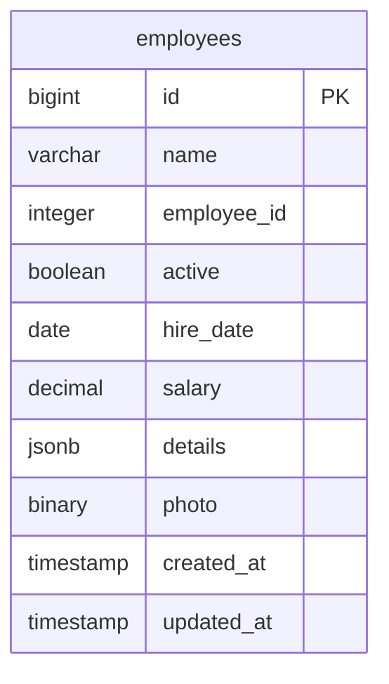

# PostgreSQL Storage Deep Dive

This module provides a practical exploration of PostgreSQL's storage mechanisms, progressing from basic concepts to advanced optimization techniques. For definitions of terms used in this module, refer to our [Glossary](GLOSSARY.md).


## Prerequisites

Before starting this module, ensure you understand:
- [ACID Properties](GLOSSARY.md#acid)
- [WAL (Write-Ahead Log)](GLOSSARY.md#wal)
- [TOAST](GLOSSARY.md#toast)

## Learning Path

1. **Basic Storage Concepts** (practice_storage)
   - Understanding 8KB pages
   - Basic tuple structure
   - Data type storage requirements
   - Simple storage examples

2. **Tuple Deep Dive** (practice_tuple)
   - Detailed tuple analysis
   - NULL handling
   - Alignment requirements
   - Real-world tuple patterns

3. **TOAST Storage** (practice_storage, practice_tuple)
   - Large value handling
   - TOAST thresholds
   - Storage strategies
   - Compression options

4. **WAL and Performance** (practice_wal)
   - Write-Ahead Log basics
   - Transaction impacts
   - Checkpoint behavior
   - Performance optimization

## Related Concepts

- [Query Planning](03_queries_README.md#query-planning)
- [Transaction Management](02_transactions_README.md#transaction-management)
- [Buffer Management](GLOSSARY.md#buffer-management)

## Database Structure



## Module Overview

In this module, you'll explore:
1. How PostgreSQL organizes data in tuples (rows)
2. How different data types affect storage and alignment
3. How PostgreSQL handles large values using TOAST
4. The relationship between theoretical and actual storage sizes

## PostgreSQL Storage Layout

### 1. Basic Page Layout (8KB)
Every PostgreSQL table is stored as an array of 8KB pages. Here's a simplified view of how a single page is organized:

```ascii
+--------------------------------+ 0
|           Page Header          |
|             (24B)              |
+--------------------------------+ 24
|         Item Pointers          |
| (4B each, points to row data) |
+--------------------------------+ varies
|                                |
|          Free Space            |
|     (available for growth)     |
|                                |
+--------------------------------+ varies
|    Row 1 Data                  |
|    - Header (23B)             |
|    - Null bitmap              |
|    - User data                |
|    - Alignment padding        |
+--------------------------------+
|    Row 2 Data                  |
|    - Header (23B)             |
```

### 2. Key Storage Concepts

#### **Tuples (Rows)**
- Each row is stored as a tuple
- Tuple header contains metadata (23 bytes minimum)
- User data follows the header
- Alignment padding ensures proper memory alignment

#### **TOAST (The Oversized-Attribute Storage Technique)**
- Automatically handles values larger than 2KB
- Creates separate TOAST tables for large data
- Compresses data when possible
- Improves main table performance

#### **Page Organization**
- Fixed 8KB page size
- Item pointers point to actual row data
- Free space management for updates
- Page-level locking

## Storage Analysis Commands

### **Table Statistics**
```sql
SELECT 
    n_live_tup as live_tuples,
    n_dead_tup as dead_tuples,
    n_tup_ins as inserts,
    n_tup_upd as updates,
    n_tup_del as deletes
FROM pg_stat_user_tables
WHERE relname = 'your_table';
```

### **Storage Sizes**
```sql
SELECT 
    pg_size_pretty(pg_total_relation_size('your_table')) as total_size,
    pg_size_pretty(pg_relation_size('your_table')) as table_size,
    pg_size_pretty(pg_indexes_size('your_table')) as index_size;
```

### **TOAST Analysis**
```sql
SELECT 
    c.relname as table_name,
    t.relname as toast_table_name,
    pg_size_pretty(pg_total_relation_size(t.oid)) as toast_size
FROM pg_class c
JOIN pg_class t ON c.reltoastrelid = t.oid
WHERE c.relname = 'your_table';
```

### **Column-level Analysis**
```sql
SELECT 
    column_name,
    data_type,
    pg_column_size(column_name::text) as storage_size
FROM information_schema.columns 
WHERE table_name = 'your_table';
```

## Performance Implications

### **Storage Optimization**
- **Column Order**: Place frequently accessed columns first
- **Data Types**: Choose appropriate types for your data
- **NULL Handling**: Consider NOT NULL constraints
- **TOAST Thresholds**: Monitor large value storage

### **Monitoring Queries**
```sql
-- Check table bloat
SELECT 
    schemaname,
    tablename,
    n_dead_tup,
    n_live_tup,
    ROUND(n_dead_tup * 100.0 / NULLIF(n_live_tup + n_dead_tup, 0), 2) as dead_percentage
FROM pg_stat_user_tables
WHERE n_dead_tup > 0
ORDER BY dead_percentage DESC;
```

## Next Steps

After completing this module:
1. Move to [Transaction Management](02_transactions_README.md) to understand concurrency
2. Explore [Query Optimization](03_queries_README.md) for performance tuning
3. Learn about [TimescaleDB](04_timescale_README.md) for time-series data

## Troubleshooting

If you encounter issues:
- Check your PostgreSQL version: `SELECT version();`
- Verify table exists: `\dt your_table`
- Check permissions: `\du`
- Review the [Troubleshooting Guide](TROUBLESHOOTING.md)
