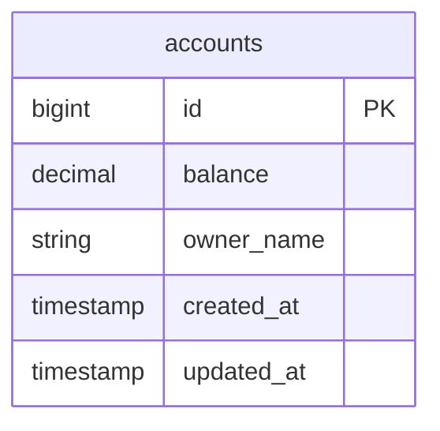
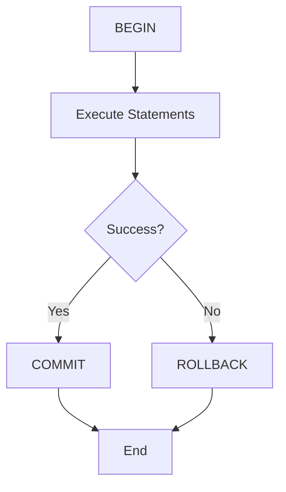
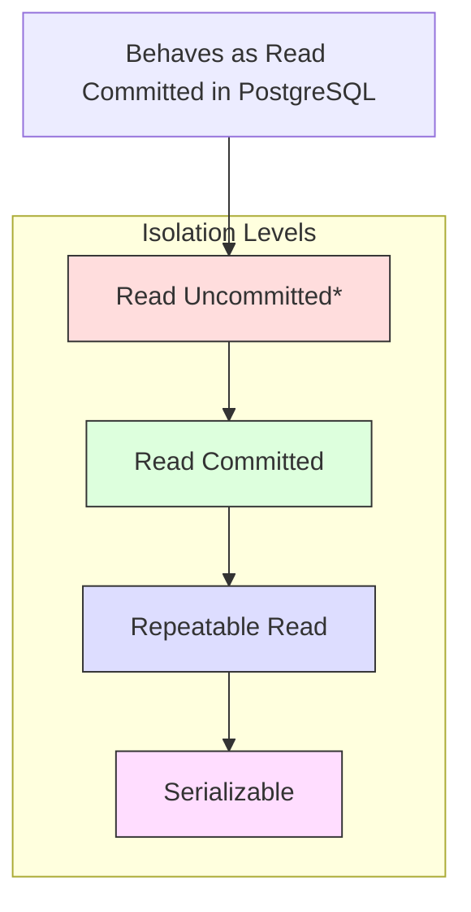

# PostgreSQL Transactions Deep Dive

This module focuses on understanding PostgreSQL's transaction management, isolation levels, and common concurrency challenges like deadlocks. For definitions of terms used in this module, refer to our [Glossary](GLOSSARY.md).


## Prerequisites

Before starting this module, ensure you understand:
- [ACID Properties](GLOSSARY.md#acid)
- [MVCC](GLOSSARY.md#mvcc)
- [Transaction](GLOSSARY.md#transaction)
- [Storage Layout](01_storage_README.md#storage-layout)

## Related Concepts

- [WAL (Write-Ahead Log)](GLOSSARY.md#wal)
- [Query Planning](03_queries_README.md#query-planning)
- [Buffer Management](GLOSSARY.md#buffer-management)

## Database Structure



## Module Overview

In this module, you'll explore:
1. How PostgreSQL manages transactions
2. Transaction isolation levels
3. Deadlock detection and prevention
4. Best practices for transaction management

## PostgreSQL Transaction Management

### 1. Basic Transaction Structure
Every PostgreSQL transaction follows this lifecycle:



### 2. Transaction Isolation Levels
PostgreSQL supports four isolation levels, each with different guarantees:



For more details on isolation levels, see [Isolation Level](GLOSSARY.md#isolation-level).

#### Isolation Level Characteristics

| Level | Dirty Read | Non-Repeatable Read | Phantom Read | Serialization Anomaly |
|-------|------------|---------------------|--------------|----------------------|
| Read Uncommitted [1] | Prevented | Possible | Possible | Possible |
| Read Committed | Prevented | Possible | Possible | Possible |
| Repeatable Read | Prevented | Prevented | Prevented [2] | Possible |
| Serializable | Prevented | Prevented | Prevented | Prevented |

1. PostgreSQL treats Read Uncommitted as Read Committed
2. PostgreSQL's implementation prevents phantom reads

## Transaction Commands and Examples

### **Basic Transaction Commands**
```sql
-- Start a transaction
BEGIN;

-- Execute statements
UPDATE accounts SET balance = balance - 100 WHERE id = 1;
UPDATE accounts SET balance = balance + 100 WHERE id = 2;

-- Commit the transaction
COMMIT;

-- Or rollback if there's an error
ROLLBACK;
```

### **Isolation Level Examples**
```sql
-- Set isolation level for current transaction
BEGIN TRANSACTION ISOLATION LEVEL REPEATABLE READ;

-- Check current isolation level
SHOW transaction_isolation;

-- Set default isolation level
ALTER DATABASE your_database SET default_transaction_isolation = 'read_committed';
```

### **Deadlock Detection**
```sql
-- Monitor for deadlocks
SELECT 
    pid,
    state,
    query_start,
    query
FROM pg_stat_activity
WHERE state != 'idle';

-- Check for blocked queries
SELECT 
    blocked_locks.pid AS blocked_pid,
    blocked_activity.usename AS blocked_user,
    blocking_locks.pid AS blocking_pid,
    blocking_activity.usename AS blocking_user,
    blocked_activity.query AS blocked_statement
FROM pg_catalog.pg_locks blocked_locks
JOIN pg_catalog.pg_stat_activity blocked_activity ON blocked_activity.pid = blocked_locks.pid
JOIN pg_catalog.pg_locks blocking_locks 
    ON (blocking_locks.locktype = blocked_locks.locktype
        AND blocking_locks.database IS NOT DISTINCT FROM blocked_locks.database
        AND blocking_locks.relation IS NOT DISTINCT FROM blocked_locks.relation
        AND blocking_locks.page IS NOT DISTINCT FROM blocked_locks.page
        AND blocking_locks.tuple IS NOT DISTINCT FROM blocked_locks.tuple
        AND blocking_locks.virtualxid IS NOT DISTINCT FROM blocked_locks.virtualxid
        AND blocking_locks.transactionid IS NOT DISTINCT FROM blocked_locks.transactionid
        AND blocking_locks.classid IS NOT DISTINCT FROM blocked_locks.classid
        AND blocking_locks.objid IS NOT DISTINCT FROM blocked_locks.objid
        AND blocking_locks.objsubid IS NOT DISTINCT FROM blocked_locks.objsubid
        AND blocking_locks.pid != blocked_locks.pid)
JOIN pg_catalog.pg_stat_activity blocking_activity ON blocking_activity.pid = blocking_locks.pid
WHERE NOT blocked_locks.granted;
```

## MVCC (Multi-Version Concurrency Control)

### **How MVCC Works**
PostgreSQL uses MVCC to provide transaction isolation:

```sql
-- Each row has system columns
SELECT 
    xmin,  -- Transaction ID that created the row
    xmax,  -- Transaction ID that deleted the row (or 0 if not deleted)
    cmin,  -- Command ID within the transaction
    cmax   -- Command ID within the transaction
FROM your_table
LIMIT 5;
```

### **Row Version Management**
```sql
-- Check for row versions
SELECT 
    schemaname,
    tablename,
    n_live_tup,
    n_dead_tup,
    n_tup_ins,
    n_tup_upd,
    n_tup_del
FROM pg_stat_user_tables
WHERE n_dead_tup > 0
ORDER BY n_dead_tup DESC;
```

## Lock Management

### **Lock Types**
```sql
-- View current locks
SELECT 
    l.pid,
    l.mode,
    l.granted,
    a.query,
    a.state
FROM pg_locks l
JOIN pg_stat_activity a ON l.pid = a.pid
WHERE NOT l.granted
ORDER BY l.pid;
```

### **Lock Conflicts**
```sql
-- Check for lock conflicts
SELECT 
    locktype,
    database,
    relation,
    page,
    tuple,
    virtualxid,
    transactionid,
    classid,
    objid,
    objsubid,
    virtualtransaction,
    pid,
    mode,
    granted
FROM pg_locks
WHERE NOT granted;
```

## Best Practices

### **Transaction Design**
1. **Keep transactions short**: Minimize the time locks are held
2. **Use appropriate isolation levels**: Don't use Serializable unless necessary
3. **Handle deadlocks gracefully**: Implement retry logic
4. **Monitor transaction performance**: Use `pg_stat_activity`

### **Deadlock Prevention**
```sql
-- Consistent ordering of operations
-- Always access tables in the same order across transactions

-- Example: Always update accounts in ID order
UPDATE accounts SET balance = balance - 100 WHERE id = 1;
UPDATE accounts SET balance = balance + 100 WHERE id = 2;

-- Use explicit locking when needed
SELECT * FROM accounts WHERE id = 1 FOR UPDATE;
```

### **Performance Monitoring**
```sql
-- Monitor transaction statistics
SELECT 
    datname,
    xact_commit,
    xact_rollback,
    blks_read,
    blks_hit,
    tup_returned,
    tup_fetched,
    tup_inserted,
    tup_updated,
    tup_deleted
FROM pg_stat_database
WHERE datname = current_database();
```

## Common Patterns

### **Transfer Pattern**
```sql
-- Atomic transfer between accounts
BEGIN;
    UPDATE accounts SET balance = balance - 100 WHERE id = 1 AND balance >= 100;
    UPDATE accounts SET balance = balance + 100 WHERE id = 2;
    -- Check if first update affected any rows
    IF NOT FOUND THEN
        RAISE EXCEPTION 'Insufficient funds or account not found';
    END IF;
COMMIT;
```

### **Batch Processing**
```sql
-- Process records in batches to avoid long transactions
DO $$
DECLARE
    batch_size INTEGER := 1000;
    processed INTEGER := 0;
BEGIN
    LOOP
        WITH batch AS (
            SELECT id FROM large_table 
            WHERE processed = false 
            LIMIT batch_size
            FOR UPDATE SKIP LOCKED
        )
        UPDATE large_table 
        SET processed = true, 
            processed_at = NOW()
        WHERE id IN (SELECT id FROM batch);
        
        GET DIAGNOSTICS processed = ROW_COUNT;
        EXIT WHEN processed = 0;
        
        COMMIT;
    END LOOP;
END $$;
```

## Next Steps

After completing this module:
1. Move to [Query Optimization](03_queries_README.md) to understand query performance
2. Explore [TimescaleDB](04_timescale_README.md) for time-series data
3. Review [Storage Layout](01_storage_README.md) for deeper understanding

## Troubleshooting

If you encounter issues:
- Check for deadlocks: `SELECT * FROM pg_locks WHERE NOT granted;`
- Monitor long-running transactions: `SELECT * FROM pg_stat_activity WHERE state = 'active';`
- Review the [Troubleshooting Guide](TROUBLESHOOTING.md)
