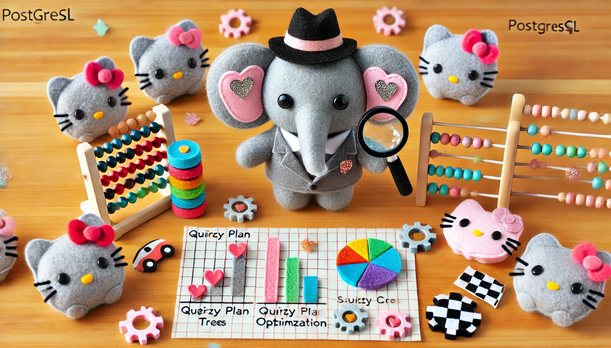

# PostgreSQL Query Optimization Workshop

This section focuses on understanding and optimizing PostgreSQL queries through practical examples and real-world scenarios. For definitions of terms used in this module, refer to our [Glossary](GLOSSARY.md).



## Prerequisites

Before starting this module, ensure you understand:
- [Query Plan](GLOSSARY.md#query-plan)
- [Index](GLOSSARY.md#index)
- [Statistics](GLOSSARY.md#statistics)
- [Transaction Management](02_transactions_README.md#transaction-management)

## Related Concepts

- [MVCC](GLOSSARY.md#mvcc-multi-version-concurrency-control)
- [Buffer Management](GLOSSARY.md#buffer-management)
- [Storage Layout](01_storage_README.md#storage-layout)

## Learning Path

### 1. Understanding Basic Concepts
Start with query analysis to understand:
- How [EXPLAIN](GLOSSARY.md#explain) works
- Reading execution plans
- Understanding query costs
- Buffer and timing statistics

### 2. Basic Query Optimization
Work through basic examples:
1. Run the basic example to see a well-optimized query
2. Observe the memory-based execution
3. Run the disk usage example to understand:
   - How PostgreSQL handles memory constraints
   - Impact of work_mem on performance
   - Disk vs memory operation differences

### 3. Structured Optimization Exercises
Complete the exercises:
1. Basic query analysis
2. [JOIN](GLOSSARY.md#join) optimization
3. [Aggregate Functions](GLOSSARY.md#aggregate-functions) optimization
4. Subquery optimization

### 4. Advanced Query Patterns
Explore complex patterns:
1. Window functions
2. Recursive CTEs
3. LATERAL joins
4. Complex aggregations

## Key Concepts by Example

### Basic Query Optimization
```sql
-- Memory-efficient query
SELECT customers.country, COUNT(DISTINCT orders.id)
FROM orders
JOIN customers ON orders.customer_id = customers.id
GROUP BY customers.country;

-- vs Memory-intensive query
SELECT customers.country,
       STRING_AGG(DISTINCT customers.name, ', '),
       COUNT(DISTINCT orders.id)
FROM orders
JOIN customers ON orders.customer_id = customers.id
GROUP BY customers.country;
```

## Query Analysis Commands

### **EXPLAIN Basics**
```sql
-- Basic EXPLAIN
EXPLAIN SELECT * FROM users WHERE email = 'user@example.com';

-- EXPLAIN with ANALYZE (executes the query)
EXPLAIN (ANALYZE, BUFFERS) SELECT * FROM users WHERE email = 'user@example.com';

-- EXPLAIN with detailed output
EXPLAIN (ANALYZE, BUFFERS, VERBOSE, FORMAT JSON) 
SELECT * FROM users WHERE email = 'user@example.com';
```

### **Query Plan Analysis**
```sql
-- Check if query uses indexes
EXPLAIN (ANALYZE, BUFFERS) 
SELECT * FROM users 
WHERE created_at > '2023-01-01' 
  AND status = 'active';

-- Compare different query approaches
EXPLAIN (ANALYZE, BUFFERS) 
SELECT u.name, COUNT(o.id) 
FROM users u
LEFT JOIN orders o ON u.id = o.user_id
GROUP BY u.id, u.name;

-- vs

EXPLAIN (ANALYZE, BUFFERS) 
SELECT u.name, 
       (SELECT COUNT(*) FROM orders WHERE user_id = u.id) as order_count
FROM users u;
```

## Index Optimization

### **Index Types and Usage**
```sql
-- B-tree index (default)
CREATE INDEX idx_users_email ON users(email);

-- Partial index
CREATE INDEX idx_active_users ON users(email) WHERE status = 'active';

-- Composite index
CREATE INDEX idx_users_status_created ON users(status, created_at);

-- Unique index
CREATE UNIQUE INDEX idx_users_email_unique ON users(email);

-- Check index usage
SELECT 
    schemaname,
    tablename,
    indexname,
    idx_scan,
    idx_tup_read,
    idx_tup_fetch
FROM pg_stat_user_indexes
WHERE schemaname = 'public'
ORDER BY idx_scan DESC;
```

### **Index Analysis**
```sql
-- Find unused indexes
SELECT 
    schemaname,
    tablename,
    indexname,
    idx_scan,
    pg_size_pretty(pg_relation_size(indexrelid)) as index_size
FROM pg_stat_user_indexes
WHERE idx_scan = 0
ORDER BY pg_relation_size(indexrelid) DESC;

-- Check index sizes
SELECT 
    schemaname,
    tablename,
    indexname,
    pg_size_pretty(pg_relation_size(indexrelid)) as index_size
FROM pg_stat_user_indexes
ORDER BY pg_relation_size(indexrelid) DESC;
```

## Join Optimization

### **Join Types and Performance**
```sql
-- INNER JOIN (most efficient)
EXPLAIN (ANALYZE, BUFFERS)
SELECT o.id, c.name
FROM orders o
INNER JOIN customers c ON o.customer_id = c.id
WHERE o.status = 'completed';

-- LEFT JOIN (preserves left table rows)
EXPLAIN (ANALYZE, BUFFERS)
SELECT c.name, COUNT(o.id) as order_count
FROM customers c
LEFT JOIN orders o ON c.id = o.customer_id
GROUP BY c.id, c.name;

-- CROSS JOIN (cartesian product - use carefully)
EXPLAIN (ANALYZE, BUFFERS)
SELECT p.name, c.name
FROM products p
CROSS JOIN categories c
WHERE p.category_id = c.id;  -- This makes it effectively an INNER JOIN
```

### **Join Order Optimization**
```sql
-- PostgreSQL automatically chooses join order
EXPLAIN (ANALYZE, BUFFERS)
SELECT o.id, c.name, p.name
FROM orders o
JOIN customers c ON o.customer_id = c.id
JOIN products p ON o.product_id = p.id
WHERE o.created_at > '2023-01-01';

-- Force join order with parentheses
EXPLAIN (ANALYZE, BUFFERS)
SELECT o.id, c.name, p.name
FROM (orders o JOIN customers c ON o.customer_id = c.id)
JOIN products p ON o.product_id = p.id
WHERE o.created_at > '2023-01-01';
```

## Aggregate Optimization

### **Aggregate Functions**
```sql
-- Simple aggregation
EXPLAIN (ANALYZE, BUFFERS)
SELECT 
    customer_id,
    COUNT(*) as order_count,
    SUM(total) as total_amount,
    AVG(total) as avg_order
FROM orders
GROUP BY customer_id;

-- Window functions (more efficient than subqueries)
EXPLAIN (ANALYZE, BUFFERS)
SELECT 
    customer_id,
    order_id,
    total,
    SUM(total) OVER (PARTITION BY customer_id) as customer_total,
    ROW_NUMBER() OVER (PARTITION BY customer_id ORDER BY total DESC) as rank
FROM orders;
```

### **Grouping Optimization**
```sql
-- Use HAVING for post-aggregation filtering
EXPLAIN (ANALYZE, BUFFERS)
SELECT 
    customer_id,
    COUNT(*) as order_count,
    SUM(total) as total_amount
FROM orders
GROUP BY customer_id
HAVING COUNT(*) > 5 AND SUM(total) > 1000;

-- vs WHERE (pre-aggregation filtering)
EXPLAIN (ANALYZE, BUFFERS)
SELECT 
    customer_id,
    COUNT(*) as order_count,
    SUM(total) as total_amount
FROM orders
WHERE total > 100  -- This filters before aggregation
GROUP BY customer_id
HAVING COUNT(*) > 5;
```

## Subquery Optimization

### **Subquery Types**
```sql
-- Correlated subquery (can be slow)
EXPLAIN (ANALYZE, BUFFERS)
SELECT 
    c.name,
    (SELECT COUNT(*) FROM orders WHERE customer_id = c.id) as order_count
FROM customers c;

-- vs JOIN (usually faster)
EXPLAIN (ANALYZE, BUFFERS)
SELECT 
    c.name,
    COUNT(o.id) as order_count
FROM customers c
LEFT JOIN orders o ON c.id = o.customer_id
GROUP BY c.id, c.name;

-- EXISTS (often faster than IN for large datasets)
EXPLAIN (ANALYZE, BUFFERS)
SELECT c.name
FROM customers c
WHERE EXISTS (
    SELECT 1 FROM orders o 
    WHERE o.customer_id = c.id 
      AND o.total > 1000
);

-- vs IN
EXPLAIN (ANALYZE, BUFFERS)
SELECT c.name
FROM customers c
WHERE c.id IN (
    SELECT DISTINCT customer_id 
    FROM orders 
    WHERE total > 1000
);
```

## Advanced Query Patterns

### **Window Functions**
```sql
-- Running totals
SELECT 
    customer_id,
    order_date,
    total,
    SUM(total) OVER (
        PARTITION BY customer_id 
        ORDER BY order_date 
        ROWS UNBOUNDED PRECEDING
    ) as running_total
FROM orders
ORDER BY customer_id, order_date;

-- Ranking
SELECT 
    customer_id,
    total,
    ROW_NUMBER() OVER (ORDER BY total DESC) as rank,
    RANK() OVER (ORDER BY total DESC) as rank_with_ties,
    DENSE_RANK() OVER (ORDER BY total DESC) as dense_rank
FROM orders;
```

### **Recursive CTEs**
```sql
-- Hierarchical data (e.g., organizational chart)
WITH RECURSIVE org_tree AS (
    -- Base case: top-level employees
    SELECT id, name, manager_id, 1 as level
    FROM employees
    WHERE manager_id IS NULL
    
    UNION ALL
    
    -- Recursive case: subordinates
    SELECT e.id, e.name, e.manager_id, ot.level + 1
    FROM employees e
    JOIN org_tree ot ON e.manager_id = ot.id
)
SELECT * FROM org_tree ORDER BY level, name;
```

### **LATERAL Joins**
```sql
-- Correlated subquery as a join
SELECT 
    c.name,
    recent_orders.order_id,
    recent_orders.total
FROM customers c
CROSS JOIN LATERAL (
    SELECT order_id, total
    FROM orders
    WHERE customer_id = c.id
    ORDER BY created_at DESC
    LIMIT 3
) recent_orders;
```

## Performance Monitoring

### **Query Statistics**
```sql
-- Most expensive queries
SELECT 
    query,
    calls,
    total_time,
    mean_time,
    rows,
    100.0 * shared_blks_hit / nullif(shared_blks_hit + shared_blks_read, 0) AS hit_percent
FROM pg_stat_statements
ORDER BY total_time DESC
LIMIT 10;

-- Slow queries
SELECT 
    query,
    calls,
    total_time,
    mean_time
FROM pg_stat_statements
WHERE mean_time > 1000  -- queries taking more than 1 second on average
ORDER BY mean_time DESC;
```

### **Buffer Cache Analysis**
```sql
-- Buffer cache hit ratio
SELECT 
    sum(heap_blks_read) as heap_read,
    sum(heap_blks_hit)  as heap_hit,
    sum(heap_blks_hit) / (sum(heap_blks_hit) + sum(heap_blks_read))::float as ratio
FROM pg_statio_user_tables;

-- Table-level buffer statistics
SELECT 
    schemaname,
    tablename,
    heap_blks_read,
    heap_blks_hit,
    heap_blks_hit::float / (heap_blks_hit + heap_blks_read) as hit_ratio
FROM pg_statio_user_tables
WHERE heap_blks_read > 0
ORDER BY heap_blks_read DESC;
```

## Best Practices

### **Query Design**
1. **Use appropriate data types**: Choose the right types for your data
2. **Limit result sets**: Use LIMIT and WHERE clauses effectively
3. **Avoid SELECT ***: Only select the columns you need
4. **Use indexes wisely**: Create indexes on frequently queried columns
5. **Monitor query performance**: Use EXPLAIN ANALYZE regularly

### **Index Strategy**
```sql
-- Create indexes for WHERE clauses
CREATE INDEX idx_orders_status ON orders(status);
CREATE INDEX idx_orders_created ON orders(created_at);

-- Create indexes for JOIN conditions
CREATE INDEX idx_orders_customer ON orders(customer_id);
CREATE INDEX idx_orders_product ON orders(product_id);

-- Create composite indexes for complex queries
CREATE INDEX idx_orders_status_created ON orders(status, created_at);
CREATE INDEX idx_orders_customer_status ON orders(customer_id, status);
```

### **Memory Configuration**
```sql
-- Check current settings
SHOW work_mem;
SHOW shared_buffers;
SHOW effective_cache_size;

-- Adjust for your workload
-- work_mem: 4MB to 256MB depending on available RAM
-- shared_buffers: 25% of available RAM
-- effective_cache_size: 75% of available RAM
```

## Next Steps

After completing this module:
1. Move to [TimescaleDB](04_timescale_README.md) for time-series optimization
2. Review [Transaction Management](02_transactions_README.md) for concurrency
3. Explore [Storage Layout](01_storage_README.md) for deeper understanding

## Troubleshooting

If you encounter issues:
- Check query plans: `EXPLAIN (ANALYZE, BUFFERS) your_query;`
- Monitor slow queries: `SELECT * FROM pg_stat_statements ORDER BY total_time DESC;`
- Review the [Troubleshooting Guide](TROUBLESHOOTING.md)
