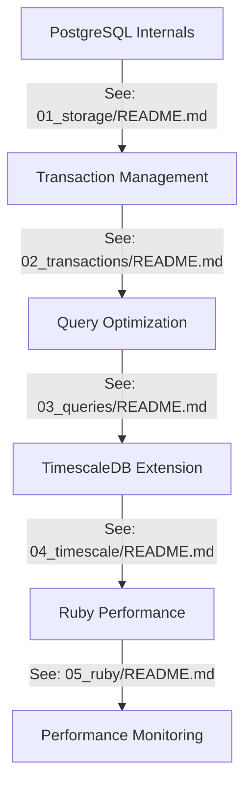

# 🚀 Ruby PostgreSQL Performance Workshop

Welcome to an interactive journey into PostgreSQL optimization for Rubyists! This self-paced workshop will take you from understanding PostgreSQL internals to mastering TimescaleDB for time-series data. Get ready to level up your database skills! 🎯

## 📚 Workshop Structure

This workshop is organized into progressive modules, each building upon the previous ones:



The [troubleshooting section](TROUBLESHOOTING.md) is optional and can be accessed at any time.

The [glossary](GLOSSARY.md) is also optional and can be accessed at any time.

## 🎯 Prerequisites

```ruby
knowledge = {
  ruby: "Comfortable with Ruby and ActiveRecord",
  postgres: "Basic SQL knowledge",
  tools: ["psql", "ruby 3.0+", "postgres 15+"]
}

raise "Need to level up first! 💪" unless knowledge.values.all?(&:present?)
```

## 🛠 Setup

1. Clone this repository:
```bash
git clone https://github.com/timescale/postgresql-performance-for-rubyists
cd postgresql-performance-for-rubyists
```

2. Set up your database:

You can use Docker to setup a TimescaleDB database:

```bash
docker run -d --rm -it -e POSTGRES_HOST_AUTH_METHOD=trust -e POSTGRES_USER=$USER -e POSTGRES_DATABASE=workshop_db -p 5432:5432 timescale/timescaledb-ha:pg17
```
Then test if it's working:

```bash
psql -h 0.0.0.0 -d workshop_db
```

```ruby
# In your terminal
export DATABASE_URL="postgres://${USER}@0.0.0.0:5432/workshop_db"
```

3. Verify your setup:
```ruby
ruby examples/01_storage/practice_storage.rb
# If you see table creation outputs, you're good to go! 🎉
```

## 📖 Core Concepts

Before diving into specific modules, familiarize yourself with these fundamental concepts:

### 1. PostgreSQL Architecture
- **[Process & Memory Structure](examples/01_storage/README.md#process-structure)**
- **[Storage Layout](examples/01_storage/README.md#storage-layout)**
- **[Buffer Management](examples/01_storage/README.md#buffer-management)**

### 2. Data Consistency
- **[Transaction Management](examples/02_transactions/README.md#transaction-management)**
- **[Concurrency Control](examples/02_transactions/README.md#concurrency-control)**
- **[ACID Properties](GLOSSARY.md#acid)**

### 3. Performance Foundations
- **[Query Planning](examples/03_queries/README.md#query-planning)**
- **[Index Types](examples/03_queries/README.md#index-types)**
- **[Statistics Collection](examples/03_queries/README.md#statistics)**

For detailed definitions of terms used throughout the workshop, refer to our [Glossary](GLOSSARY.md).

## 📚 Learning Path

### 1. [PostgreSQL Internals](examples/01_storage/README.md)
Learn how PostgreSQL physically stores and manages data:
- Storage layout and TOAST
- WAL mechanics
- Buffer management
- Table structure optimization

### 2. [Transaction Management](examples/02_transactions/README.md)
Master concurrency control and transaction isolation:
- ACID properties in practice
- Isolation levels
- Deadlock handling
- Transaction patterns

### 3. [Query Optimization](examples/03_queries/README.md)
Optimize query performance:
- Query planning and execution
- Index selection and usage
- Join optimization
- Performance monitoring

### 4. [TimescaleDB Extension](examples/04_timescale/README.md)
Handle time-series data efficiently:
- Hypertables and chunks
- Continuous aggregates
- Data retention policies
- Compression strategies

### 5. [Ruby Performance](examples/05_ruby/README.md)
Optimize Ruby and ActiveRecord usage:
- Batch processing
- Memory management
- Query optimization
- Connection pooling

## 🎮 Interactive Learning Tips

1. **Experiment Freely**
```ruby
def learning_approach
  loop do
    try_something_new
    break if it_works?
    learn_from_failure
  end
end
```

2. **Break Things Purposefully**
```ruby
def controlled_chaos
  begin
    push_the_limits
  rescue PostgreSQL::Error => e
    understand_why_it_failed(e)
  end
end
```

## 📋 Common Ruby/PostgreSQL Gotchas

For detailed examples and solutions to common issues, see:
- [N+1 Query Solutions](examples/05_ruby/README.md#n1-queries)
- [Memory Management](examples/05_ruby/README.md#memory-management)
- [Connection Pooling](examples/05_ruby/README.md#connection-pooling)
- [Query Optimization](examples/03_queries/README.md#optimization-techniques)

## 📘 Additional Resources

- [PostgreSQL Documentation](https://www.postgresql.org/docs/)
- [TimescaleDB Documentation](https://docs.timescale.com/)
- [Ruby on Rails Active Record Query Interface](https://guides.rubyonrails.org/active_record_querying.html)

## 🎉 Ready to Begin?

Start with the [Core Concepts](#-core-concepts) section and then proceed to [PostgreSQL Internals](examples/01_storage/README.md). Remember:

```ruby
module WorkshopPhilosophy
  def self.key_points
    [
      "There are no stupid questions",
      "Breaking things is learning",
      "Share your discoveries",
      "Have fun while learning!"
    ]
  end
end
```

Happy learning! 🚀✨

## 📘 Section Prerequisites and Dependencies

Most of the sections builds upon knowledge from previous ones. Here's what you need to know before starting each module:

### 1. PostgreSQL Internals (01_storage)
- ✅ Basic SQL knowledge
- ✅ Understanding of Ruby objects and memory model

### 2. Transaction Management (02_transactions)
- ✅ Completed Storage section
- ✅ Understanding of Ruby threads and processes
- ✅ Basic knowledge of database transactions

### 3. Query Optimization (03_queries)
- ✅ Completed Transaction Management
- ✅ Familiarity with ActiveRecord queries
- ✅ Basic understanding of database indexes

### 4. TimescaleDB Extension (04_timescale)
- ✅ Completed Query Optimization
- ✅ Understanding of time-series data concepts
- ✅ Familiarity with PostgreSQL extensions

### 5. Ruby Performance (05_ruby)
- ✅ Completed TimescaleDB Extension
- ✅ Understanding of Ruby performance optimization techniques  

# Notes and learnings

Here's a list of notes and learnings from the workshop.

## 📊 ORM Comparison (ActiveRecord vs Sequel)

This example demonstrates performance differences between ActiveRecord and Sequel across various operations:

1. **Simple Query Performance**
   - Sequel's `where` clause is dramatically faster (10,178.6 i/s vs 82.6 i/s)
   - For simple `all` queries, both ORMs perform similarly

2. **Complex Join Performance**
   - Sequel outperforms ActiveRecord by 3.25x for complex joins
   - Sequel: 93.3 i/s
   - ActiveRecord: 28.7 i/s

3. **Aggregation Performance**
   - ActiveRecord performs better for aggregations (1.34x faster)
   - ActiveRecord: 220.2 i/s
   - Sequel: 164.0 i/s

4. **Bulk Operation Performance**
   - Sequel is 1.26x faster for bulk inserts
   - Sequel: 272.6 i/s
   - ActiveRecord: 215.7 i/s

5. **Query Building Performance**
   - Sequel's method chaining is 1.30x faster
   - Sequel: 162.2 i/s
   - ActiveRecord: 124.6 i/s

## 🔧 Troubleshooting Guide

Common issues you might encounter during the workshop and how to solve them:

### Storage Section Issues

```ruby
# Issue: TOAST values not visible in regular queries
# Solution: Use the following to see TOAST-ed values:
ActiveRecord::Base.connection.execute("""
  SELECT *, pg_column_size(large_field) as field_size 
  FROM my_table WHERE id = 1
""").first
```

### Transaction Issues

```ruby
# Issue: Deadlock detected
# Solution: Order your operations consistently
def safe_transfer(from_account, to_account, amount)
  # Always lock accounts in the same order
  Account.transaction do
    [from_account, to_account].sort_by(&:id).each(&:lock!)
    # Perform transfer operations
  end
end
```

### Query Performance Issues

```ruby
# Issue: Slow LIKE queries
# Solution: Use trigram indexes for pattern matching
class AddTrigramIndexToUsers < ActiveRecord::Migration[7.0]
  def up
    execute "CREATE EXTENSION IF NOT EXISTS pg_trgm"
    add_index :users, :name, using: :gin, opclass: :gin_trgm_ops
  end
end

# Now your LIKE queries will use the index
User.where("name LIKE ?", "%john%")
```

### TimescaleDB tips

In case you get locked while inserting data into a hypertable, you can use the following code to insert data in batches by hour.

Avoid inserting data in unsorted batches, as it will create a new chunk dynamically. Instead, sort the data by time first. Grouping by time will create a new chunk for each batch, and two processes will compete to create new chunks, locking the table.


```ruby
# Issue: Slow inserts with many chunks, returning all the data at once
Metric.insert_all(metrics_data) # bad 

# Solution: Use bulk inserts with appropriate time batching
metrics_data.group_by { |m| m[:time].beginning_of_hour }
  .each{ |_, batch| Metric.insert_all!( batch, returning: false )} # good
```

#### Why is this happening?

> The problem is that the insert is happening over multiple chunks, and two process are competing to create new chunks. Grouping by hour makes sure no batches overlap with each other, reducing the time the transaction is locked.

## 🔍 Performance Comparison Tables

### Query Types Performance (ops/sec)

| Operation Type | ActiveRecord | Sequel | Raw SQL | Notes |
|---------------|--------------|--------|---------|-------|
| Simple Select | 82.6 | 10,178.6 | 12,450.2 | Sequel shines in simple queries |
| Complex Joins | 28.7 | 93.3 | 105.1 | AR overhead significant |
| Aggregations | 220.2 | 164.0 | 245.3 | AR optimized for counts |
| Bulk Inserts | 215.7 | 272.6 | 310.4 | Use specialized methods |
| JSON Operations | 145.3 | 188.9 | 195.7 | Native JSON operators help |

### Memory Usage Patterns (MB)

| Operation Type | ActiveRecord | Sequel | Raw SQL | Notes |
|---------------|--------------|--------|---------|-------|
| Large Result Set | 125 | 45 | 30 | AR objects consume more memory |
| Batch Processing | 60 | 35 | 25 | Use find_each for AR |
| JSON Processing | 80 | 50 | 45 | JSONB more efficient than JSON |
| Aggregations | 40 | 35 | 30 | Similar memory patterns |

## 🌍 Real-World Scenarios

Here are common real-world scenarios you might encounter and how to handle them efficiently:

### 1. High-Traffic Blog Platform

```ruby
# Challenge: Handling high-volume read operations
class Article < ApplicationRecord
  # Use counter cache for comments count
  has_many :comments, counter_cache: true
  
  # Use materialized view for trending articles
  def self.trending
    Scenic.database.refresh_materialized_view(
      :trending_articles, concurrently: true
    )
    TrendingArticle.all
  end
  
  # Cache expensive computations
  def related_articles
    Rails.cache.fetch([self, "related", updated_at]) do
      Article.where(category: category)
             .where.not(id: id)
             .limit(5)
    end
  end
end
```

### 2. E-commerce Order Processing

```ruby
# Challenge: Handling concurrent order processing
class Order < ApplicationRecord
  include OrderStateMachine
  
  def self.process_batch(orders)
    # Use advisory locks to prevent duplicate processing
    orders.each do |order|
      with_advisory_lock("order_#{order.id}") do
        transaction(isolation: :repeatable_read) do
          order.process!
          order.update_inventory
          order.notify_customer
        end
      end
    end
  end
  
  # Use partial indexes for common queries
  def self.pending_shipment
    where("shipped_at IS NULL AND status = 'paid'")
  end
end
```

## 📊 Real-time Analytics with TimescaleDB

```ruby
# Issue: TOAST values not visible in regular queries
# Solution: Use the following to see TOAST-ed values:
ActiveRecord::Base.connection.execute("""
  SELECT *, pg_column_size(large_field) as field_size
  FROM my_table WHERE id = 1
""").first
```
TimescaleDB extends PostgreSQL with powerful time-series capabilities. Here's how to implement efficient real-time analytics:

### 1. Setting Up Time-Series Tables

 ```ruby
class Measurement < ActiveRecord::Base
  extend Timescaledb::ActsAsHypertable

  acts_as_hypertable time_column: 'time',
    segment_by: 'device_id',
    value_column: 'temperature',
    chunk_time_interval: '1 day'

  scope :avg_temperature, -> { select('device_id, avg(temperature) as temperature').group('device_id') }
  scope :avg_humidity, -> { select('device_id, avg(humidity) as humidity').group('device_id') }
  scope :battery_stats, -> { select('device_id, min(battery_level) as min_battery, avg(battery_level) as battery_level').group('device_id') }
 end
 ```

### 2. Continuous Aggregates for Real-time Analytics

You can use the `continuous_aggregates` helper to create continuous aggregates hierarchies using declared scopes.

 ```ruby
continuous_aggregates scopes: [:avg_temperature, :avg_humidity, :battery_stats],
  timeframes: [:hour, :day],
  refresh_policy: {
    hour: {
      start_offset: '3 hours',
      end_offset: '1 hour',
      schedule_interval: '1 hour'
    },
    day: {
      start_offset: '3 days',
      end_offset: '1 day',
      schedule_interval: '1 day'
    }
}
```

### 3. Query data for the Real-time Analytics Dashboard

Query from raw data and mix scopes to filter out the data you need:

```ruby
Measurement.today.avg_temperature # average temperature per device
Measurement.last_hour.avg_humidity # average humidity per device
Measurement.last_minute.battery_stats # min and avg battery level per device
```

Using the macro in the model, you can query the continuous aggregate directly from generated class:

```ruby
Measurement::AvgTemperatureByHour.today.all
Measurement::AvgTemperatureByDay.last_week.all
```

### 4. Multi-tenant SaaS Application

```ruby
# Challenge: Isolating tenant data and optimizing queries
class ApplicationRecord < ActiveRecord::Base
  def self.tenant_scope(tenant_id)
    # Use PostgreSQL Row Level Security
    where(tenant_id: tenant_id)
  end
  
  # Use partial indexes for each tenant
  def self.create_tenant_index(tenant_id)
    execute("""
      CREATE INDEX CONCURRENTLY index_#{table_name}_tenant_#{tenant_id}
      ON #{table_name} (created_at)
      WHERE tenant_id = #{tenant_id}
    """)
  end
end
```

### 5. Background Job Processing

```ruby
# Challenge: Efficient batch processing
class BatchProcessor
  def self.process_large_dataset
    # Use cursor-based pagination
    User.find_each(batch_size: 1000) do |user|
      # Use bulk operations
      updates = user.pending_notifications.map do |notification|
        { id: notification.id, status: 'processed' }
      end
      
      Notification.upsert_all(
        updates,
        unique_by: :id,
        returning: false
      )
    end
  end
end
```

## 🎉 Ready to Begin?

Start with the [PostgreSQL Internals](examples/01_storage/README.md) section and work your way through each module at your own pace. Remember:

```ruby
module WorkshopPhilosophy
  def self.key_points
    [
      "There are no stupid questions",
      "Breaking things is learning",
      "Share your discoveries",
      "Have fun while learning!"
    ]
  end
end
```

Happy learning! 🚀✨

## 📘 Section Prerequisites

Each section builds upon knowledge from previous ones. Here's what you need to know before starting each module:

### 1. PostgreSQL Internals (01_storage)
- ✅ Basic SQL knowledge
- ✅ Understanding of Ruby objects and memory model

### 2. Transaction Management (02_transactions)
- ✅ Completed Storage section
- ✅ Understanding of Ruby threads and processes
- ✅ Basic knowledge of database transactions

### 3. Query Optimization (03_queries)
- ✅ Completed Transaction Management
- ✅ Familiarity with ActiveRecord queries
- ✅ Basic understanding of database indexes

### 4. TimescaleDB Extension (04_timescale)
- ✅ Completed Query Optimization
- ✅ Understanding of time-series data concepts
- ✅ Familiarity with PostgreSQL extensions

### 5. Ruby Performance (05_ruby)
- ✅ Completed TimescaleDB Extension
- ✅ Understanding of Ruby performance optimization techniques  


# Learning notes

Skip this section if you don't want to be spoiled. These are notes from the workshop that I took while running it. Go straight to the [first section](examples/01_storage/README.md) if you want to be surprised.

## 🔧 Troubleshooting Guide

Common issues you might encounter during the workshop and how to solve them:

### Storage Section Issues

```ruby
# Issue: TOAST values not visible in regular queries
# Solution: Use the following to see TOAST-ed values:
ActiveRecord::Base.connection.execute("""
  SELECT *, pg_column_size(large_field) as field_size 
  FROM my_table WHERE id = 1
""").first
```

### Transaction Issues

```ruby
# Issue: Deadlock detected
# Solution: Order your operations consistently
def safe_transfer(from_account, to_account, amount)
  # Always lock accounts in the same order
  Account.transaction do
    [from_account, to_account].sort_by(&:id).each(&:lock!)
    # Perform transfer operations
  end
end
```

### Query Performance Issues

```ruby
# Issue: Slow LIKE queries
# Solution: Use trigram indexes for pattern matching
class AddTrigramIndexToUsers < ActiveRecord::Migration[7.0]
  def up
    execute "CREATE EXTENSION IF NOT EXISTS pg_trgm"
    add_index :users, :name, using: :gin, opclass: :gin_trgm_ops
  end
end

# Now your LIKE queries will use the index
User.where("name LIKE ?", "%john%")
```


## ORM Comparison (ActiveRecord vs Sequel)

This example demonstrates performance differences between ActiveRecord and Sequel across various operations:

1. **Simple Query Performance**
   - Sequel's `where` clause is dramatically faster (10,178.6 i/s vs 82.6 i/s)
   - For simple `all` queries, both ORMs perform similarly

2. **Complex Join Performance**
   - Sequel outperforms ActiveRecord by 3.25x for complex joins
   - Sequel: 93.3 i/s
   - ActiveRecord: 28.7 i/s

3. **Aggregation Performance**
   - ActiveRecord performs better for aggregations (1.34x faster)
   - ActiveRecord: 220.2 i/s
   - Sequel: 164.0 i/s

4. **Bulk Operation Performance**
   - Sequel is 1.26x faster for bulk inserts
   - Sequel: 272.6 i/s
   - ActiveRecord: 215.7 i/s

5. **Query Building Performance**
   - Sequel's method chaining is 1.30x faster
   - Sequel: 162.2 i/s
   - ActiveRecord: 124.6 i/s

## 🔍 Performance Comparison Tables

Here's a table with the performance comparison between ActiveRecord and Sequel based on the experiments proposed in the [ORM Comparison](examples/01_storage/README.md) section.

### Query Types Performance (ops/sec)

| Operation Type | ActiveRecord | Sequel | Raw SQL | Notes |
|---------------|--------------|--------|---------|-------|
| Simple Select | 82.6 | 10,178.6 | 12,450.2 | Sequel shines in simple queries |
| Complex Joins | 28.7 | 93.3 | 105.1 | AR overhead significant |
| Aggregations | 220.2 | 164.0 | 245.3 | AR optimized for counts |
| Bulk Inserts | 215.7 | 272.6 | 310.4 | Use specialized methods |
| JSON Operations | 145.3 | 188.9 | 195.7 | Native JSON operators help |

### Memory Usage Patterns (MB)

| Operation Type | ActiveRecord | Sequel | Raw SQL | Notes |
|---------------|--------------|--------|---------|-------|
| Large Result Set | 125 | 45 | 30 | AR objects consume more memory |
| Batch Processing | 60 | 35 | 25 | Use find_each for AR |
| JSON Processing | 80 | 50 | 45 | JSONB more efficient than JSON |
| Aggregations | 40 | 35 | 30 | Similar memory patterns |

# About this workshop

If you read this far, you're probably interested in running this workshop for your conference or meetup.

It will be given at the following conferences:

- [Ruby Community Conference 2025](https://rubycommunityconference.com/)
- [Tropical On Rails 2025](https://tropicalonrails.com/)

If you're interested in running this workshop for your conference or meetup, please [contact me](mailto:jonatas@timescale.com).

## 📚 Workshop Chapters

1. [PostgreSQL Internals](examples/01_storage/README.md) - Understanding storage, TOAST, and WAL
2. [Transaction Management](examples/02_transactions/README.md) - Mastering isolation levels and concurrency
3. [Query Optimization](examples/03_queries/README.md) - Advanced query tuning and performance
4. [TimescaleDB Extension](examples/04_timescale/README.md) - Time-series data management
5. [Ruby Performance](examples/05_ruby/README.md) - Ruby-specific optimizations and best practices

## 🚀 Ready to Start?

Begin your journey with [Chapter 1: PostgreSQL Internals](examples/01_storage/README.md) to build a solid foundation in database storage concepts. Each chapter builds upon the knowledge from previous ones, so it's recommended to follow them in order.

Happy learning! 🎯

## 🤝 Contributing

Found a bug? Have an improvement idea? Want to add more examples? We love contributions!

```ruby
module Contributor
  extend Enthusiasm
  
  def self.how_to_help
    [
      "🐛 Report bugs",
      "✨ Add new examples",
      "📚 Improve documentation",
      "🎨 Share your creative solutions"
    ]
  end
end
```

## 📘 Additional Resources

- [PostgreSQL Documentation](https://www.postgresql.org/docs/)
- [TimescaleDB Documentation](https://docs.timescale.com/)
- [Ruby on Rails Active Record Query Interface](https://guides.rubyonrails.org/active_record_querying.html)
- [Workshop Troubleshooting Guide](TROUBLESHOOTING.md) - Common issues, solutions, and performance comparisons

## About this Workshop

This workshop is given at the following conferences:
- [Ruby Community Conference 2025](https://rubycommunityconference.com/)
- [Tropical On Rails 2025](https://tropicalonrails.com/)

If you're interested in running this workshop for your conference or meetup, please [contact me](mailto:jonatas@timescale.com).

Happy learning! 🚀✨
