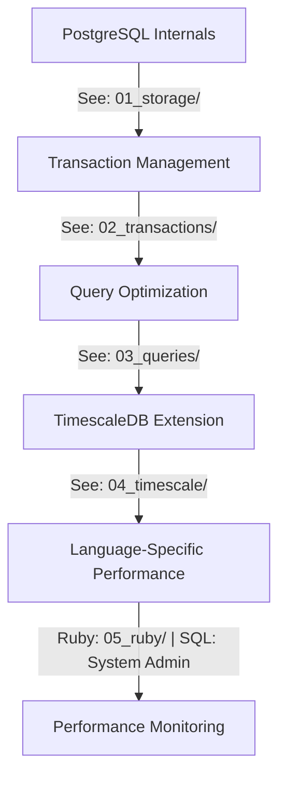

# 🚀 PostgreSQL Performance Workshop

Welcome to an interactive journey into PostgreSQL optimization! This self-paced workshop will take you from understanding PostgreSQL internals to mastering TimescaleDB for time-series data. Choose your preferred language - Ruby or pure SQL - and get ready to level up your database skills! 🎯

 with big sparkly eyes and rosy cheeks, wearing a tiny crown made of red felt")

## 🎯 Choose Your Learning Path

This workshop is available in two editions:

### 🐍 **Ruby Edition** (Original)
- **Perfect for**: Ruby developers, Rails applications
- **Focus**: ActiveRecord optimization, Ruby performance patterns
- **Setup**: `./setup/setup_ruby.sh`
- **Examples**: `ruby/`

### 🗄️ **SQL Edition** (New)
- **Perfect for**: Database administrators, SQL developers, any programming language
- **Focus**: Pure PostgreSQL optimization, system administration
- **Setup**: `./setup/setup_sql.sh`
- **Examples**: `sql/examples/`

## 📚 Workshop Structure

This workshop is organized into progressive modules, each building upon the previous ones:



The [troubleshooting section](TROUBLESHOOTING.md) is optional and can be accessed at any time.

The [glossary](GLOSSARY.md) is also optional and can be accessed at any time.

## 🎯 Prerequisites

### **For Ruby Edition:**
```ruby
knowledge = {
  ruby: "Comfortable with Ruby and ActiveRecord",
  postgres: "Basic SQL knowledge",
  tools: ["psql", "ruby 3.0+", "postgres 15+"]
}
```

### **For SQL Edition:**
```sql
-- Required knowledge
SELECT 'Basic SQL knowledge' as requirement
UNION ALL
SELECT 'PostgreSQL fundamentals'
UNION ALL
SELECT 'psql command-line tool';
```

## 🛠 Setup

### **Quick Start**

1. **Clone this repository:**
```bash
git clone https://github.com/jonatas/postgresql-performance-workshops
cd postgresql-performance-workshops
```

2. **Set up your database:**

You can use Docker to setup a TimescaleDB database:

```bash
docker run -d --rm -it -e POSTGRES_HOST_AUTH_METHOD=trust -e POSTGRES_USER=postgres -e POSTGRES_PASSWORD=password -e POSTGRES_DATABASE=mdshow -p 5433:5432 timescale/timescaledb-ha:pg17
```

3. **Configure environment variables:**

Copy the example environment file and adjust if needed:

```bash
cp env.example .env
```

The `.env` file contains the DATABASE_URL and other configuration settings.

4. **Choose your edition and run setup:**

**For Ruby Edition:**
```bash
./setup/setup_ruby.sh
```

**For SQL Edition:**
```bash
./setup/setup_sql.sh
```

### **Manual Setup**

#### **Ruby Edition:**
```bash
# Install dependencies
bundle install

# Set database URL
export DATABASE_URL="postgres://${USER}@0.0.0.0:5432/workshop_db"

# Test setup
bundle exec ruby ruby/01_storage/practice_storage.rb
```

#### **SQL Edition:**
```bash
# Connect to database
psql -h 0.0.0.0 -d workshop_db

# Run examples
\i sql/01_storage/practice_storage.sql
```

## 📖 Core Concepts

Before diving into specific modules, familiarize yourself with these fundamental concepts:

### 1. PostgreSQL Architecture
- **[Process & Memory Structure](ruby/01_storage/README.md#process-structure)** | **[SQL Version](sql/01_storage/README.md#process-structure)**
- **[Storage Layout](ruby/01_storage/README.md#storage-layout)** | **[SQL Version](sql/01_storage/README.md#storage-layout)**
- **[Buffer Management](shared/GLOSSARY.md#buffer-management)**

### 2. Data Consistency
- **[Transaction Management](ruby/02_transactions/README.md#transaction-management)** | **[SQL Version](sql/02_transactions/README.md#transaction-management)**
- **[Concurrency Control](ruby/02_transactions/README.md#concurrency-control)** | **[SQL Version](sql/02_transactions/README.md#concurrency-control)**
- **[ACID Properties](shared/GLOSSARY.md#acid)**

### 3. Performance Foundations
- **[Query Planning](ruby/03_queries/README.md#query-planning)** | **[SQL Version](sql/03_queries/README.md#query-planning)**
- **[Index Types](ruby/03_queries/README.md#index-types)** | **[SQL Version](sql/03_queries/README.md#index-types)**
- **[Statistics Collection](ruby/03_queries/README.md#statistics)** | **[SQL Version](sql/03_queries/README.md#statistics)**

For detailed definitions of terms used throughout the workshop, refer to our [Glossary](shared/GLOSSARY.md).

## 📚 Learning Path

### 1. [PostgreSQL Internals](ruby/01_storage/README.md) | [SQL Version](sql/01_storage/README.md)
Learn how PostgreSQL physically stores and manages data:
- Storage layout and TOAST
- WAL mechanics
- Buffer management
- Table structure optimization

### 2. [Transaction Management](ruby/02_transactions/README.md) | [SQL Version](sql/02_transactions/README.md)
Master concurrency control and transaction isolation:
- ACID properties in practice
- Isolation levels
- Deadlock handling
- Transaction patterns

### 3. [Query Optimization](ruby/03_queries/README.md) | [SQL Version](sql/03_queries/README.md)
Optimize query performance:
- Query planning and execution
- Index selection and usage
- Join optimization
- Performance monitoring

### 4. [TimescaleDB Extension](ruby/04_timescale/README.md) | [SQL Version](sql/04_timescale/README.md)
Handle time-series data efficiently:
- Hypertables and chunks
- Continuous aggregates
- Data retention policies
- Compression strategies

### 5. Language-Specific Performance
- **[Ruby Performance](ruby/05_ruby/README.md)**: ORM optimization, batch processing, memory management
- **[SQL System Administration](sql/README.md)**: Database administration, monitoring, maintenance

## 🎮 Interactive Learning

**Experiment Freely**

```ruby
# Ruby Edition
def learning_approach
  loop do
    try_something_new
    break if it_works?
    learn_from_failure
  end
end
```

```sql
-- SQL Edition
DO $$
BEGIN
  LOOP
    -- Try something new
    -- Learn from results
    EXIT WHEN success;
  END LOOP;
END $$;
```

## 🤝 Contributing

Found a bug? Have an improvement idea? Want to add more examples? We love contributions!

```ruby
module Contributor
  extend Enthusiasm
  
  def self.how_to_help
    [
      "🐛 Report bugs",
      "✨ Add new examples",
      "📚 Improve documentation",
      "🎨 Share your creative solutions",
      "🔧 Add support for more languages"
    ]
  end
end
```

## 📘 Additional Resources

- [PostgreSQL Documentation](https://www.postgresql.org/docs/)
- [TimescaleDB Documentation](https://docs.timescale.com/)
- [Ruby on Rails Active Record Query Interface](https://guides.rubyonrails.org/active_record_querying.html)
- [Workshop Troubleshooting Guide](shared/TROUBLESHOOTING.md) - For common issues, solutions, and performance comparisons

## About this Workshop

This workshop is given at the following conferences:
- [Ruby Community Conference 2025](https://rubycommunityconference.com/)
- [Tropical On Rails 2025](https://tropicalonrails.com/)

If you're interested in running this workshop for your conference or meetup, please [contact me](mailto:jonatas@timescale.com).

Happy learning! 🚀✨
