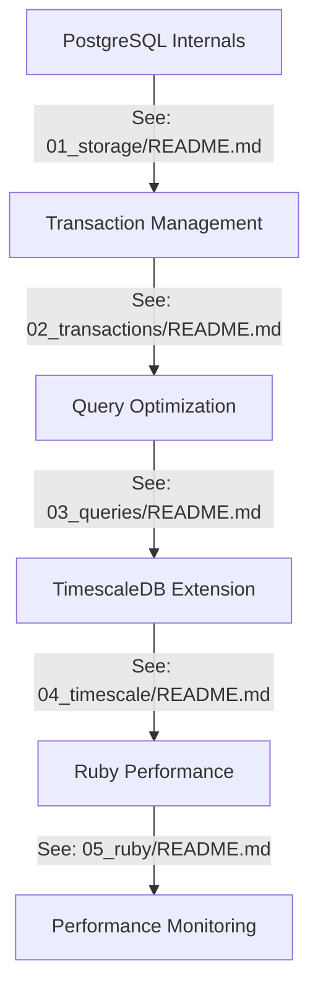

# 🚀 Ruby PostgreSQL Performance Workshop

Welcome to an interactive journey into PostgreSQL optimization for Rubyists! This self-paced workshop will take you from understanding PostgreSQL internals to mastering TimescaleDB for time-series data. Get ready to level up your database skills! 🎯

 with big sparkly eyes and rosy cheeks, wearing a tiny crown made of red felt")

## 📚 Workshop Structure

This workshop is organized into progressive modules, each building upon the previous ones:



The [troubleshooting section](TROUBLESHOOTING.md) is optional and can be accessed at any time.

The [glossary](GLOSSARY.md) is also optional and can be accessed at any time.

## 🎯 Prerequisites

```ruby
knowledge = {
  ruby: "Comfortable with Ruby and ActiveRecord",
  postgres: "Basic SQL knowledge",
  tools: ["psql", "ruby 3.0+", "postgres 15+"]
}

raise "Need to level up first! 💪" unless knowledge.values.all?(&:present?)
```

## 🛠 Setup

1. Clone this repository:
```bash
git clone https://github.com/timescale/postgresql-performance-for-rubyists
cd postgresql-performance-for-rubyists
```

2. Set up your database:

You can use Docker to setup a TimescaleDB database:

```bash
docker run -d --rm -it -e POSTGRES_HOST_AUTH_METHOD=trust -e POSTGRES_USER=$USER -e POSTGRES_DATABASE=workshop_db -p 5432:5432 timescale/timescaledb-ha:pg17
```
Then test if it's working:

```bash
psql -h 0.0.0.0 -d workshop_db
```

```ruby
# In your terminal
export DATABASE_URL="postgres://${USER}@0.0.0.0:5432/workshop_db"
```

3. Verify your setup:
```ruby
ruby examples/01_storage/practice_storage.rb
# If you see table creation outputs, you're good to go! 🎉
```

## 📖 Core Concepts

Before diving into specific modules, familiarize yourself with these fundamental concepts:

### 1. PostgreSQL Architecture
- **[Process & Memory Structure](examples/01_storage/README.md#process-structure)**
- **[Storage Layout](examples/01_storage/README.md#storage-layout)**
- **[Buffer Management](examples/01_storage/README.md#buffer-management)**

### 2. Data Consistency
- **[Transaction Management](examples/02_transactions/README.md#transaction-management)**
- **[Concurrency Control](examples/02_transactions/README.md#concurrency-control)**
- **[ACID Properties](GLOSSARY.md#acid)**

### 3. Performance Foundations
- **[Query Planning](examples/03_queries/README.md#query-planning)**
- **[Index Types](examples/03_queries/README.md#index-types)**
- **[Statistics Collection](examples/03_queries/README.md#statistics)**

For detailed definitions of terms used throughout the workshop, refer to our [Glossary](GLOSSARY.md).

## 📚 Learning Path

### 1. [PostgreSQL Internals](examples/01_storage/README.md)
Learn how PostgreSQL physically stores and manages data:
- Storage layout and TOAST
- WAL mechanics
- Buffer management
- Table structure optimization

### 2. [Transaction Management](examples/02_transactions/README.md)
Master concurrency control and transaction isolation:
- ACID properties in practice
- Isolation levels
- Deadlock handling
- Transaction patterns

### 3. [Query Optimization](examples/03_queries/README.md)
Optimize query performance:
- Query planning and execution
- Index selection and usage
- Join optimization
- Performance monitoring

### 4. [TimescaleDB Extension](examples/04_timescale/README.md)
Handle time-series data efficiently:
- Hypertables and chunks
- Continuous aggregates
- Data retention policies
- Compression strategies

### 5. [Ruby Performance](examples/05_ruby/README.md)
Optimize Ruby and ActiveRecord usage:
- Batch processing
- Memory management
- Query optimization
- Connection pooling

## 🎮 Interactive Learning Tips

1. **Experiment Freely**

```ruby
def learning_approach
  loop do
    try_something_new
    break if it_works?
    learn_from_failure
  end
end
```

2. **Break Things Purposefully**

```ruby
def controlled_chaos
  begin
    push_the_limits
  rescue PostgreSQL::Error => e
    understand_why_it_failed(e)
  end
end
```

## 🤝 Contributing

Found a bug? Have an improvement idea? Want to add more examples? We love contributions!

```ruby
module Contributor
  extend Enthusiasm
  
  def self.how_to_help
    [
      "🐛 Report bugs",
      "✨ Add new examples",
      "📚 Improve documentation",
      "🎨 Share your creative solutions"
    ]
  end
end
```

## 📘 Additional Resources

- [PostgreSQL Documentation](https://www.postgresql.org/docs/)
- [TimescaleDB Documentation](https://docs.timescale.com/)
- [Ruby on Rails Active Record Query Interface](https://guides.rubyonrails.org/active_record_querying.html)
- [Workshop Troubleshooting Guide](TROUBLESHOOTING.md) - For common issues, solutions, and performance comparisons

## About this Workshop

This workshop is given at the following conferences:
- [Ruby Community Conference 2025](https://rubycommunityconference.com/)
- [Tropical On Rails 2025](https://tropicalonrails.com/)

If you're interested in running this workshop for your conference or meetup, please [contact me](mailto:jonatas@timescale.com).

Happy learning! 🚀✨
