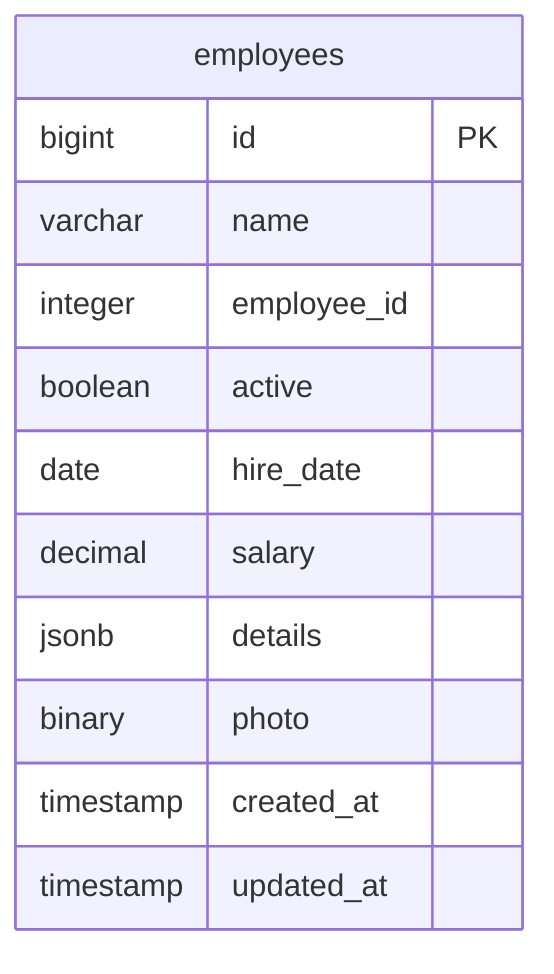
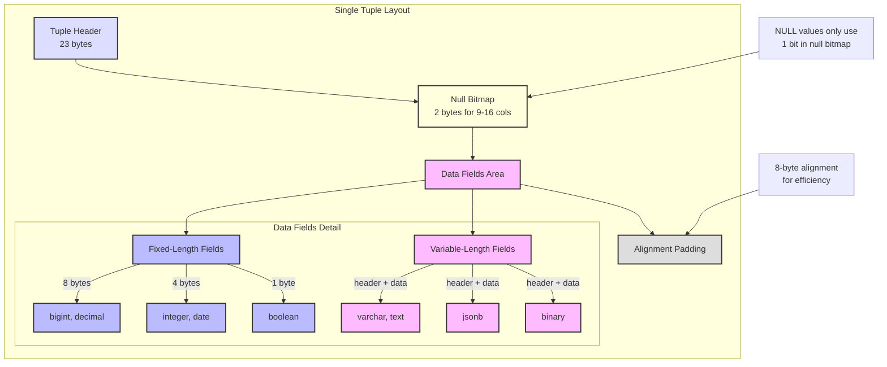
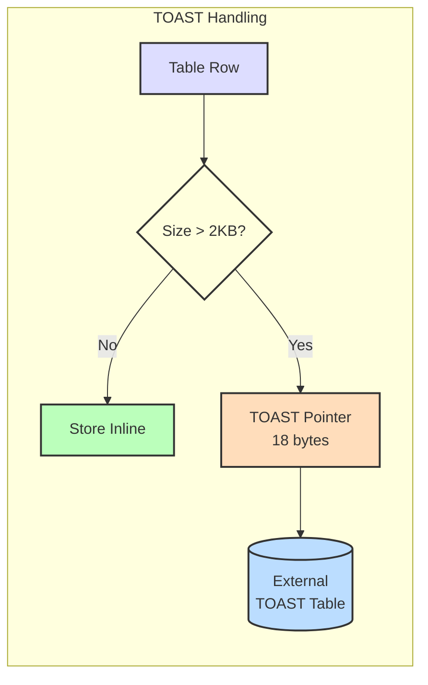
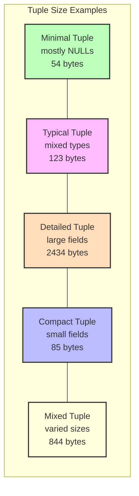
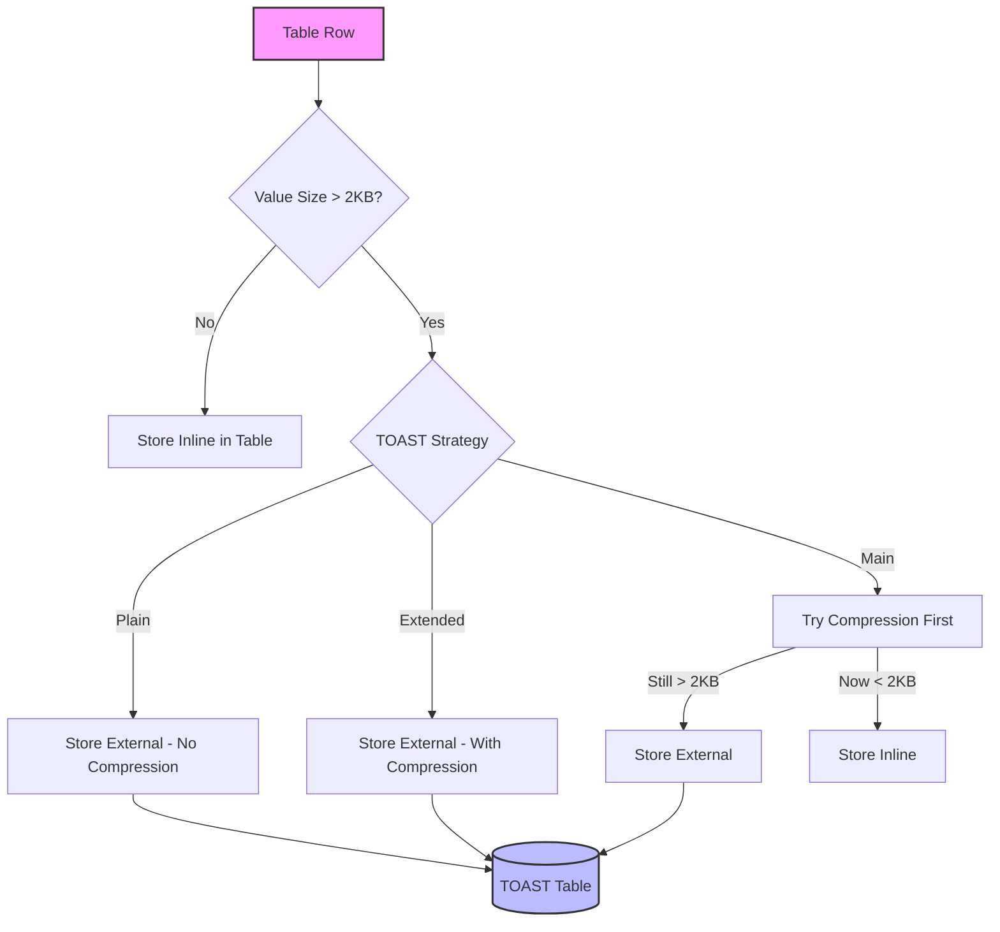
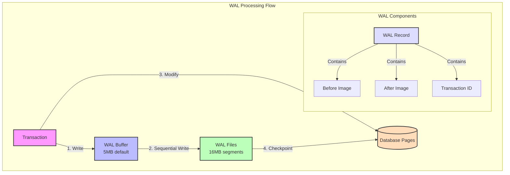

# PostgreSQL Storage Deep Dive

This module provides a practical exploration of PostgreSQL's storage mechanisms, progressing from basic concepts to advanced optimization techniques. For definitions of terms used in this module, refer to our [Glossary](../../GLOSSARY.md).

## Prerequisites

Before starting this module, ensure you understand:
- [ACID Properties](../../GLOSSARY.md#acid)
- [WAL (Write-Ahead Log)](../../GLOSSARY.md#wal)
- [TOAST](../../GLOSSARY.md#toast)

## Learning Path

1. **Basic Storage Concepts** (practice_storage.rb)
   - Understanding 8KB pages
   - Basic tuple structure
   - Data type storage requirements
   - Simple storage examples

2. **Tuple Deep Dive** (practice_tuple.rb)
   - Detailed tuple analysis
   - NULL handling
   - Alignment requirements
   - Real-world tuple patterns

3. **TOAST Storage** (practice_storage.rb, practice_tuple.rb)
   - Large value handling
   - TOAST thresholds
   - Storage strategies
   - Compression options

4. **WAL and Performance** (practice_wal.rb)
   - Write-Ahead Log basics
   - Transaction impacts
   - Checkpoint behavior
   - Performance optimization

## Related Concepts

- [Query Planning](../03_queries/README.md#query-planning)
- [Transaction Management](../02_transactions/README.md#transaction-management)
- [Buffer Management](../../GLOSSARY.md#buffer-management)

## Database Structure



## Module Overview

In this module, you'll explore:
1. How PostgreSQL organizes data in tuples (rows)
2. How different data types affect storage and alignment
3. How PostgreSQL handles large values using TOAST
4. The relationship between theoretical and actual storage sizes

You can run the examples by running `bundle exec ruby examples/01_storage/practice_storage.rb`
and `bundle exec ruby examples/01_storage/practice_tuple.rb`.

## PostgreSQL Storage Layout

### 1. Basic Page Layout (8KB)
Every PostgreSQL table is stored as an array of 8KB pages. Here's a simplified view of how a single page is organized:

```ascii
+--------------------------------+ 0
|           Page Header          |
|             (24B)              |
+--------------------------------+ 24
|         Item Pointers          |
| (4B each, points to row data) |
+--------------------------------+ varies
|                                |
|          Free Space            |
|     (available for growth)     |
|                                |
+--------------------------------+ varies
|    Row 1 Data                  |
|    - Header (23B)             |
|    - Null bitmap              |
|    - User data                |
|    - Alignment padding        |
+--------------------------------+
|    Row 2 Data                  |
|    - Header (23B)             |
|    - Null bitmap              |
|    - User data                |
|    - Alignment padding        |
+--------------------------------+
|           More Rows...         |
+--------------------------------+
|    Special Space (optional)    |
|    (index data, etc.)         |
+--------------------------------+ 8192
```

For more details on specific concepts, see:
- [Heap](../../GLOSSARY.md#heap)
- [MVCC](../../GLOSSARY.md#mvcc)
- [VACUUM](../../GLOSSARY.md#vacuum)

## Next Steps

After completing this module, proceed to:
1. [Transaction Management](../02_transactions/README.md) to learn how PostgreSQL handles concurrent access
2. [Query Optimization](../03_queries/README.md) to understand how storage affects query performance

## PostgreSQL Storage Layout

### 1. Basic Page Layout (8KB)
Every PostgreSQL table is stored as an array of 8KB pages. Here's a simplified view of how a single page is organized:

```ascii
+--------------------------------+ 0
|           Page Header          |
|             (24B)              |
+--------------------------------+ 24
|         Item Pointers          |
| (4B each, points to row data) |
+--------------------------------+ varies
|                                |
|          Free Space            |
|     (available for growth)     |
|                                |
+--------------------------------+ varies
|    Row 1 Data                  |
|    - Header (23B)             |
|    - Null bitmap              |
|    - User data                |
|    - Alignment padding        |
+--------------------------------+
|    Row 2 Data                  |
|    - Header (23B)             |
|    - Null bitmap              |
|    - User data                |
|    - Alignment padding        |
+--------------------------------+
|           More Rows...         |
+--------------------------------+
|    Special Space (optional)    |
|    (index data, etc.)         |
+--------------------------------+ 8192
```

Key Components:
1. Page Header (24B): Metadata about the page
2. Item Pointers: Array pointing to tuple locations
3. Free Space: Available for new/updated tuples
4. Tuple Data: Actual row data with structure:
   - Header (23B)
   - Null bitmap (2B for 9-16 cols)
   - Column values
   - Alignment padding
5. TOAST Pointers: For values > 2KB

### 2. Tuple Structure
Each row (tuple) in a table follows this structure, optimized for both storage efficiency and quick access:



### 3. Data Field Types and Sizes

```mermaid
graph TD
    subgraph "Fixed-Length Types"
        direction LR
        F1[bigint<br/>8 bytes] --- F2[integer<br/>4 bytes]
        F2 --- F3[boolean<br/>1 byte]
        F3 --- F4[date<br/>4 bytes]
        F4 --- F5[decimal<br/>8 bytes]
        F5 --- F6[timestamp<br/>8 bytes]
    end

    subgraph "Variable-Length Types"
        direction LR
        V1[varchar<br/>variable + metadata] --- V2[jsonb<br/>variable + metadata]
        V2 --- V3[binary<br/>variable + metadata]
    end

    style F1 fill:#bbf,stroke:#333,stroke-width:2px
    style F2 fill:#bbf,stroke:#333,stroke-width:2px
    style F3 fill:#bbf,stroke:#333,stroke-width:2px
    style F4 fill:#bbf,stroke:#333,stroke-width:2px
    style F5 fill:#bbf,stroke:#333,stroke-width:2px
    style F6 fill:#bbf,stroke:#333,stroke-width:2px
    style V1 fill:#fbf,stroke:#333,stroke-width:2px
    style V2 fill:#fbf,stroke:#333,stroke-width:2px
    style V3 fill:#fbf,stroke:#333,stroke-width:2px
```

PostgreSQL optimizes storage by using different strategies for fixed and variable-length types:



### 4. TOAST Storage System
Large values (>2KB) are handled by PostgreSQL's TOAST (The Oversized-Attribute Storage Technique) system:



### Storage Size Examples
Real-world measurements from our test database showing how different types of rows consume space:



### Key Points About Storage

1. **Page Layout**:
   - Fixed 8KB size
   - Contains header, pointers, and tuple data
   - Special area for index-specific information

2. **Tuple Structure**:
   - Fixed header (23 bytes)
   - Null bitmap size depends on column count
   - Data fields with alignment requirements
   - Padding ensures proper alignment

3. **Data Types Impact**:
   - Fixed-length types have predictable sizes
   - Variable-length types need extra metadata
   - NULL values only use 1 bit in null bitmap
   - Large values use TOAST storage

4. **TOAST System**:
   - Handles values larger than 2KB
   - Uses pointer in main tuple (18 bytes)
   - Supports compression
   - External storage in separate table

## Part 1: Understanding Tuples and Page Layout

In PostgreSQL, each row in a table is called a "tuple". These tuples are stored in fixed-size pages (blocks) of 8KB by default. Understanding tuple structure is crucial for:
- Optimizing table design
- Understanding storage overhead
- Managing data alignment
- Predicting storage requirements

### Tuple Structure

A tuple contains:
- Header data (23 bytes)
- Null bitmap (variable size)
- User data (actual column values)
- Alignment padding

```ascii
+--------------------------------+
|        Tuple Header            |
|          (23 bytes)            |
+--------------------------------+
|        Null Bitmap             |
|      (2+ bytes, varies)        |
+--------------------------------+
|                                |
|        User Data               |
|     (Column Values)            |
|                                |
+--------------------------------+
|     Alignment Padding          |
|    (as needed for 8-byte       |
|     boundary alignment)        |
+--------------------------------+
```

Now, filling it with some hypothetical data for an employee record:

```ascii
+--------------------------------+
|        Tuple Header            |
|          (23 bytes)            |
+--------------------------------+
|        Null Bitmap             |
|     (2 bytes - 00000000)       |
+--------------------------------+
|      id: 1 (bigint)            |
|          (8 bytes)             |
+--------------------------------+
|    name: "John Smith"          |
|    (12 bytes + 4 byte header)  |
+--------------------------------+
|    employee_id: 1001           |
|          (4 bytes)             |
+--------------------------------+
|    active: true                |
|          (1 byte)              |
+--------------------------------+
|    hire_date: 2024-03-20       |
|          (4 bytes)             |
+--------------------------------+
|    salary: 75000.00            |
|          (8 bytes)             |
+--------------------------------+
|    details: {"role": "dev"}    |
|    (19 bytes + 4 byte header)  |
+--------------------------------+
|    photo: null                 |
|          (0 bytes)             |
+--------------------------------+
|    created_at: timestamp       |
|          (8 bytes)             |
+--------------------------------+
|    updated_at: timestamp       |
|          (8 bytes)             |
+--------------------------------+
|     Alignment Padding          |
|          (3 bytes)             |
+--------------------------------+

Total size: 108 bytes

Storage Breakdown:
1. Header (23B): Contains metadata like tuple length
2. Null Bitmap (2B): One bit per column (photo is null)
3. Data Fields:
   - Fixed-length fields are stored directly
   - Variable-length fields (name, details) include a 4-byte header
   - Timestamps stored as microseconds since 2000
4. Padding (3B): Added to maintain 8-byte alignment

Note: This example shows an "ideal" case where all values fit in the main tuple. 
Larger values (>2KB) would be stored in TOAST tables with only a pointer here.
```

### Key Learnings from Tuple Analysis

From our practical examples in `practice_tuple.rb`, we observed:

1. **Basic Tuple Overhead**:
   - Header: 23 bytes fixed
   - Null bitmap: 2 bytes for our 9-column table
   - Actual measurements from different tuple types:
     * Minimal tuple (mostly NULLs): 54 bytes
     * Typical tuple (mixed types): 123 bytes
     * Detailed tuple (large fields): 2434 bytes
     * Compact tuple (small fields): 85 bytes
     * Mixed tuple (varied sizes): 844 bytes

2. **Data Type Storage Patterns**:
   ```
   Fixed-length types (from our examples):
   - integer (employee_id): 4 bytes
   - boolean (active): 1 byte
   - date (hire_date): 4 bytes
   - decimal (salary): 8 bytes
   - timestamp (created_at/updated_at): 8 bytes each

   Variable-length types (from our examples):
   - text/varchar (name): 8-60 bytes in our tests
   - jsonb (details): 19-1316 bytes depending on content
   - binary (photo): 500-1000 bytes in our tests
   ```

3. **Storage Efficiency Insights**:
   - NULL values only consume space in the null bitmap
   - Our table uses 4 TOAST-capable columns (name, details, photo, text fields)
   - A single 8KB page can hold multiple records (5 in our test)
   - Index overhead adds significant space (16KB in our case)

### Practical Exercises - Tuple Analysis

1. **Null Bitmap Investigation**
   ```ruby
   # Modify the employees table to test null bitmap sizes:
   # Current size: 2 bytes for 9 columns
   # Add columns in multiples of 8 to observe changes:
   t.string :department
   t.string :title
   t.string :location
   t.string :manager
   t.string :team
   t.string :project
   t.string :role
   ```

2. **Alignment Impact**
   ```ruby
   # Reorder our existing columns to test alignment:
   # Current order: string, integer, boolean, date, decimal, jsonb, binary, timestamps
   # Try alternative order:
   t.boolean :active       # 1-byte
   t.date    :hire_date    # 4-byte
   t.string  :name         # variable
   t.decimal :salary       # 8-byte
   # Compare storage sizes
   ```

3. **TOAST Threshold Testing**
   ```ruby
   # Use our existing photo and details fields:
   Employee.create!(
     name: "Test Employee",
     photo: "A" * 2048,  # Just under TOAST threshold
     details: { data: "B" * 2048 }  # Test JSONB TOAST
   )
   ```

## Part 2: TOAST Storage

PostgreSQL uses a fixed page size (commonly 8KB), but needs to store values that are potentially much larger. The TOAST system allows PostgreSQL to store and manipulate large values that exceed the page size efficiently.

### TOAST Behavior



### TOAST Analysis from Practice

From our examples:
- Large JSON (1316 bytes): Stored inline
- Photo (1000 bytes): Stored inline
- Very large text (>2KB): Moved to TOAST
- Actual table size: 8192 bytes
- TOAST columns: 4 (name, details, photo, text fields)

### Practical Exercises - TOAST

1. **TOAST Threshold Testing**
   ```ruby
   # Create records with increasing field sizes:
   # - 1KB, 1.5KB, 2KB, 2.5KB, 3KB
   # Observe when TOAST kicks in
   ```

2. **TOAST Strategy Impact**
   ```ruby
   # Compare storage for the same large value using:
   # - PLAIN strategy
   # - EXTENDED strategy
   # - MAIN strategy
   ```

3. **Compression Effectiveness**
   ```ruby
   # Store the same size data with:
   # - Random bytes (less compressible)
   # - Repeated pattern (more compressible)
   # Compare TOAST storage size
   ```

## Part 3: Write-Ahead Log (WAL) Impact

PostgreSQL's Write-Ahead Logging (WAL) is crucial for ensuring data durability and consistency. Our practical tests revealed important insights about WAL's behavior and its performance implications.

### WAL Architecture and Flow



### Key Performance Metrics from Our Tests

1. **WAL Generation by Operation Type**
   ```ruby
   # Single Row Insert
   # WAL: ~400 bytes, Execution: ~20ms
   User.create!(name: "Test User")
   
   # Batch Insert (100 rows)
   # WAL: ~23KB, Execution: ~8ms
   User.insert_all!(batch_records)  # ~230 bytes/row
   
   # Large Update
   # WAL: ~140KB, Execution: ~2ms
   User.update_all(description: large_text)
   
   # Delete Operation
   # WAL: ~6.4KB, Execution: <1ms
   User.delete_all
   ```

2. **Transaction Impact**
   ```ruby
   # Individual Operations
   # WAL: ~4KB per transaction
   10.times { User.create!(name: "User #{i}") }
   
   # Grouped Transaction
   # WAL: ~4.3KB total
   ActiveRecord::Base.transaction do
     10.times { User.create!(name: "User #{i}") }
   end
   ```

3. **WAL Compression Effects**
   ```ruby
   # Compressible Data (repeated text)
   # WAL: ~12.5KB
   record.update!(description: "A" * 1000)
   
   # Random Data (same size)
   # WAL: ~69.4KB
   record.update!(description: SecureRandom.hex(500))
   ```

4. **TOAST Impact on WAL**
   ```
   Data Size | WAL Generated
   ----------|---------------
   1000 bytes|  1.23 KB
   2000 bytes|  264 bytes
   4000 bytes|  288 bytes
   8000 bytes|  328 bytes
   ```

### Performance Optimization Strategies

1. **Transaction Management**
   ```ruby
   # ✅ Efficient: Group related operations
   ActiveRecord::Base.transaction do
     user.update!(status: 'active')
     user.audit_logs.create!(action: 'activation')
     user.notifications.create!(type: 'welcome')
   end
   
   # ❌ Inefficient: Separate transactions
   user.update!(status: 'active')
   user.audit_logs.create!(action: 'activation')
   user.notifications.create!(type: 'welcome')
   ```

2. **Batch Processing**
   ```ruby
   # ✅ Efficient: Batch insert
   User.insert_all!(users_data)  # ~230 bytes WAL per row
   
   # ❌ Inefficient: Individual inserts
   users_data.each { |data| User.create!(data) }  # ~400 bytes WAL per row
   ```

3. **Large Updates**
   ```ruby
   # ✅ Efficient: Targeted updates
   User.where(status: 'inactive')
      .update_all(status: 'active')  # Single WAL record
   
   # ❌ Inefficient: Individual updates
   User.where(status: 'inactive')
      .find_each { |u| u.update!(status: 'active') }  # WAL record per update
   ```

### Key Performance Indicators

1. **WAL Generation Rates**
   ```
   Operation Type     | Normal Range  | Warning Level
   ------------------|---------------|---------------
   Single Inserts    | 200-400B/op   | >500B/op
   Batch Inserts     | 200-250B/row  | >300B/row
   Updates           | 1-2KB/row     | >5KB/row
   Deletes          | 50-100B/row   | >200B/row
   ```

2. **Cache Hit Ratios**
   ```
   Quality Level | Hit Ratio
   -------------|----------
   Excellent    | >99%
   Good         | 95-99%
   Poor         | <95%
   ```

3. **Checkpoint Impact**
   ```
   Metric           | Target Range | Warning Level
   -----------------|--------------|---------------
   Duration        | <1s          | >2s
   Write Time      | <500ms       | >1s
   Sync Time       | <100ms       | >200ms
   ```

### Common Performance Pitfalls

1. **Transaction Size**
   - Too small: High WAL overhead per operation
   - Too large: Recovery time impact, memory pressure
   - Optimal: Group related operations, target 100-1000 operations per transaction

2. **Data Patterns**
   - Compressible data benefits from WAL compression (5.5x reduction observed)
   - Random/binary data generates more WAL
   - TOAST threshold crossings can impact WAL size

3. **Concurrency**
   - High contention increases WAL generation
   - Connection pool size affects concurrent WAL writers
   - Transaction isolation level impacts WAL size

### Monitoring WAL Performance

```ruby
# Example using our WalAnalyzer
result = WalAnalyzer.measure_wal_generation do
  # Your database operations
end

puts "WAL Generated: #{result[:wal_bytes]} bytes"
puts "Rate: #{result[:bytes_per_second]} bytes/sec"
puts "Cache Hit Ratio: #{result[:stats_diff][:io][:hit_ratio]}%"
```

### Best Practices Summary

1. **Data Operations**
   - Use batch operations when possible
   - Group related operations in transactions
   - Consider data compression patterns
   - Monitor TOAST thresholds

2. **Configuration**
   - Tune `wal_buffers` based on concurrent connections
   - Adjust `checkpoint_timeout` for write patterns
   - Consider `wal_compression` for compressible data
   - Monitor `max_wal_size` vs. write volume

3. **Application Design**
   - Use connection pooling effectively
   - Implement retry mechanisms for conflicts
   - Monitor transaction duration
   - Use appropriate isolation levels

### Learning Exercises

1. **WAL Generation Analysis**
   ```ruby
   # Run the practice_wal.rb script
   ruby examples/01_storage/practice_wal.rb
   
   # Observe:
   # - WAL bytes per operation type
   # - Transaction statistics
   # - I/O patterns
   # - Cache hit ratios
   ```

2. **Optimization Practice**
   ```ruby
   # Compare WAL generation:
   # 1. Individual operations
   # 2. Batched operations
   # 3. Mixed transactions
   # 4. Concurrent operations
   ```

3. **Performance Monitoring**
   ```ruby
   # Monitor key metrics:
   # - WAL generation rates
   # - Checkpoint frequency
   # - Buffer cache efficiency
   # - Transaction throughput
   ```

## Learning Objectives Checklist

After completing this module, you should understand:
- [ ] Basic tuple structure and overhead
- [ ] How NULL values impact storage
- [ ] Alignment requirements for different data types
- [ ] When and how TOAST storage is triggered
- [ ] The relationship between theoretical and actual storage sizes
- [ ] WAL's impact on storage and performance

## Files in this Module

1. `storage_explorer.rb`: Utilities for analyzing PostgreSQL storage
2. `practice_tuple.rb`: Hands-on exercises with tuple storage concepts
3. `practice_storage.rb`: Examples of general storage concepts
4. `practice_wal.rb`: Practical exercises demonstrating WAL behavior

### WAL Analysis Examples

The `practice_wal.rb` file provides hands-on examples for understanding WAL behavior:

1. **WAL Generation Measurement**:
   ```ruby
   WalAnalyzer.measure_wal_generation do
     # Your database operations here
   end
   ```

2. **Scenarios Covered**:
   - Single row operations
   - Batch inserts
   - Large updates
   - Delete operations
   - Complex transactions
   - Checkpoint behavior

3. **Key Metrics**:
   - WAL bytes generated per operation
   - Checkpoint duration and statistics
   - WAL and checkpoint settings

4. **Sample Output**:
   ```
   Scenario: Batch Insert (100 rows)
   --------------------------------------------------
   WAL bytes generated: 128.45 KB
   
   Scenario: Large Update
   --------------------------------------------------
   WAL bytes generated: 256.78 KB
   
   Checkpoint Statistics:
   - Duration: 0.123 seconds
   - Buffers written: 1250
   - Buffers allocated: 5000
   ```

5. **Learning Objectives**:
   - Understand WAL generation patterns
   - Compare operation efficiency
   - Analyze checkpoint impact
   - Monitor WAL settings

### WAL Best Practices

From our practical examples, we learned:

1. **Operation Efficiency**:
   ```ruby
   # More efficient (less WAL)
   ActiveRecord::Base.transaction do
     100.times { create_record }
   end
   
   # Less efficient (more WAL)
   100.times do
     ActiveRecord::Base.transaction do
       create_record
     end
   end
   ```

2. **Checkpoint Management**:
   ```ruby
   # Monitor checkpoint impact
   checkpoint_info = WalAnalyzer.analyze_checkpoints
   puts "Duration: #{checkpoint_info[:duration]} seconds"
   ```

3. **WAL Settings Analysis**:
   ```ruby
   # View current WAL configuration
   WalAnalyzer.current_settings.each do |setting|
     puts "#{setting['name']}: #{setting['setting']}"
   end
   ```

### Key WAL Observations

1. **Operation Impact**:
   - Single row operations: ~1-2KB WAL per operation
   - Batch operations: ~0.5KB WAL per row
   - Large updates: WAL size proportional to changed data
   - Deletes: Minimal WAL for simple deletes

2. **Transaction Benefits**:
   - Grouped operations reduce total WAL
   - Single commit record for multiple changes
   - Better crash recovery properties

3. **Checkpoint Considerations**:
   - Regular checkpoints reduce recovery time
   - More frequent checkpoints = more I/O
   - Balance needed between durability and performance

## Additional Resources

- [PostgreSQL Documentation: Database Page Layout](https://www.postgresql.org/docs/current/storage-page-layout.html)
- [PostgreSQL Documentation: TOAST](https://www.postgresql.org/docs/current/storage-toast.html)
- [PostgreSQL Documentation: Database Physical Storage](https://www.postgresql.org/docs/current/storage.html)
