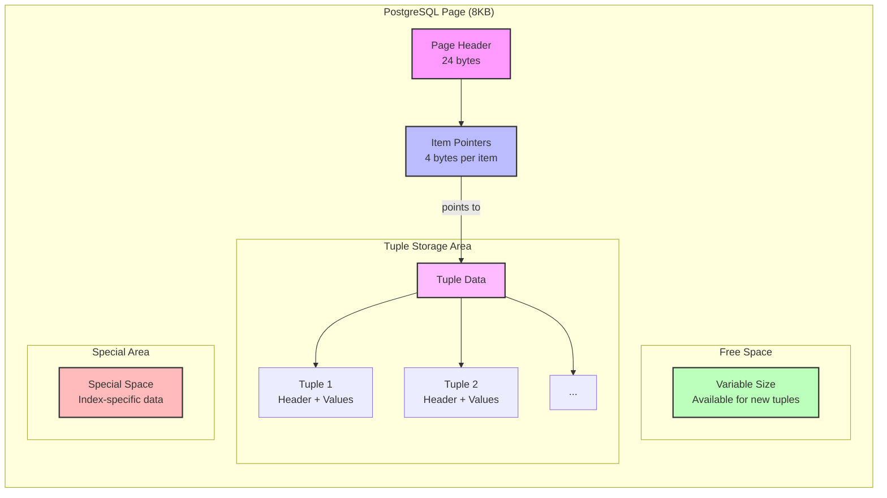

# PostgreSQL Storage Deep Dive

This module focuses on understanding PostgreSQL's physical storage mechanisms and how different data types and sizes affect storage organization. Through practical examples, you'll learn how PostgreSQL organizes data at the lowest level and how this impacts database performance and storage efficiency.

## Database Structure


## Module Overview

In this module, you'll explore:
1. How PostgreSQL organizes data in tuples (rows)
2. How different data types affect storage and alignment
3. How PostgreSQL handles large values using TOAST
4. The relationship between theoretical and actual storage sizes

## Part 1: Understanding Tuples and Page Layout

In PostgreSQL, each row in a table is called a "tuple". These tuples are stored in fixed-size pages (blocks) of 8KB by default. Understanding tuple structure is crucial for:
- Optimizing table design
- Understanding storage overhead
- Managing data alignment
- Predicting storage requirements

### Tuple Structure

A tuple contains:
- Header data (23 bytes)
- Null bitmap (variable size)
- User data (actual column values)
- Alignment padding

Here's a representation of a PostgreSQL page layout:



### Key Learnings from Tuple Analysis

From our practical examples in `practice_tuple.rb`, we observed:

1. **Basic Tuple Overhead**:
   - Header: 23 bytes fixed
   - Null bitmap: 2 bytes for our 9-column table
   - Actual measurements from different tuple types:
     * Minimal tuple (mostly NULLs): 54 bytes
     * Typical tuple (mixed types): 123 bytes
     * Detailed tuple (large fields): 2434 bytes
     * Compact tuple (small fields): 85 bytes
     * Mixed tuple (varied sizes): 844 bytes

2. **Data Type Storage Patterns**:
   ```
   Fixed-length types (from our examples):
   - integer (employee_id): 4 bytes
   - boolean (active): 1 byte
   - date (hire_date): 4 bytes
   - decimal (salary): 8 bytes
   - timestamp (created_at/updated_at): 8 bytes each

   Variable-length types (from our examples):
   - text/varchar (name): 8-60 bytes in our tests
   - jsonb (details): 19-1316 bytes depending on content
   - binary (photo): 500-1000 bytes in our tests
   ```

3. **Storage Efficiency Insights**:
   - NULL values only consume space in the null bitmap
   - Our table uses 4 TOAST-capable columns (name, details, photo, text fields)
   - A single 8KB page can hold multiple records (5 in our test)
   - Index overhead adds significant space (16KB in our case)

### Practical Exercises - Tuple Analysis

1. **Null Bitmap Investigation**
   ```ruby
   # Modify the employees table to test null bitmap sizes:
   # Current size: 2 bytes for 9 columns
   # Add columns in multiples of 8 to observe changes:
   t.string :department
   t.string :title
   t.string :location
   t.string :manager
   t.string :team
   t.string :project
   t.string :role
   ```

2. **Alignment Impact**
   ```ruby
   # Reorder our existing columns to test alignment:
   # Current order: string, integer, boolean, date, decimal, jsonb, binary, timestamps
   # Try alternative order:
   t.boolean :active       # 1-byte
   t.date    :hire_date    # 4-byte
   t.string  :name         # variable
   t.decimal :salary       # 8-byte
   # Compare storage sizes
   ```

3. **TOAST Threshold Testing**
   ```ruby
   # Use our existing photo and details fields:
   Employee.create!(
     name: "Test Employee",
     photo: "A" * 2048,  # Just under TOAST threshold
     details: { data: "B" * 2048 }  # Test JSONB TOAST
   )
   ```

## Part 2: TOAST Storage

PostgreSQL uses a fixed page size (commonly 8KB), but needs to store values that are potentially much larger. The TOAST system allows PostgreSQL to store and manipulate large values that exceed the page size efficiently.

### TOAST Behavior


### TOAST Analysis from Practice

From our examples:
- Large JSON (1316 bytes): Stored inline
- Photo (1000 bytes): Stored inline
- Very large text (>2KB): Moved to TOAST
- Actual table size: 8192 bytes
- TOAST columns: 4 (name, details, photo, text fields)

### Practical Exercises - TOAST

1. **TOAST Threshold Testing**
   ```ruby
   # Create records with increasing field sizes:
   # - 1KB, 1.5KB, 2KB, 2.5KB, 3KB
   # Observe when TOAST kicks in
   ```

2. **TOAST Strategy Impact**
   ```ruby
   # Compare storage for the same large value using:
   # - PLAIN strategy
   # - EXTENDED strategy
   # - MAIN strategy
   ```

3. **Compression Effectiveness**
   ```ruby
   # Store the same size data with:
   # - Random bytes (less compressible)
   # - Repeated pattern (more compressible)
   # Compare TOAST storage size
   ```

## Learning Objectives Checklist

After completing this module, you should understand:
- [ ] Basic tuple structure and overhead
- [ ] How NULL values impact storage
- [ ] Alignment requirements for different data types
- [ ] When and how TOAST storage is triggered
- [ ] The relationship between theoretical and actual storage sizes

## Files in this Module

1. `storage_explorer.rb`: Utilities for analyzing PostgreSQL storage
2. `practice_tuple.rb`: Hands-on exercises with tuple storage concepts
3. `practice_storage.rb`: Examples of general storage concepts

## Additional Resources

- [PostgreSQL Documentation: Database Page Layout](https://www.postgresql.org/docs/current/storage-page-layout.html)
- [PostgreSQL Documentation: TOAST](https://www.postgresql.org/docs/current/storage-toast.html)
- [PostgreSQL Documentation: Database Physical Storage](https://www.postgresql.org/docs/current/storage.html)
