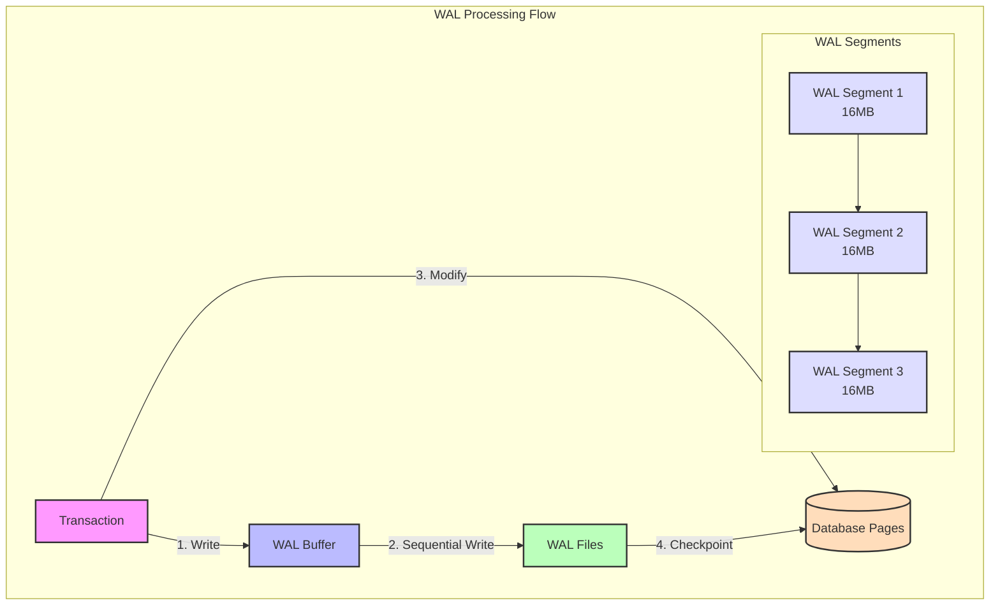

# PostgreSQL Storage Deep Dive

This module focuses on understanding PostgreSQL's physical storage mechanisms and how different data types and sizes affect storage organization. Through practical examples, you'll learn how PostgreSQL organizes data at the lowest level and how this impacts database performance and storage efficiency.

## Database Structure


## Module Overview

In this module, you'll explore:
1. How PostgreSQL organizes data in tuples (rows)
2. How different data types affect storage and alignment
3. How PostgreSQL handles large values using TOAST
4. The relationship between theoretical and actual storage sizes

## PostgreSQL Storage Layout

### 1. Basic Page Structure (8KB)
Every PostgreSQL table is stored as an array of 8KB pages. Here's how a single page is organized:


### 2. Tuple Structure
Each row (tuple) in a table follows this structure, optimized for both storage efficiency and quick access:


### 3. Data Field Types and Sizes
PostgreSQL optimizes storage by using different strategies for fixed and variable-length types:


### 4. TOAST Storage System
Large values (>2KB) are handled by PostgreSQL's TOAST (The Oversized-Attribute Storage Technique) system:


### Storage Size Examples
Real-world measurements from our test database showing how different types of rows consume space:


### Key Points About Storage

1. **Page Layout**:
   - Fixed 8KB size
   - Contains header, pointers, and tuple data
   - Special area for index-specific information

2. **Tuple Structure**:
   - Fixed header (23 bytes)
   - Null bitmap size depends on column count
   - Data fields with alignment requirements
   - Padding ensures proper alignment

3. **Data Types Impact**:
   - Fixed-length types have predictable sizes
   - Variable-length types need extra metadata
   - NULL values only use 1 bit in null bitmap
   - Large values use TOAST storage

4. **TOAST System**:
   - Handles values larger than 2KB
   - Uses pointer in main tuple (18 bytes)
   - Supports compression
   - External storage in separate table

## Part 1: Understanding Tuples and Page Layout

In PostgreSQL, each row in a table is called a "tuple". These tuples are stored in fixed-size pages (blocks) of 8KB by default. Understanding tuple structure is crucial for:
- Optimizing table design
- Understanding storage overhead
- Managing data alignment
- Predicting storage requirements

### Tuple Structure

A tuple contains:
- Header data (23 bytes)
- Null bitmap (variable size)
- User data (actual column values)
- Alignment padding

Here's a representation of a PostgreSQL page layout:


### Key Learnings from Tuple Analysis

From our practical examples in `practice_tuple.rb`, we observed:

1. **Basic Tuple Overhead**:
   - Header: 23 bytes fixed
   - Null bitmap: 2 bytes for our 9-column table
   - Actual measurements from different tuple types:
     * Minimal tuple (mostly NULLs): 54 bytes
     * Typical tuple (mixed types): 123 bytes
     * Detailed tuple (large fields): 2434 bytes
     * Compact tuple (small fields): 85 bytes
     * Mixed tuple (varied sizes): 844 bytes

2. **Data Type Storage Patterns**:
   ```
   Fixed-length types (from our examples):
   - integer (employee_id): 4 bytes
   - boolean (active): 1 byte
   - date (hire_date): 4 bytes
   - decimal (salary): 8 bytes
   - timestamp (created_at/updated_at): 8 bytes each

   Variable-length types (from our examples):
   - text/varchar (name): 8-60 bytes in our tests
   - jsonb (details): 19-1316 bytes depending on content
   - binary (photo): 500-1000 bytes in our tests
   ```

3. **Storage Efficiency Insights**:
   - NULL values only consume space in the null bitmap
   - Our table uses 4 TOAST-capable columns (name, details, photo, text fields)
   - A single 8KB page can hold multiple records (5 in our test)
   - Index overhead adds significant space (16KB in our case)

### Practical Exercises - Tuple Analysis

1. **Null Bitmap Investigation**
   ```ruby
   # Modify the employees table to test null bitmap sizes:
   # Current size: 2 bytes for 9 columns
   # Add columns in multiples of 8 to observe changes:
   t.string :department
   t.string :title
   t.string :location
   t.string :manager
   t.string :team
   t.string :project
   t.string :role
   ```

2. **Alignment Impact**
   ```ruby
   # Reorder our existing columns to test alignment:
   # Current order: string, integer, boolean, date, decimal, jsonb, binary, timestamps
   # Try alternative order:
   t.boolean :active       # 1-byte
   t.date    :hire_date    # 4-byte
   t.string  :name         # variable
   t.decimal :salary       # 8-byte
   # Compare storage sizes
   ```

3. **TOAST Threshold Testing**
   ```ruby
   # Use our existing photo and details fields:
   Employee.create!(
     name: "Test Employee",
     photo: "A" * 2048,  # Just under TOAST threshold
     details: { data: "B" * 2048 }  # Test JSONB TOAST
   )
   ```

## Part 2: TOAST Storage

PostgreSQL uses a fixed page size (commonly 8KB), but needs to store values that are potentially much larger. The TOAST system allows PostgreSQL to store and manipulate large values that exceed the page size efficiently.

### TOAST Behavior


### TOAST Analysis from Practice

From our examples:
- Large JSON (1316 bytes): Stored inline
- Photo (1000 bytes): Stored inline
- Very large text (>2KB): Moved to TOAST
- Actual table size: 8192 bytes
- TOAST columns: 4 (name, details, photo, text fields)

### Practical Exercises - TOAST

1. **TOAST Threshold Testing**
   ```ruby
   # Create records with increasing field sizes:
   # - 1KB, 1.5KB, 2KB, 2.5KB, 3KB
   # Observe when TOAST kicks in
   ```

2. **TOAST Strategy Impact**
   ```ruby
   # Compare storage for the same large value using:
   # - PLAIN strategy
   # - EXTENDED strategy
   # - MAIN strategy
   ```

3. **Compression Effectiveness**
   ```ruby
   # Store the same size data with:
   # - Random bytes (less compressible)
   # - Repeated pattern (more compressible)
   # Compare TOAST storage size
   ```

## Part 3: Write-Ahead Log (WAL) Impact

PostgreSQL's Write-Ahead Logging (WAL) is crucial for ensuring data durability and consistency. Understanding WAL's impact on storage and performance is essential for database optimization.

### WAL Structure and Behavior



### Key WAL Concepts

1. **WAL Records**:
   - Each change generates WAL records
   - Contains before/after page images
   - Sequential write for performance
   - Default segment size: 16MB

2. **Storage Impact**:
   - Minimum WAL storage = 2 segments
   - Each transaction adds WAL overhead
   - Full page writes on checkpoints
   - WAL archiving needs extra space

3. **Performance Considerations**:
   - WAL writes are sequential
   - Checkpoints flush modified pages
   - WAL archiving affects I/O
   - Transaction size impacts WAL volume

### Practical Exercises - WAL Analysis

1. **WAL Generation Rate**
   ```ruby
   # Measure WAL generation for different operations:
   def analyze_wal_impact
     # Get initial WAL location
     initial_wal = ActiveRecord::Base.connection.execute(
       "SELECT pg_current_wal_lsn()"
     ).first["pg_current_wal_lsn"]

     # Perform operations
     yield

     # Get final WAL location
     final_wal = ActiveRecord::Base.connection.execute(
       "SELECT pg_current_wal_lsn()"
     ).first["pg_current_wal_lsn"]

     # Calculate WAL bytes
     wal_bytes = ActiveRecord::Base.connection.execute(
       "SELECT pg_wal_lsn_diff($1, $2)", [final_wal, initial_wal]
     ).first["pg_wal_lsn_diff"]

     puts "WAL bytes generated: #{wal_bytes}"
   end

   # Test different scenarios
   analyze_wal_impact do
     # Scenario 1: Single row insert
     Employee.create!(name: "Test", employee_id: 1)
   end

   analyze_wal_impact do
     # Scenario 2: Batch insert
     Employee.insert_all!(
       100.times.map { |i| 
         {name: "Test #{i}", employee_id: i}
       }
     )
   end

   analyze_wal_impact do
     # Scenario 3: Large update
     Employee.update_all(salary: 50000)
   end
   ```

2. **Checkpoint Impact**
   ```ruby
   # Force checkpoint and measure timing:
   def measure_checkpoint
     start_time = Time.now
     ActiveRecord::Base.connection.execute("CHECKPOINT")
     end_time = Time.now
     
     puts "Checkpoint duration: #{end_time - start_time} seconds"
   end

   # Test checkpoint after different workloads
   measure_checkpoint  # Baseline
   # Generate some work...
   measure_checkpoint  # After work
   ```

3. **WAL Settings Impact**
   ```ruby
   # Compare performance with different WAL settings:
   def test_wal_settings
     configurations = [
       "SET synchronous_commit TO ON",
       "SET synchronous_commit TO OFF",
       "SET wal_compression TO ON",
       "SET wal_compression TO OFF"
     ]

     configurations.each do |config|
       ActiveRecord::Base.connection.execute(config)
       analyze_wal_impact { yield }
     end
   end

   # Test with sample workload
   test_wal_settings do
     1000.times do |i|
       Employee.create!(
         name: "Test #{i}",
         employee_id: i,
         details: { data: "X" * 1000 }
       )
     end
   end
   ```

## Learning Objectives Checklist

After completing this module, you should understand:
- [ ] Basic tuple structure and overhead
- [ ] How NULL values impact storage
- [ ] Alignment requirements for different data types
- [ ] When and how TOAST storage is triggered
- [ ] The relationship between theoretical and actual storage sizes
- [ ] WAL's impact on storage and performance

## Files in this Module

1. `storage_explorer.rb`: Utilities for analyzing PostgreSQL storage
2. `practice_tuple.rb`: Hands-on exercises with tuple storage concepts
3. `practice_storage.rb`: Examples of general storage concepts

## Additional Resources

- [PostgreSQL Documentation: Database Page Layout](https://www.postgresql.org/docs/current/storage-page-layout.html)
- [PostgreSQL Documentation: TOAST](https://www.postgresql.org/docs/current/storage-toast.html)
- [PostgreSQL Documentation: Database Physical Storage](https://www.postgresql.org/docs/current/storage.html)
