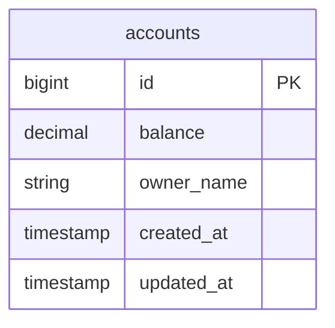
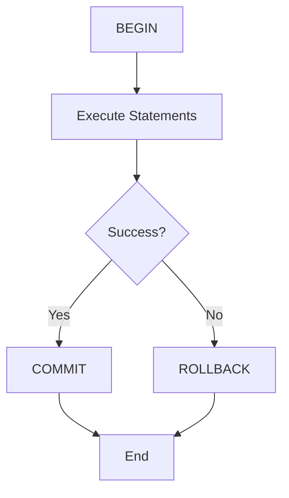
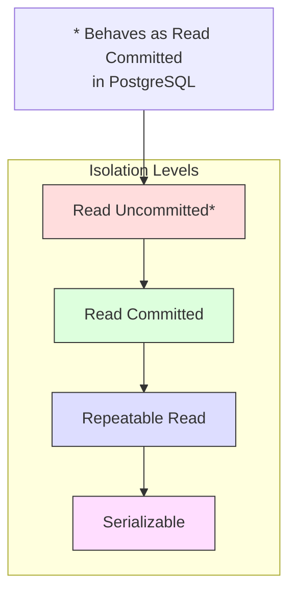
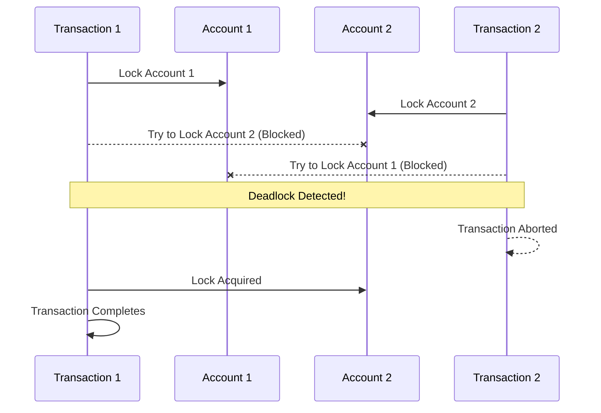

# PostgreSQL Transactions Deep Dive

This module focuses on understanding PostgreSQL's transaction management, isolation levels, and common concurrency challenges like deadlocks. Through practical examples, you'll learn how PostgreSQL handles concurrent operations and how to design robust transaction strategies.

## Database Structure



## Module Overview

In this module, you'll explore:
1. How PostgreSQL manages transactions
2. Transaction isolation levels
3. Deadlock detection and prevention
4. Best practices for transaction management

## PostgreSQL Transaction Management

### 1. Basic Transaction Structure
Every PostgreSQL transaction follows this lifecycle:



### 2. Transaction Isolation Levels
PostgreSQL supports four isolation levels:



### 3. Deadlock Scenario
Our `transaction_lab.rb` demonstrates a classic deadlock:



## Key Concepts

### 1. Transaction Properties (ACID)
- **Atomicity**: All or nothing execution
- **Consistency**: Database remains valid after transaction
- **Isolation**: Transactions don't interfere with each other
- **Durability**: Committed changes are permanent

### 2. Lock Types
PostgreSQL uses various lock types:
```
- Row-Level Locks
  - FOR UPDATE
  - FOR NO KEY UPDATE
  - FOR SHARE
  - FOR KEY SHARE
  
- Table-Level Locks
  - ACCESS SHARE
  - ROW SHARE
  - ROW EXCLUSIVE
  - SHARE UPDATE EXCLUSIVE
  - SHARE
  - SHARE ROW EXCLUSIVE
  - EXCLUSIVE
  - ACCESS EXCLUSIVE
```

### 3. Deadlock Detection
PostgreSQL automatically detects deadlocks:
1. Monitors wait-for graph
2. Identifies cycles (deadlocks)
3. Chooses a victim transaction
4. Rolls back the victim

## Practical Exercises - Transaction Management

1. **Basic Transaction Handling**
   ```ruby
   Account.transaction do
     # Operations here are atomic
     account.update!(balance: account.balance + 100)
   end
   ```

2. **Deadlock Simulation**
   ```ruby
   # See transaction_lab.rb for implementation
   TransactionLab.simulate_deadlock
   ```

3. **Isolation Level Testing**
   ```ruby
   Account.transaction(isolation: :serializable) do
     # Operations here run in serializable isolation
   end
   ```

## Learning Objectives Checklist

After completing this module, you should understand:
- [ ] Basic transaction management in PostgreSQL
- [ ] Different isolation levels and their implications
- [ ] How deadlocks occur and how to prevent them
- [ ] Best practices for handling concurrent transactions
- [ ] Lock types and their use cases

## Files in this Module

1. `transaction_lab.rb`: Hands-on exercises with transaction concepts
2. `README.md`: This documentation file

## Additional Resources

- [PostgreSQL Documentation: Transaction Management](https://www.postgresql.org/docs/current/transaction-iso.html)
- [PostgreSQL Documentation: Concurrency Control](https://www.postgresql.org/docs/current/mvcc.html)
- [PostgreSQL Documentation: Lock Management](https://www.postgresql.org/docs/current/explicit-locking.html)

## Key Observations

1. PostgreSQL's MVCC (Multi-Version Concurrency Control) allows for high concurrency
2. Deadlocks are automatically detected and resolved
3. Proper transaction isolation level selection is crucial for application correctness
4. Lock management requires careful consideration to avoid performance issues
5. Transaction scope should be as narrow as possible while maintaining consistency 