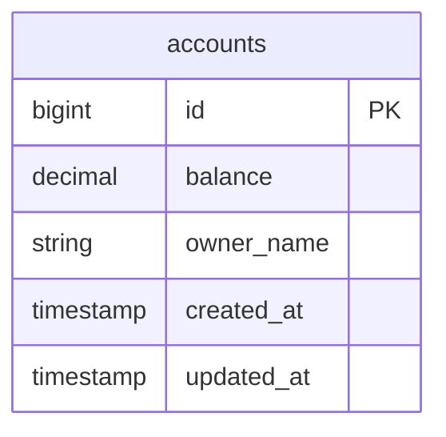
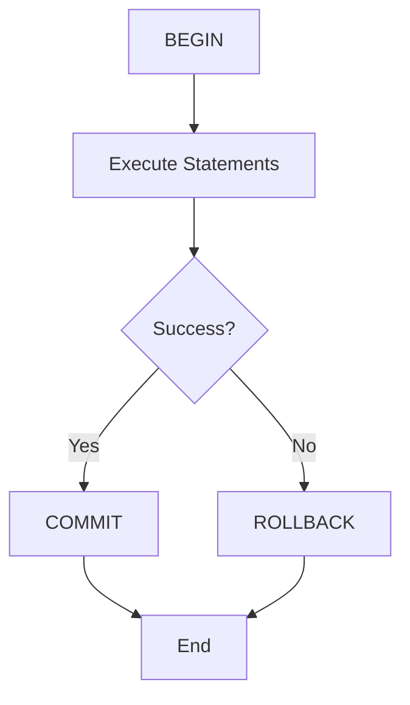
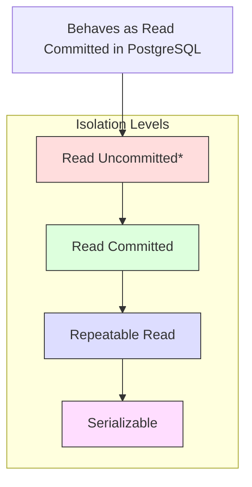
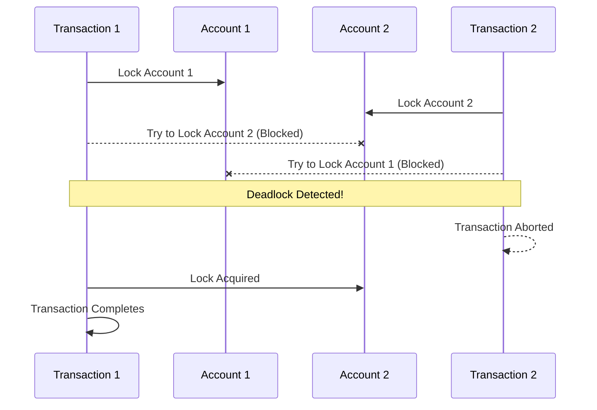

# PostgreSQL Transactions Deep Dive

This module focuses on understanding PostgreSQL's transaction management, isolation levels, and common concurrency challenges like deadlocks. For definitions of terms used in this module, refer to our [Glossary](../../GLOSSARY.md).

## Prerequisites

Before starting this module, ensure you understand:
- [ACID Properties](../../GLOSSARY.md#acid)
- [MVCC](../../GLOSSARY.md#mvcc)
- [Transaction](../../GLOSSARY.md#transaction)
- [Storage Layout](../01_storage/README.md#storage-layout)

## Related Concepts

- [WAL (Write-Ahead Log)](../../GLOSSARY.md#wal)
- [Query Planning](../03_queries/README.md#query-planning)
- [Buffer Management](../../GLOSSARY.md#buffer-management)

## Database Structure



## Module Overview

In this module, you'll explore:
1. How PostgreSQL manages transactions
2. Transaction isolation levels
3. Deadlock detection and prevention
4. Best practices for transaction management

## PostgreSQL Transaction Management

### 1. Basic Transaction Structure
Every PostgreSQL transaction follows this lifecycle:



### 2. Transaction Isolation Levels
PostgreSQL supports four isolation levels, each with different guarantees:



For more details on isolation levels, see [Isolation Level](../../GLOSSARY.md#isolation-level).

#### Isolation Level Characteristics

| Level | Dirty Read | Non-Repeatable Read | Phantom Read | Serialization Anomaly |
|-------|------------|---------------------|--------------|----------------------|
| Read Uncommitted [1] | Prevented | Possible | Possible | Possible |
| Read Committed | Prevented | Possible | Possible | Possible |
| Repeatable Read | Prevented | Prevented | Prevented [2] | Possible |
| Serializable | Prevented | Prevented | Prevented | Prevented |

1. PostgreSQL treats Read Uncommitted as Read Committed
2. PostgreSQL's implementation prevents phantom reads

#### Example Output from Our Deadlock Simulation:

Run `ruby transaction_lab.rb` to see the output.

```
Starting concurrent transfers (this should cause a deadlock)...
👱‍♀️ Alice initiating transfer...
👨 Bob initiating transfer...
Transferring 100 from Bob to Alice
Deadlock detected (attempt 1/3): PG::TRDeadlockDetected
DETAIL: Process 6338 waits for ShareLock on transaction 48693606; blocked by process 6339.
Process 6339 waits for ShareLock on transaction 48693605; blocked by process 6338.
```

#### Using Different Isolation Levels

```ruby
# Read Committed (default)
Account.transaction do
  # Default isolation level
  account.update!(balance: new_balance)
end

# Repeatable Read
Account.transaction(isolation: :repeatable_read) do
  # Prevents non-repeatable reads
  balance = account.balance
  sleep(1) # Simulate work
  # Will see same balance even if another transaction changed it
  account.update!(balance: balance + 100)
end

# Serializable
Account.transaction(isolation: :serializable) do
  # Strongest isolation - prevents all concurrency anomalies
  # May throw SerializationFailure - application must retry
  balance = account.balance
  account.update!(balance: balance + 100)
end
```

### Common Concurrency Phenomena

1. **Dirty Read** (prevented in PostgreSQL)
   - Transaction reads data written by concurrent uncommitted transaction

2. **Non-Repeatable Read** (possible in Read Committed)
   ```ruby
   # Transaction 1           # Transaction 2
   read(A)  # value = 100
                           update(A) to 200
                           commit
   read(A)  # value = 200   
   # Different result!
   ```

3. **Phantom Read** (possible in Read Committed)
   ```ruby
   # Transaction 1           # Transaction 2
   count(*) # returns 10
                           insert new row
                           commit
   count(*) # returns 11
   # Different result!
   ```

4. **Serialization Anomaly** (possible in all except Serializable)
   ```ruby
   # Transaction 1           # Transaction 2
   sum = total_balance()    sum = total_balance()
   insert(-100)            insert(-100)
   commit                  commit
   # Both transactions saw the same sum but both subtracted,
   # potentially leading to negative balance
   ```

### 3. Deadlock Scenario
Our `transaction_lab.rb` demonstrates a classic deadlock:



For more information about deadlocks, see [Deadlock](../../GLOSSARY.md#deadlock).

## Key Concepts

### 1. Transaction Properties (ACID)
See [ACID Properties](../../GLOSSARY.md#acid) in the glossary.

### 2. Lock Types
PostgreSQL uses various lock types. For details, see [Lock Types](../../GLOSSARY.md#lock-types).

### 3. Deadlock Detection
PostgreSQL automatically detects deadlocks:
1. Monitors wait-for graph
2. Identifies cycles (deadlocks)
3. Chooses a victim transaction
4. Rolls back the victim

## Key Learnings from Deadlock Simulation

### 1. Connection Pool Management
- Each thread needs its own database connection in multi-threaded scenarios
- Use `ActiveRecord::Base.connection_pool.with_connection` to ensure proper connection handling
- Connections are automatically returned to the pool after the block completes

### 2. Transaction Rollback Behavior
- Deadlocks cause automatic transaction rollback
- Both transactions involved in a deadlock may be affected
- Need to explicitly reload records after deadlock to get current state
- Always verify final state after transaction completion

### 3. Lock Ordering
- Inconsistent lock ordering is a primary cause of deadlocks
- To prevent deadlocks, always acquire locks in a consistent order
- Example: Always lock records in ascending ID order
- Use `Account.lock.where(id: [id1, id2]).order(:id)` pattern

### 4. Multi-threaded Transaction Patterns
- Reset initial state before running concurrent transactions
- Use explicit transaction blocks
- Handle both specific (Deadlocked) and generic exceptions
- Verify final state through explicit reload

## Practical Exercises - Transaction Management

1. **Basic Transaction Handling**
   ```ruby
   Account.transaction do
     # Operations here are atomic
     account.update!(balance: account.balance + 100)
   end
   ```

2. **Deadlock Simulation**
   ```ruby
   # See transaction_lab.rb for implementation
   TransactionLab.simulate_deadlock
   ```

3. **Isolation Level Testing**
   ```ruby
   Account.transaction(isolation: :serializable) do
     # Operations here run in serializable isolation
   end
   ```

## Exercise Resolution Learnings

### Basic Transaction Example
```
=== Basic Transaction Example ===
Initial balance: 0.0
Balance after update: 100.0
Transaction failed: Simulated error
Balance after rollback: 0.0
```
**Key Learnings:**
1. Proper initialization is crucial - always ensure accounts start with a valid balance
2. Transactions properly rollback on error, maintaining data consistency
3. Using `reload` after operations ensures we see the actual database state
4. The `update_column` bypass can be useful for initial setup, but should be used sparingly

### Deadlock Simulation Results
```
Deadlock detected (attempt 1/3): PG::TRDeadlockDetected
DETAIL: Process 10899 waits for ShareLock on transaction 48746007; blocked by process 10898.
Process 10898 waits for ShareLock on transaction 48746008; blocked by process 10899.
```
**Key Learnings:**
1. Deadlocks are automatically detected by PostgreSQL
2. Retry mechanism with exponential backoff helps resolve deadlocks
3. Final account balances remain consistent despite deadlocks
4. Detailed error messages help diagnose lock conflicts

### Isolation Level Behaviors

#### Read Committed
```
Initial balance read: 1000.0
Concurrent transaction modified balance (+50)
Balance after concurrent modification: 1050.0
Final balance after our update (+100): 1150.0
```
- Sees and incorporates concurrent changes
- No serialization failures
- Most permissive but least consistent

#### Repeatable Read & Serializable
```
Initial balance read: 1000.0
Concurrent transaction modified balance (+50)
Balance after concurrent modification: 1000.0
Serialization failure occurred...
```
**Key Learnings:**
1. Higher isolation levels prevent reading intermediate states
2. Serialization failures require retry logic
3. Maximum retry limits prevent infinite retry loops
4. Each retry sees the latest committed state

### Best Practices Discovered
1. **Balance Management:**
   - Always initialize accounts with valid balances
   - Use `reload` to ensure fresh data
   - Handle nil values explicitly

2. **Concurrency Handling:**
   - Implement retry mechanisms with maximum attempts
   - Use exponential backoff between retries
   - Reset test data between isolation level tests

3. **Error Handling:**
   - Catch specific exceptions (`PG::TRDeadlockDetected`, `ActiveRecord::SerializationFailure`)
   - Provide clear error messages
   - Verify final state after errors

4. **Testing Strategy:**
   - Reset state before each test
   - Test each isolation level independently
   - Verify both success and failure scenarios

These practical exercises demonstrate the importance of proper transaction management and the trade-offs between different isolation levels in a real-world scenario.

## Learning Objectives Checklist

After completing this module, you should understand:
- [ ] Basic transaction management in PostgreSQL
- [ ] Different isolation levels and their implications
- [ ] How deadlocks occur and how to prevent them
- [ ] Best practices for handling concurrent transactions
- [ ] Lock types and their use cases

## Files in this Module

1. `transaction_lab.rb`: Hands-on exercises with transaction concepts
2. `README.md`: This documentation file

## Additional Resources

- [PostgreSQL Documentation: Transaction Management](https://www.postgresql.org/docs/current/transaction-iso.html)
- [PostgreSQL Documentation: Concurrency Control](https://www.postgresql.org/docs/current/mvcc.html)
- [PostgreSQL Documentation: Lock Management](https://www.postgresql.org/docs/current/explicit-locking.html)

## Key Observations

1. PostgreSQL's MVCC (Multi-Version Concurrency Control) allows for high concurrency
2. Deadlocks are automatically detected and resolved
3. Proper transaction isolation level selection is crucial for application correctness
4. Lock management requires careful consideration to avoid performance issues
5. Transaction scope should be as narrow as possible while maintaining consistency 

## Next Steps

After completing this module, proceed to:
1. [Query Optimization](../03_queries/README.md) to learn how transactions affect query performance
2. [TimescaleDB Extension](../04_timescale/README.md) to understand time-series data management 