# PostgreSQL Query Optimization Workshop

This section focuses on understanding and optimizing PostgreSQL queries through practical examples and real-world scenarios. For definitions of terms used in this module, refer to our [Glossary](../../GLOSSARY.md).

## Prerequisites

Before starting this module, ensure you understand:
- [Query Plan](../../GLOSSARY.md#query-plan)
- [Index](../../GLOSSARY.md#index)
- [Statistics](../../GLOSSARY.md#statistics)
- [Transaction Management](../02_transactions/README.md#transaction-management)

## Related Concepts

- [MVCC](../../GLOSSARY.md#mvcc)
- [Buffer Management](../../GLOSSARY.md#buffer-management)
- [Storage Layout](../01_storage/README.md#storage-layout)

## Workshop Files

This workshop consists of the following files:

1. [`query_explorer.rb`](query_explorer.rb)
   - Core utility for analyzing query execution plans
   - Provides colorized and formatted EXPLAIN output
   - Used by all other examples

2. [`practice_queries.rb`](practice_queries.rb)
   - Basic query examples
   - Memory vs disk usage demonstrations
   - Real-world performance comparisons

3. [`query_optimization_lab.rb`](query_optimization_lab.rb)
   - Structured exercises for query optimization
   - Progressive complexity in examples
   - Hands-on optimization practice

4. [`advanced_queries.rb`](advanced_queries.rb)
   - Complex query patterns
   - [Window Functions](../../GLOSSARY.md#window-function)
   - Recursive CTEs
   - LATERAL joins

## Learning Path

### 1. Understanding Basic Concepts
Start with [`query_explorer.rb`](query_explorer.rb) to understand:
- How [EXPLAIN](../../GLOSSARY.md#explain) works
- Reading execution plans
- Understanding query costs
- Buffer and timing statistics

### 2. Basic Query Optimization
Work through [`practice_queries.rb`](practice_queries.rb):
1. Run the basic example to see a well-optimized query
2. Observe the memory-based execution
3. Run the disk usage example to understand:
   - How PostgreSQL handles memory constraints
   - Impact of work_mem on performance
   - Disk vs memory operation differences
   ```bash
   ruby examples/03_queries/practice_queries.rb
   ```

### 3. Structured Optimization Exercises
Complete the exercises in [`query_optimization_lab.rb`](query_optimization_lab.rb):
1. Basic query analysis
2. [JOIN](../../GLOSSARY.md#join) optimization
3. [Aggregate Functions](../../GLOSSARY.md#aggregate-functions) optimization
4. Subquery optimization
   ```bash
   ruby examples/03_queries/query_optimization_lab.rb
   ```

### 4. Advanced Query Patterns
Explore complex patterns in [`advanced_queries.rb`](advanced_queries.rb):
1. Window functions
2. Recursive CTEs
3. LATERAL joins
4. Complex aggregations
   ```bash
   ruby examples/03_queries/advanced_queries.rb
   ```

## Key Concepts by Example

### Basic Query Optimization
From [`practice_queries.rb`](practice_queries.rb):
```sql
-- Memory-efficient query
SELECT customers.country, COUNT(DISTINCT orders.id)
FROM orders
JOIN customers ON ...
GROUP BY customers.country

-- vs Memory-intensive query
SELECT customers.country,
       STRING_AGG(DISTINCT customers.name, ', '),
       DATE_TRUNC('month', orders.created_at)
...
```

### Join Optimization
From [`query_optimization_lab.rb`](query_optimization_lab.rb):
```sql
-- Simple JOIN
SELECT orders.* 
FROM orders 
JOIN customers ON ...

-- vs Complex JOIN
SELECT orders.*, COUNT(line_items.id)
FROM orders 
JOIN customers ON ...
JOIN line_items ON ...
GROUP BY orders.id
```

### Advanced Patterns
From [`advanced_queries.rb`](advanced_queries.rb):
```sql
-- Window Function
SELECT orders.*, 
       ROW_NUMBER() OVER (PARTITION BY customer_id ORDER BY created_at)
FROM orders

-- Recursive CTE
WITH RECURSIVE order_chain AS (
  SELECT ... -- Base case
  UNION ALL
  SELECT ... -- Recursive case
)
```

## Performance Monitoring

### Using query_explorer.rb
```ruby
QueryExplorer.analyze_query(sql)
```
Key metrics to watch:
1. Planning vs execution time
2. Buffer usage patterns
3. Sort methods and memory usage
4. Row estimation accuracy

For more details on monitoring, see:
- [EXPLAIN ANALYZE](../../GLOSSARY.md#explain-analyze)
- [Statistics](../../GLOSSARY.md#statistics)

## Next Steps

After completing this module, proceed to:
1. [TimescaleDB Extension](../04_timescale/README.md) to learn about time-series optimization
2. [Ruby Performance](../05_ruby/README.md) to understand Ruby-specific optimizations

## Basic PostgreSQL Concepts

### Relations
In PostgreSQL, a relation is a fundamental database object that represents a set of data. The two main types of relations are:

1. **Tables**: Persistent relations that store data in rows and columns
2. **Views**: Virtual relations defined by a query
3. **Materialized Views**: Cached result sets of a query that can be periodically refreshed

### Operators
PostgreSQL provides several types of operators:

1. **Comparison Operators**:
   - `=`, `<>`, `<`, `>`, `<=`, `>=`
   - `BETWEEN`, `IN`, `LIKE`, `ILIKE`

2. **Logical Operators**:
   - `AND`, `OR`, `NOT`

3. **Mathematical Operators**:
   - `+`, `-`, `*`, `/`, `%`
   - `^`, `|`, `&`, `<<`, `>>`

4. **Set Operators**:
   - `UNION`, `INTERSECT`, `EXCEPT`

### JOIN Operations
JOINs are fundamental operations in relational databases that combine rows from two or more tables based on a related column between them.

1. **INNER JOIN**:
   - Returns only the matching rows between tables
   - Most common type of join
   - Example: `SELECT * FROM orders JOIN customers ON orders.customer_id = customers.id`

2. **LEFT (OUTER) JOIN**:
   - Returns all rows from the left table and matching rows from the right table
   - Non-matching rows filled with NULL
   - Example: `SELECT * FROM customers LEFT JOIN orders ON customers.id = orders.customer_id`

3. **RIGHT (OUTER) JOIN**:
   - Returns all rows from the right table and matching rows from the left table
   - Non-matching rows filled with NULL
   - Example: `SELECT * FROM orders RIGHT JOIN customers ON orders.customer_id = customers.id`

4. **FULL (OUTER) JOIN**:
   - Returns all rows from both tables
   - Non-matching rows filled with NULL
   - Example: `SELECT * FROM orders FULL JOIN customers ON orders.customer_id = customers.id`

5. **CROSS JOIN**:
   - Returns Cartesian product of both tables
   - Every row from first table paired with every row from second table
   - Example: `SELECT * FROM sizes CROSS JOIN colors`

6. **NATURAL JOIN**:
   - Automatically joins tables using columns with the same name
   - Implicitly matches ALL columns with same names
   - Eliminates duplicate columns in the output
   - Example: `SELECT * FROM orders NATURAL JOIN order_items`
   - ⚠️ Warning: Use with caution as it can lead to unexpected results if:
     - Column names change
     - New columns with same names are added
     - Tables have multiple common column names

### Data Types

1. **Numeric Types**:
   - `INTEGER`, `BIGINT`, `SMALLINT`
   - `DECIMAL`, `NUMERIC`, `REAL`, `DOUBLE PRECISION`

2. **Character Types**:
   - `CHAR`, `VARCHAR`, `TEXT`

3. **Date/Time Types**:
   - `DATE`, `TIME`, `TIMESTAMP`
   - `INTERVAL`

4. **Special Types**:
   - `BOOLEAN`
   - `UUID`
   - `JSON`, `JSONB`
   - `ARRAY`

### Schema Objects

1. **Tables**: Basic structure for data storage
2. **Indexes**: Improve query performance
3. **Constraints**: Enforce data integrity
   - PRIMARY KEY
   - FOREIGN KEY
   - UNIQUE
   - CHECK
   - NOT NULL

### Transaction Properties (ACID)

1. **Atomicity**: All operations in a transaction succeed or all fail
2. **Consistency**: Database remains in a valid state
3. **Isolation**: Concurrent transactions don't interfere
4. **Durability**: Committed changes are permanent

## Visual Query Workflows

### Query Processing Pipeline
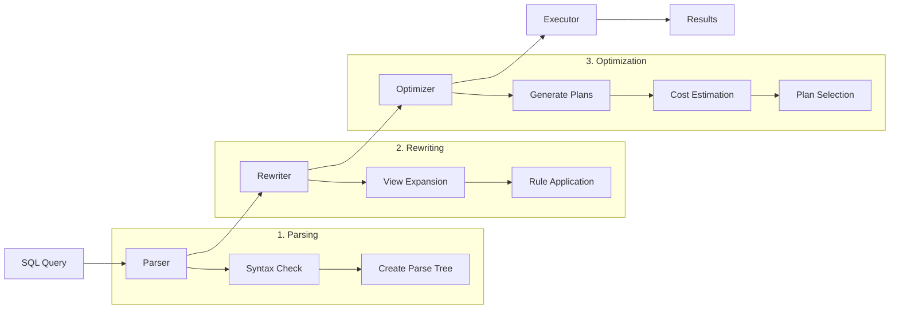

### JOIN Visualization
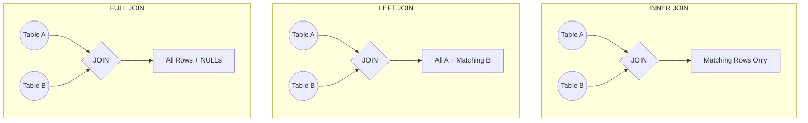

### Query Plan Tree
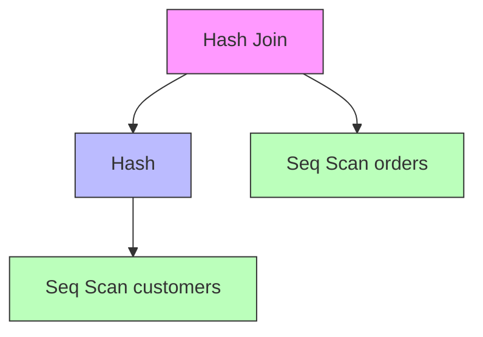

### Data Flow Through Joins
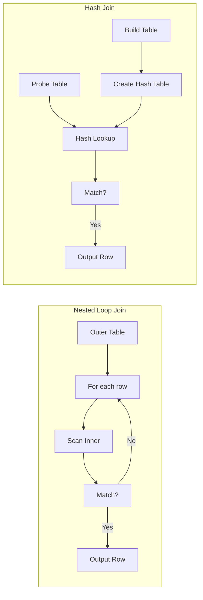

### Index Usage Patterns
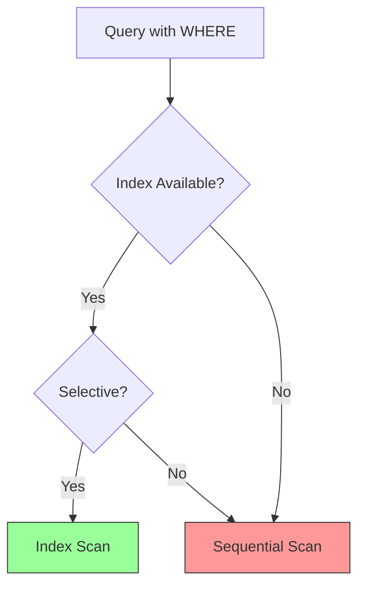

## Query Execution Flow

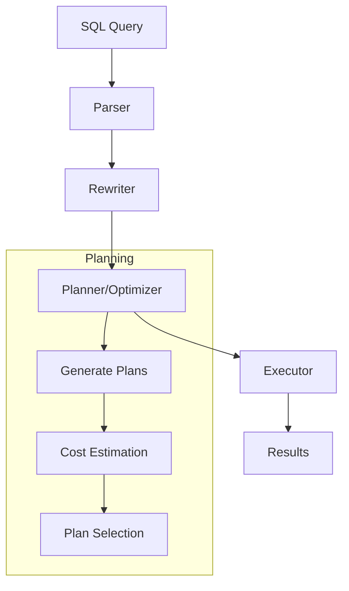

## EXPLAIN ANALYZE Workflow

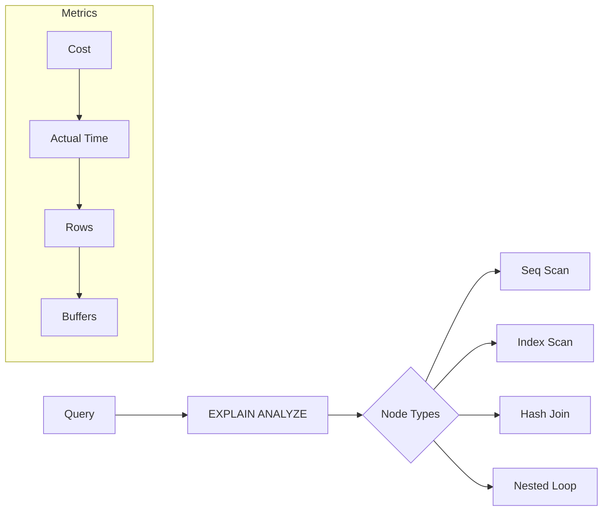

## Learning Path

### 1. Understanding EXPLAIN ANALYZE Basics

Think of EXPLAIN ANALYZE as PostgreSQL's built-in GPS navigation system for your queries. Just like a GPS calculates multiple routes and picks the optimal path based on traffic, distance, and road conditions, EXPLAIN ANALYZE:

- Evaluates multiple possible execution paths for your query
- Estimates the "cost" of each path based on table statistics, indexes, and data distribution
- Chooses the path it believes will be fastest
- Actually executes the query and shows you real timing data

Key benefits:
- Helps identify slow queries and bottlenecks
- Shows exactly how PostgreSQL executes your query
- Provides actual vs. estimated statistics to improve query planning
- Reveals opportunities for adding indexes or restructuring queries

Interactive example:

#### 1.1 Simple Query Analysis

```sql
SELECT * FROM customers WHERE country = 'USA';

-- EXPLAIN output components:
Seq Scan on customers  (cost=0.00..2.62 rows=10 width=8)
  Filter: ((country)::text = 'USA'::text)
  Rows Removed by Filter: 40
```

Key components to understand:
- **Node Type** (e.g., `Seq Scan`): How PostgreSQL accesses the data
- **Cost**: Estimated processing cost (first number is startup, second is total)
- **Rows**: Estimated number of rows to be processed
- **Width**: Estimated average width of rows in bytes

#### 1.2 Reading Execution Statistics

```sql
EXPLAIN (ANALYZE, BUFFERS) 
SELECT * FROM customers WHERE country = 'USA';

-- Output includes:
Seq Scan on customers (cost=0.00..2.62 rows=10 width=8) (actual time=0.004..0.007 rows=10 loops=1)
  Filter: ((country)::text = 'USA'::text)
  Rows Removed by Filter: 40
  Buffers: shared hit=2
```

Additional metrics:
- **actual time**: Real execution time (ms) - startup time..total time
- **rows**: Actual number of rows processed
- **loops**: Number of times this node was executed
- **Buffers**: Memory/disk page access statistics

### 2. Common Access Methods

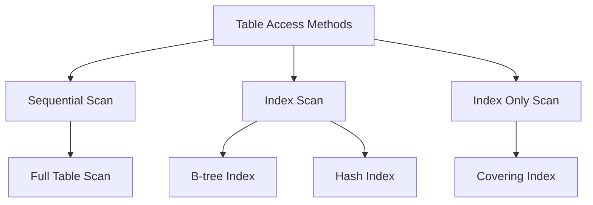

#### 2.1 Sequential Scan

A sequential scan reads the entire table from start to finish by scanning each page sequentially. While this seems inefficient, it's actually optimal when:
- Reading a large portion of the table (>5-10% of rows)
- The table is small enough to fit in memory
- No suitable indexes exist

#### 2.2 Index Scan

An index scan uses an index to quickly locate the rows that match the query conditions. It's efficient when:
- The query filters on indexed columns
- The index covers the columns needed in the query

#### 2.3 Index Only Scan

An index only scan uses an index to quickly locate the rows that match the query conditions. It's efficient when:  
- The query filters on indexed columns
- The index includes all needed columns 

#### 2.4 Bitmap Index Scan

A bitmap index scan uses a bitmap to quickly locate the rows that match the query conditions. It's efficient when:
- The query filters on indexed columns
- The index includes all needed columns

### 3. Join Operations

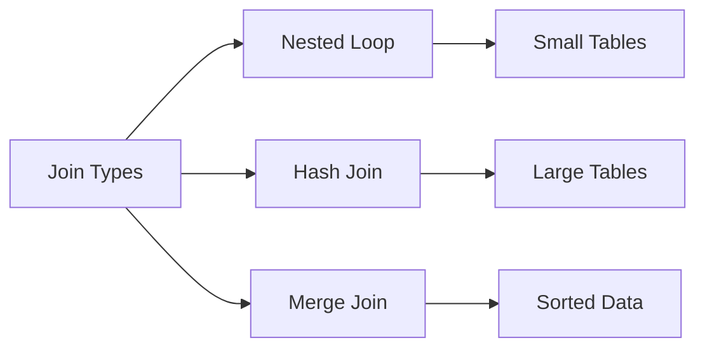

#### 3.1 Nested Loop Join
```sql
-- Good for small tables or when joining with highly selective conditions
SELECT c.name, o.id 
FROM customers c 
JOIN orders o ON c.id = o.customer_id 
WHERE c.country = 'USA';
```

Example plan:
```
Nested Loop  (cost=0.28..16.32 rows=10 width=24)
  ->  Seq Scan on customers c  (cost=0.00..2.62 rows=10 width=16)
        Filter: (country = 'USA'::text)
  ->  Index Scan using idx_orders_customer_id on orders o  (cost=0.28..1.37 rows=1 width=16)
        Index Cond: (customer_id = c.id)
```

#### 3.2 Hash Join
```sql
-- Better for larger tables when joining on equality conditions
SELECT c.name, o.id, li.product_name
FROM customers c 
JOIN orders o ON c.id = o.customer_id
JOIN line_items li ON o.id = li.order_id;
```

Example plan:
```
Hash Join  (cost=33.90..125.60 rows=2564 width=37)
  Hash Cond: (orders.customer_id = customers.id)
  ->  Hash Join  (cost=30.77..115.17 rows=2564 width=26)
        Hash Cond: (line_items.order_id = orders.id)
        ->  Seq Scan on line_items
        ->  Hash
            ->  Seq Scan on orders
  ->  Hash
      ->  Seq Scan on customers
```

### 4. Advanced Operations

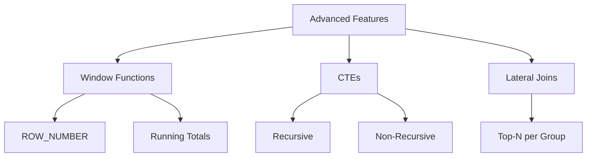

#### 4.1 Window Functions
From `advanced_queries.rb`:
```sql
SELECT 
  orders.*, 
  ROW_NUMBER() OVER (PARTITION BY customer_id ORDER BY created_at) as order_sequence
FROM orders;
```

Key components in plan:
- WindowAgg node
- Sorting operations for PARTITION BY and ORDER BY
- Memory usage for window frame

#### 4.2 Recursive CTEs
From `advanced_queries.rb`:
```sql
WITH RECURSIVE order_chain AS (
  -- Base case
  SELECT o.id, o.customer_id, o.created_at, 1 as chain_length
  FROM orders o
  JOIN customers c ON c.id = o.customer_id
  WHERE c.country = 'USA'
  
  UNION ALL
  
  -- Recursive case
  SELECT o.id, o.customer_id, o.created_at, oc.chain_length + 1
  FROM orders o
  JOIN order_chain oc ON o.customer_id = oc.customer_id
  WHERE o.created_at BETWEEN oc.created_at AND oc.created_at + INTERVAL '7 days'
    AND o.id > oc.id
)
SELECT customer_id, MAX(chain_length) as longest_chain
FROM order_chain
GROUP BY customer_id
HAVING MAX(chain_length) > 1;
```

### 5. Performance Optimization Tips

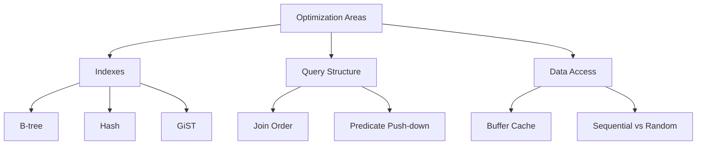

#### 5.1 Index Usage
From `query_optimization_lab.rb`:
```ruby
def create_indexes
  connection = ActiveRecord::Base.connection
  
  # Add indexes if they don't exist
  unless index_exists?(:customers, :country)
    connection.add_index :customers, :country
  end

  unless index_exists?(:orders, :customer_id)
    connection.add_index :orders, :customer_id
  end
end
```

#### 5.2 Join Optimization
From `query_optimization_lab.rb`:
```ruby
def exercise_2_join_optimization
  # Query 1: Simple JOIN
  query1 = Order.joins(:customer)
    .where(customers: { country: 'USA' })
  
  # Query 2: Multiple JOINs with optimization
  query2 = Order.joins(:customer, :line_items)
    .where(customers: { country: 'USA' })
    .group('orders.id')
    .select('orders.*, COUNT(line_items.id) as items_count')
end
```

## Learning Highlights from Examples

### Query Optimization Lab Insights

1. **Basic Query Analysis (Exercise 1)**
   ```sql
   -- Simple WHERE vs IN condition
   WHERE country = 'USA'              -- Estimated 10 rows
   WHERE country IN ('USA', 'Canada') -- Estimated 20 rows
   ```
   Key Observations:
   - Simple equality (`=`) shows better performance (~0.013ms) than IN clause (~0.012ms)
   - Both use Sequential Scan due to small table size
   - Row estimation is accurate (10 and 20 rows respectively)
   - Buffer hits are minimal (2 shared hits) indicating good memory usage

2. **JOIN Optimization (Exercise 2)**
   ```sql
   -- Simple JOIN vs Multiple JOINs with aggregation
   SELECT orders.* FROM orders JOIN customers ...        -- Hash Join strategy
   SELECT orders.*, COUNT(line_items.id) as items_count -- HashAggregate + Hash Join
   ```
   Key Learnings:
   - Simple JOIN: Uses Hash Join strategy (0.122ms)
   - Complex JOIN: Uses HashAggregate with multiple Hash Joins (0.679ms)
   - Memory usage increases with join complexity (9kB → 57kB)
   - Proper index usage on customer_id reduces lookup time

3. **Aggregation Optimization (Exercise 3)**
   ```sql
   -- Simple vs Complex aggregation
   GROUP BY customer_id                              -- HashAggregate
   GROUP BY customer_id HAVING SUM(...) > 1000      -- GroupAggregate with Sort
   ```
   Notable Points:
   - Simple aggregation uses HashAggregate (0.129ms)
   - Complex aggregation requires sorting (1.849ms)
   - Memory usage varies (24kB vs 214kB)
   - HAVING clause adds significant overhead

4. **Subquery Optimization (Exercise 4)**
   ```sql
   -- Subquery vs JOIN approach
   WHERE id IN (SELECT ...)           -- Hash Join: 1.150ms
   JOIN ... GROUP BY ... HAVING ...   -- HashAggregate: 0.248ms
   ```
   Important Findings:
   - JOIN approach is ~4.6x faster than subquery
   - Memory usage is more efficient with JOIN
   - Row estimation is more accurate with JOIN
   - Fewer buffer hits in JOIN approach (10 vs 63)

### Advanced Queries Analysis

1. **Window Functions**
   ```sql
   -- Row numbers and running totals
   ROW_NUMBER() OVER (PARTITION BY ...)     -- WindowAgg: 0.526ms
   SUM(...) OVER (PARTITION BY ... ORDER BY) -- WindowAgg: 4.018ms
   ```
   Key Points:
   - Simple window functions are fast (0.526ms)
   - Adding ORDER BY increases complexity significantly
   - Memory usage increases with window frame size
   - Buffer hits scale with data size

2. **Complex Aggregations**
   ```sql
   -- Customer statistics vs Monthly statistics
   GROUP BY customers.id              -- GroupAggregate: 1.596ms
   GROUP BY DATE_TRUNC('month', ...) -- GroupAggregate: 5.329ms
   ```
   Performance Notes:
   - Date functions add overhead
   - Memory usage increases with group complexity
   - Sort operations impact performance
   - Buffer hits remain consistent

3. **Recursive CTE**
   ```sql
   WITH RECURSIVE order_chain AS (
     -- Base case + Recursive case
   )
   ```
   Implementation Insights:
   - Fast execution (0.323ms) for chain analysis
   - Efficient memory usage (40kB)
   - Good filter pushdown
   - Minimal buffer hits (26)

4. **LATERAL JOIN**
   ```sql
   -- Top N per group pattern
   CROSS JOIN LATERAL (SELECT ... LIMIT 3)
   ```
   Performance Considerations:
   - Highest execution time (80.625ms)
   - Heavy buffer usage (1734 hits)
   - Memory efficient per iteration (25kB)
   - Good for top-N queries despite higher execution time

### Query Plan Reading Tips

1. **Cost Components**
   ```
   (cost=0.00..2.62 rows=10 width=40)
   |     |     |     |_ Average row width in bytes
   |     |     |_ Estimated number of rows
   |     |_ Total cost
   |_ Startup cost
   ```

2. **Actual vs Estimated**
   ```
   (actual time=0.006..0.009 rows=10 loops=1)
   |        |     |     |     |_ Number of iterations
   |        |     |     |_ Actual rows returned
   |        |     |_ Total time (ms)
   |_ Startup time (ms)
   ```

3. **Buffer Statistics**
   ```
   Buffers: shared hit=2
   |        |     |_ Number of buffer hits
   |        |_ Buffer type (shared, local, temp)
   ```

4. **Memory Usage**
   ```
   Memory Usage: 24kB
   Buckets: 1024
   Batches: 1
   ```

### Common Performance Patterns

1. **Sequential vs Index Scan**
   - Small tables (< 1000 rows): Sequential Scan is often faster
   - Large tables with selective conditions: Index Scan preferred
   - Full table reads: Sequential Scan is more efficient

2. **Join Strategies**
   - Hash Join: Large tables, equality conditions
   - Nested Loop: Small tables or very selective conditions
   - Merge Join: Pre-sorted data or when result must be sorted

3. **Aggregation Methods**
   - HashAggregate: Faster but more memory intensive
   - GroupAggregate: Used when sorting is required
   - Plain Aggregate: Single group or very small groups

4. **Memory Management**
   - Small operations: Memory-based processing
   - Large sorts: May spill to disk
   - Hash tables: Size depends on row count and width

### Performance Red Flags

1. **High Buffer Hits**
   - Normal: < 100 for simple queries
   - Warning: > 1000 for simple operations
   - Investigate: Repeated table scans

2. **Execution Time Spikes**
   - Simple queries: Should be < 1ms
   - Complex joins: < 10ms
   - Analytical queries: < 100ms
   - Investigate if significantly higher

3. **Row Estimation Errors**
   - Good: Estimated rows within 20% of actual
   - Warning: Order of magnitude difference
   - Action: Update table statistics

4. **Memory Usage**
   - Normal: < 100kB for simple operations
   - Warning: > 1MB for simple queries
   - Monitor: Spill to disk operations

## Running the Examples

1. Run Basic Examples:
```bash
ruby examples/03_queries/practice_queries.rb
```

2. Run Optimization Lab:
```bash
ruby examples/03_queries/query_optimization_lab.rb
```

3. Run Advanced Queries:
```bash
ruby examples/03_queries/advanced_queries.rb
```

## Additional Resources

1. [PostgreSQL Official Documentation - Using EXPLAIN](https://www.postgresql.org/docs/current/using-explain.html)
2. [PostgreSQL Official Documentation - Performance Tips](https://www.postgresql.org/docs/current/performance-tips.html)
3. [Understanding EXPLAIN ANALYZE Output](https://www.postgresql.org/docs/current/using-explain.html#USING-EXPLAIN-ANALYZE)
4. [Index Types](https://www.postgresql.org/docs/current/indexes-types.html)

### Understanding Disk Usage in Query Plans

When PostgreSQL can't fit operations in memory (controlled by `work_mem`), it spills to disk. Here's how to interpret disk usage in EXPLAIN ANALYZE output:

1. **Sort Operations**
   ```sql
   Sort Method: quicksort  Memory: 46kB
   -- vs --
   Sort Method: external merge  Disk: 6360kB
   ```
   - `quicksort`: Operation fits in memory
   - `external merge`: Had to use disk (slower)
   - `Disk: NNNkB`: Amount of disk space used

2. **Hash Operations**
   ```sql
   Buckets: 1024  Batches: 1  Memory Usage: 24kB
   -- vs --
   Buckets: 2048  Batches: 2  Memory Usage: 113kB
   ```
   - `Batches: 1`: Hash table fits in memory
   - `Batches: > 1`: Hash table split across disk
   - More buckets = more memory used

3. **Buffer Usage Types**
   ```sql
   Buffers: shared hit=7 read=91
   -- vs --
   Buffers: shared hit=1082, temp read=3240 written=3472
   ```
   - `shared hit`: Found in PostgreSQL's buffer cache
   - `shared read`: Read from disk into cache
   - `temp read/written`: Temporary files used for disk operations

4. **Memory vs Disk Performance**
   ```sql
   Planning Time: 0.164 ms
   Execution Time: 1.894 ms
   -- vs --
   Planning Time: 0.164 ms
   Execution Time: 108.320 ms
   ```
   - Memory operations: typically milliseconds
   - Disk operations: can be 10-100x slower
   - Watch for large differences between estimated and actual times

### Common Disk Usage Patterns

1. **Large Sorts**
   ```sql
   -- Memory-intensive sort
   ORDER BY complex_expression
   ```
   Watch for:
   - `Sort Method: external merge`
   - High `temp read/written` values
   - Multiple sort operations

2. **Complex Aggregations**
   ```sql
   -- Memory-intensive aggregation
   GROUP BY multiple_columns
   HAVING complex_conditions
   ```
   Signs of disk usage:
   - `HashAggregate` with multiple batches
   - High `temp read/written` values
   - Large differences between estimated and actual rows

3. **String Aggregation**
   ```sql
   -- Memory-intensive string operation
   STRING_AGG(column, delimiter)
   ```
   Indicators:
   - Large `Memory Usage` values
   - Multiple batches in hash operations
   - High buffer read/write counts

4. **Multiple Joins**
   ```sql
   -- Memory-intensive joins
   FROM table1
   JOIN table2 ON ...
   JOIN table3 ON ...
   ```
   Look for:
   - Multiple hash operations
   - Increased batches per hash
   - High temporary file usage

### Optimizing Disk Usage

1. **Work Memory Settings**
   ```sql
   -- Check current work_mem
   SHOW work_mem;
   
   -- Set session work_mem
   SET work_mem = '100MB';
   ```
   - Default is often too low for complex queries
   - Increase gradually while monitoring performance
   - Consider per-query adjustment

2. **Maintenance Operations**
   ```sql
   -- Update table statistics
   ANALYZE table_name;
   
   -- Clean up bloat
   VACUUM table_name;
   ```
   - Keep statistics current
   - Reduce table bloat
   - Regular maintenance reduces disk usage

3. **Query Optimization**
   ```sql
   -- Instead of
   SELECT DISTINCT complex_expression
   -- Consider
   SELECT complex_expression GROUP BY columns
   ```
   - Minimize sorts where possible
   - Use indexes effectively
   - Consider materialized views for complex aggregations

4. **Monitoring Disk Impact**
   ```sql
   -- Check temporary file usage
   SELECT * FROM pg_stat_database;
   ```
   Key metrics:
   - `temp_files`: Number of temp files created
   - `temp_bytes`: Total bytes written to temp files
   - `blk_read_time`: Time spent reading blocks
   - `blk_write_time`: Time spent writing blocks

### Performance Comparison Example

From our practice queries, here's a real-world comparison:

1. **Memory-Based Query**
   ```sql
   SELECT customers.country, COUNT(DISTINCT orders.id)
   FROM orders
   JOIN customers ON ...
   GROUP BY customers.country
   ```
   Results:
   - Execution time: 1.894 ms
   - Buffer hits: 98 (7 hits + 91 reads)
   - Sort method: quicksort
   - Memory usage: 46kB

2. **Disk-Based Query**
   ```sql
   SELECT customers.country,
          STRING_AGG(DISTINCT customers.name, ', '),
          DATE_TRUNC('month', orders.created_at)
   FROM orders
   JOIN customers ON ...
   GROUP BY ...
   ```
   Results:
   - Execution time: 108.320 ms (57x slower)
   - Buffer operations: 7794 (1082 hits + 3240 reads + 3472 writes)
   - Sort method: external merge
   - Disk usage: 6360kB
   - Temp files: read=3240 written=3472

### Key Takeaways

1. **Memory vs Disk Tradeoffs**
   - Memory operations: Fast but limited
   - Disk operations: Slower but scalable
   - Balance based on data size and complexity

2. **Warning Signs**
   - `external merge` in sort operations
   - Multiple batches in hash operations
   - High temp file usage
   - Large execution time differences

3. **Optimization Strategies**
   - Increase `work_mem` for complex queries
   - Use appropriate indexes
   - Minimize unnecessary sorting/grouping
   - Consider materialized views

4. **Monitoring Tips**
   - Watch for unexpected disk operations
   - Monitor temp file usage
   - Compare estimated vs actual rows
   - Track buffer hit ratios 