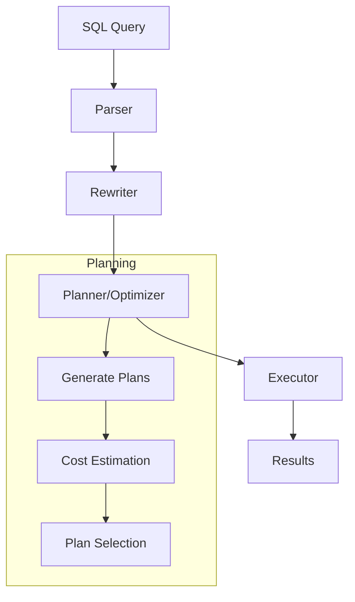
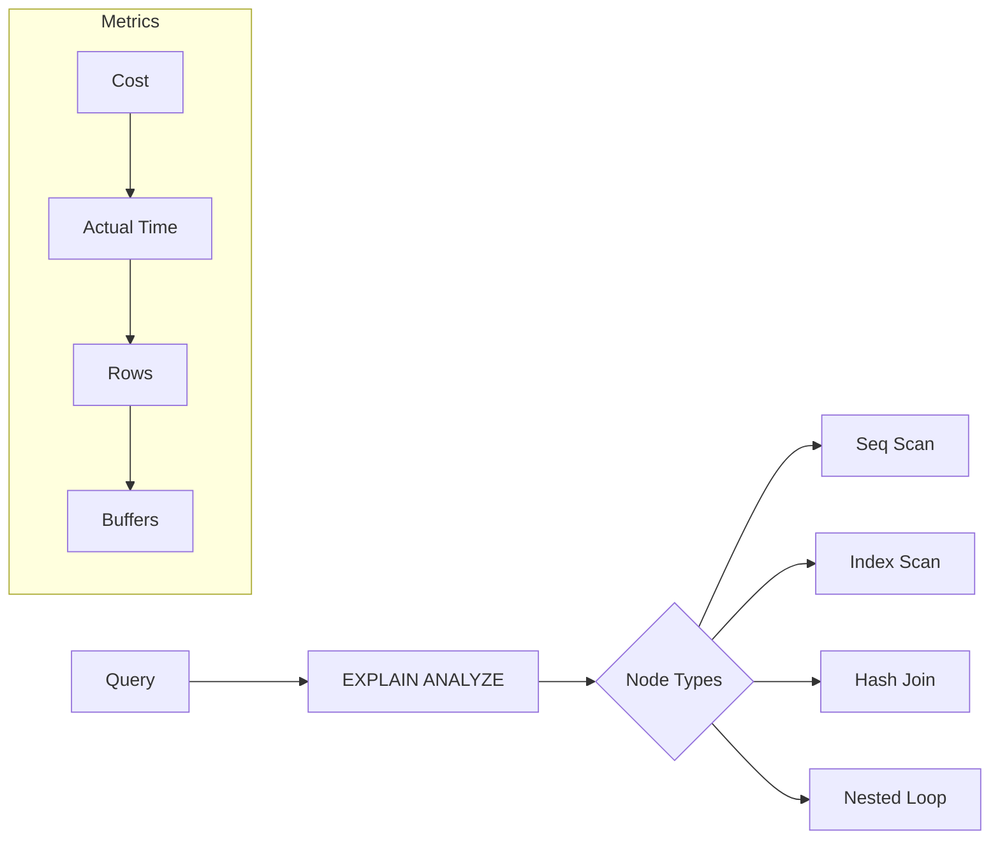
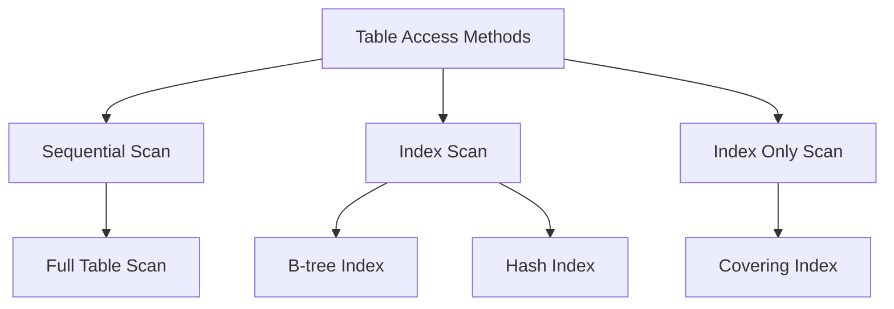
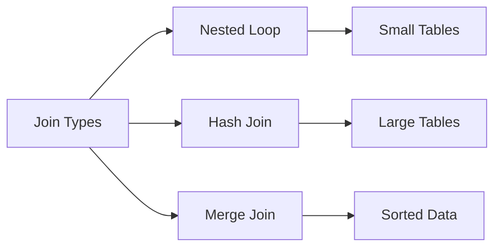
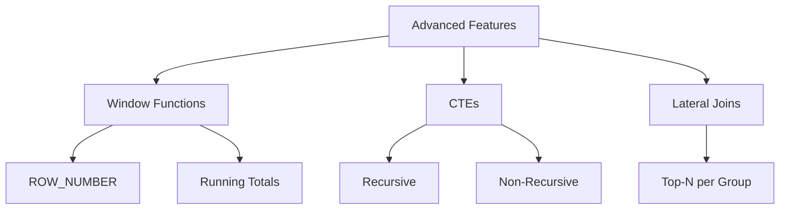
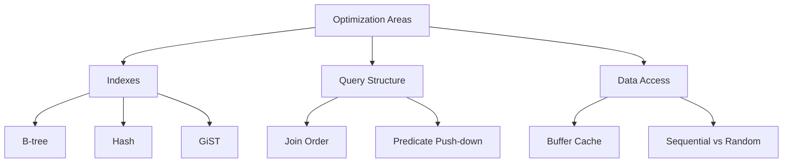

# PostgreSQL Query Optimization Workshop

This section focuses on understanding and optimizing PostgreSQL queries through practical examples and real-world scenarios.

## Files Overview

1. `query_explorer.rb`: Core utility for analyzing query execution plans
2. `practice_queries.rb`: Basic examples for getting started
3. `query_optimization_lab.rb`: Structured exercises with sample data
4. `advanced_queries.rb`: Complex query patterns and optimizations

## Query Execution Flow



## EXPLAIN ANALYZE Workflow



## Learning Path

### 1. Understanding EXPLAIN ANALYZE Basics

#### 1.1 Simple Query Analysis
```sql
SELECT * FROM customers WHERE country = 'USA';

-- EXPLAIN output components:
Seq Scan on customers  (cost=0.00..2.62 rows=10 width=8)
  Filter: ((country)::text = 'USA'::text)
  Rows Removed by Filter: 40
```

Key components to understand:
- **Node Type** (e.g., `Seq Scan`): How PostgreSQL accesses the data
- **Cost**: Estimated processing cost (first number is startup, second is total)
- **Rows**: Estimated number of rows to be processed
- **Width**: Estimated average width of rows in bytes

#### 1.2 Reading Execution Statistics
```sql
EXPLAIN (ANALYZE, BUFFERS) 
SELECT * FROM customers WHERE country = 'USA';

-- Output includes:
Seq Scan on customers (cost=0.00..2.62 rows=10 width=8) (actual time=0.004..0.007 rows=10 loops=1)
  Filter: ((country)::text = 'USA'::text)
  Rows Removed by Filter: 40
  Buffers: shared hit=2
```

Additional metrics:
- **actual time**: Real execution time (ms) - startup time..total time
- **rows**: Actual number of rows processed
- **loops**: Number of times this node was executed
- **Buffers**: Memory/disk page access statistics

### 2. Common Access Methods



#### 2.1 Sequential Scan
```sql
SELECT name FROM customers;
-- Shows basic table scan without conditions
```

#### 2.2 Index Scan
```sql
SELECT * FROM orders WHERE customer_id = 1;
-- Uses index on customer_id if available
```

#### 2.3 Index Only Scan
```sql
SELECT country FROM customers WHERE country = 'USA';
-- Can use index without touching the table if index includes all needed columns
```

### 3. Join Operations



#### 3.1 Nested Loop Join
```sql
-- Good for small tables or when joining with highly selective conditions
SELECT c.name, o.id 
FROM customers c 
JOIN orders o ON c.id = o.customer_id 
WHERE c.country = 'USA';
```

Example plan:
```
Nested Loop  (cost=0.28..16.32 rows=10 width=24)
  ->  Seq Scan on customers c  (cost=0.00..2.62 rows=10 width=16)
        Filter: (country = 'USA'::text)
  ->  Index Scan using idx_orders_customer_id on orders o  (cost=0.28..1.37 rows=1 width=16)
        Index Cond: (customer_id = c.id)
```

#### 3.2 Hash Join
```sql
-- Better for larger tables when joining on equality conditions
SELECT c.name, o.id, li.product_name
FROM customers c 
JOIN orders o ON c.id = o.customer_id
JOIN line_items li ON o.id = li.order_id;
```

Example plan:
```
Hash Join  (cost=33.90..125.60 rows=2564 width=37)
  Hash Cond: (orders.customer_id = customers.id)
  ->  Hash Join  (cost=30.77..115.17 rows=2564 width=26)
        Hash Cond: (line_items.order_id = orders.id)
        ->  Seq Scan on line_items
        ->  Hash
            ->  Seq Scan on orders
  ->  Hash
      ->  Seq Scan on customers
```

### 4. Advanced Operations



#### 4.1 Window Functions
From `advanced_queries.rb`:
```sql
SELECT 
  orders.*, 
  ROW_NUMBER() OVER (PARTITION BY customer_id ORDER BY created_at) as order_sequence
FROM orders;
```

Key components in plan:
- WindowAgg node
- Sorting operations for PARTITION BY and ORDER BY
- Memory usage for window frame

#### 4.2 Recursive CTEs
From `advanced_queries.rb`:
```sql
WITH RECURSIVE order_chain AS (
  -- Base case
  SELECT o.id, o.customer_id, o.created_at, 1 as chain_length
  FROM orders o
  JOIN customers c ON c.id = o.customer_id
  WHERE c.country = 'USA'
  
  UNION ALL
  
  -- Recursive case
  SELECT o.id, o.customer_id, o.created_at, oc.chain_length + 1
  FROM orders o
  JOIN order_chain oc ON o.customer_id = oc.customer_id
  WHERE o.created_at BETWEEN oc.created_at AND oc.created_at + INTERVAL '7 days'
    AND o.id > oc.id
)
SELECT customer_id, MAX(chain_length) as longest_chain
FROM order_chain
GROUP BY customer_id
HAVING MAX(chain_length) > 1;
```

### 5. Performance Optimization Tips



#### 5.1 Index Usage
From `query_optimization_lab.rb`:
```ruby
def create_indexes
  connection = ActiveRecord::Base.connection
  
  # Add indexes if they don't exist
  unless index_exists?(:customers, :country)
    connection.add_index :customers, :country
  end

  unless index_exists?(:orders, :customer_id)
    connection.add_index :orders, :customer_id
  end
end
```

#### 5.2 Join Optimization
From `query_optimization_lab.rb`:
```ruby
def exercise_2_join_optimization
  # Query 1: Simple JOIN
  query1 = Order.joins(:customer)
    .where(customers: { country: 'USA' })
  
  # Query 2: Multiple JOINs with optimization
  query2 = Order.joins(:customer, :line_items)
    .where(customers: { country: 'USA' })
    .group('orders.id')
    .select('orders.*, COUNT(line_items.id) as items_count')
end
```

## Running the Examples

1. Setup Database:
```bash
bundle install
rake db:setup
```

2. Run Basic Examples:
```bash
ruby examples/03_queries/practice_queries.rb
```

3. Run Optimization Lab:
```bash
ruby examples/03_queries/query_optimization_lab.rb
```

4. Run Advanced Queries:
```bash
ruby examples/03_queries/advanced_queries.rb
```

## Additional Resources

1. [PostgreSQL Official Documentation - Using EXPLAIN](https://www.postgresql.org/docs/current/using-explain.html)
2. [PostgreSQL Official Documentation - Performance Tips](https://www.postgresql.org/docs/current/performance-tips.html)
3. [Understanding EXPLAIN ANALYZE Output](https://www.postgresql.org/docs/current/using-explain.html#USING-EXPLAIN-ANALYZE)
4. [Index Types](https://www.postgresql.org/docs/current/indexes-types.html) 