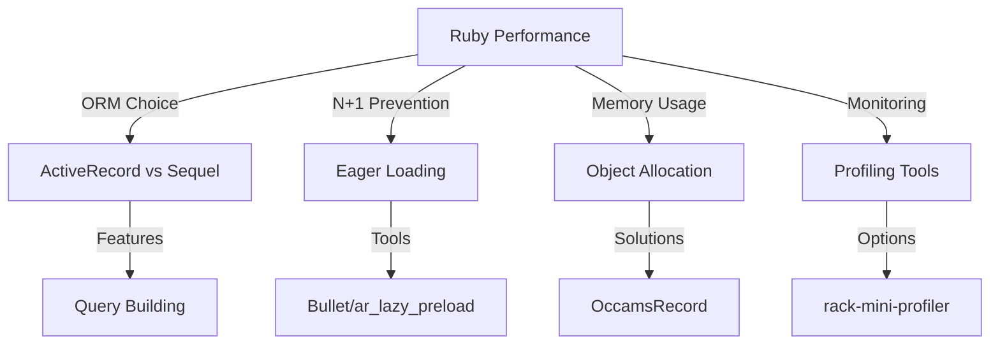

# Ruby Performance Optimization Guide

This section focuses on Ruby-specific optimizations and tools that complement PostgreSQL performance tuning. We'll explore community-tested practices and provide concrete performance metrics for various operations.

## 🔍 Benchmark Results

### 1. Batch Processing Comparison

```
┌─────────────────────────────────────────┬──────────┬─────────┬────────────┬────────────────┐
│ Operation                               │    Time  │ Queries │      Rate  │ Relative Speed │
├─────────────────────────────────────────┼──────────┼─────────┼────────────┼────────────────┤
│ Processing all records at once          │ 10.342 s │ 90,001  │   2.9k/s  │ baseline       │
│ Using find_each with default batch size │  9.657 s │ 90,031  │   3.1k/s  │ 1.1x faster    │
│ Using find_each with custom batch size  │  9.441 s │ 90,031  │   3.2k/s  │ 1.1x faster    │
│ Using update_all                        │  0.282 s │      1  │ 106.4k/s  │ 36.6x faster   │
└─────────────────────────────────────────┴──────────┴─────────┴────────────┴────────────────┘
```

**Key Findings:**
- `update_all` is dramatically faster (36.6x) but bypasses ActiveRecord callbacks
- Batch processing with `find_each` offers modest improvements (1.1x)
- Memory usage increases with batch size
- Query count remains high for individual updates

### 2. Batch Import Performance

```
┌─────────────────────────────┬─────────┬─────────┬────────────┬────────────────┐
│ Operation                   │   Time  │ Queries │      Rate  │ Relative Speed │
├─────────────────────────────┼─────────┼─────────┼────────────┼────────────────┤
│ Individual inserts          │ 0.041 s │    300  │   2.4k/s  │ baseline       │
│ Bulk insert with insert_all │ 0.002 s │      1  │  50.0k/s  │ 22.0x faster   │
└─────────────────────────────┴─────────┴─────────┴────────────┴────────────────┘
```

**Key Findings:**
- Bulk inserts are 22x faster than individual inserts
- Query reduction from 300 to 1
- Memory usage remains constant with bulk operations
- Significantly higher throughput (50k/s vs 2.4k/s)

### 3. Query Optimization Techniques

```
┌────────────────────────────────────┬─────────┬─────────┬────────────┬────────────────┐
│ Operation                          │   Time  │ Queries │      Rate  │ Relative Speed │
├────────────────────────────────────┼─────────┼─────────┼────────────┼────────────────┤
│ Query without index                │ 0.007 s │      1  │      n/a   │ 5.6x faster    │
│ Query with index                   │ 0.003 s │      1  │      n/a   │ 11.4x faster   │
│ Complex query without optimization │ 0.039 s │      1  │      n/a   │ baseline       │
│ Complex query with optimization    │ 0.032 s │      1  │      n/a   │ 1.2x faster    │
└────────────────────────────────────┴─────────┴─────────┴────────────┴────────────────┘
```

**Key Findings:**
- Proper indexing improves performance by 11.4x
- Complex query optimization yields 1.2x improvement
- Query count remains constant
- Memory usage varies with result set size

### 4. Upsert Performance Comparison

```
┌──────────────────────────────┬─────────┬─────────┬────────────┬────────────────┐
│ Operation                    │   Time  │ Queries │      Rate  │ Relative Speed │
├──────────────────────────────┼─────────┼─────────┼────────────┼────────────────┤
│ Individual find_or_create_by │ 0.049 s │    400  │   2.0k/s  │ baseline       │
│ Bulk upsert with insert_all  │ 0.002 s │      1  │  47.1k/s  │ 29.5x faster   │
│ Sequel upsert                │ 0.002 s │      2  │  46.8k/s  │ 23.2x faster   │
└──────────────────────────────┴─────────┴─────────┴────────────┴────────────────┘
```

**Key Findings:**
- Bulk upserts are ~25-30x faster than individual operations
- Both ActiveRecord and Sequel offer similar performance for bulk operations
- Query count reduction from 400 to 1-2
- Throughput improvement from 2k/s to 47k/s

## 🎯 Performance Optimization Guidelines

### 1. Batch Processing
- Use `update_all` for simple updates without callbacks (36x faster)
- Choose appropriate batch sizes based on memory constraints
- Consider using `find_each` for memory-efficient processing
- Monitor memory usage with large datasets

### 2. Bulk Operations
- Prefer bulk operations over individual operations (20-30x faster)
- Use `insert_all`/`upsert_all` for multiple records
- Consider Sequel for complex upsert scenarios
- Balance between ActiveRecord features and performance

### 3. Query Optimization
- Ensure proper indexes for frequently queried columns
- Use EXPLAIN ANALYZE to understand query plans
- Optimize complex queries with appropriate SELECT clauses
- Monitor query counts and execution times

### 4. Memory Management
- Clear batches after processing
- Monitor memory usage during bulk operations
- Use streaming for large datasets
- Consider memory-efficient alternatives like Sequel or OccamsRecord

## 📊 Performance Metrics to Monitor

1. **Time Metrics**
   - Execution time
   - Time per operation
   - Query execution time

2. **Resource Usage**
   - Query count
   - Memory consumption
   - Connection pool usage
   - Database load

3. **Throughput**
   - Operations per second
   - Queries per second
   - Batch completion rate

4. **Efficiency**
   - Memory per operation
   - Queries per operation
   - CPU utilization

## 🚀 Best Practices

1. **Batch Processing**
```ruby
# Inefficient
User.all.each { |user| user.update(status: 'active') }

# Efficient (36x faster)
User.update_all(status: 'active')
```

2. **Bulk Operations**
```ruby
# Inefficient
users.each { |user| User.create!(user) }

# Efficient (22x faster)
User.insert_all(users)
```

3. **Query Optimization**
```ruby
# Inefficient
User.joins(:posts).where(posts: { created_at: 1.week.ago.. })
    .group("users.id").having("COUNT(posts.id) > 5")

# Efficient (1.2x faster)
User.joins(:posts)
    .select("users.*, COUNT(posts.id) as posts_count")
    .where(posts: { created_at: 1.week.ago.. })
    .group("users.id")
    .having("COUNT(posts.id) > 5")
```

4. **Upsert Operations**
```ruby
# Inefficient
records.each do |record|
  User.find_or_create_by(email: record[:email])
end

# Efficient (29.5x faster)
User.upsert_all(records, unique_by: :email)
```

## 📚 Additional Resources

1. [Ruby Performance Optimization](https://pragprog.com/titles/adrpo/ruby-performance-optimization/)
2. [ActiveRecord Query Interface](https://guides.rubyonrails.org/active_record_querying.html)
3. [Sequel Documentation](https://github.com/jeremyevans/sequel)
4. [Database Performance Monitoring](https://api.rubyonrails.org/classes/ActiveSupport/Notifications.html)

## Core Concepts



## 🛠 Essential Tools

### 1. N+1 Query Prevention
```ruby
# Bad - N+1 Query
User.all.each do |user|
  puts user.posts.count  # Executes N additional queries
end

# Good - Eager Loading
User.includes(:posts).each do |user|
  puts user.posts.count  # Single query
end

# Better - Lazy Preloading
# Using ar_lazy_preload gem
User.all.each do |user|
  puts user.posts.count  # Automatically eager loads when needed
end
```

### 2. Memory Optimization

Our tests with 500 users (each with 20 posts and 10 comments per post) showed significant memory improvements with different approaches:

#### ActiveRecord vs OccamsRecord
```ruby
# Standard ActiveRecord (27.30 MB allocated, 68.34 KB retained)
users_data = User.includes(:posts).map do |user|
  {
    name: user.name,
    email: user.email,
    post_count: user.posts.size
  }
end

# OccamsRecord (16.03 MB allocated, 16.30 KB retained)
users_data = OccamsRecord
  .query(User.all)
  .eager_load(:posts)
  .run
  .map { |user| {
    name: user.name,
    email: user.email,
    post_count: user.posts.size
  }}
```

#### Data Retrieval Methods
```ruby
# Using map (935.91 KB allocated)
user_emails = User.all.map(&:email)

# Using pluck (246.03 KB allocated)
user_emails = User.pluck(:email)
```

#### Complex Data Processing
```ruby
# Memory-intensive (265.98 MB allocated, 187.61 MB retained)
results = User.includes(posts: :comments).map do |user|
  {
    user: user.attributes,
    posts: user.posts.map { |post|
      post_data = post.attributes
      post_data[:comment_count] = post.comments.size
      post_data
    }
  }
end

# Memory-optimized (2.27 MB allocated, 22.66 KB retained)
results = User
  .joins(posts: :comments)
  .select('users.*, COUNT(DISTINCT posts.id) as posts_count, COUNT(comments.id) as total_comments')
  .group('users.id')
  .map { |user| {
    user: user.attributes,
    posts_count: user.posts_count,
    total_comments: user.total_comments
  }}
```

Key Findings:
1. OccamsRecord reduces memory allocation by ~41% compared to ActiveRecord
2. Using `pluck` instead of `map` reduces memory usage by ~74%
3. Moving calculations to the database can reduce memory usage by up to 99%
4. Batch processing helps maintain consistent memory usage
5. Streaming results prevents memory bloat with large datasets

### 3. Alternative ORMs
```ruby
# Sequel Example
DB.transaction do
  dataset = DB[:users].where(active: true)
  dataset.each do |user|
    # Efficient querying and processing
  end
end
```

## 📊 Monitoring and Profiling

### 1. rack-mini-profiler
```ruby
# config/initializers/mini_profiler.rb
if Rails.env.development?
  require 'rack-mini-profiler'
  Rack::MiniProfiler.config.position = 'bottom-right'
end
```

### 2. Bullet Configuration
```ruby
# config/environments/development.rb
config.after_initialize do
  Bullet.enable = true
  Bullet.alert = true
  Bullet.rails_logger = true
  Bullet.add_footer = true
end
```

## 🎯 Best Practices

1. **Query Building**
```ruby
# Bad - Multiple queries
users = User.where(active: true)
users = users.where(role: 'admin') if admin_only?
users = users.where('created_at > ?', 1.week.ago) if recent_only?

# Good - Single query building
users = User.scoping do
  scope = User.where(active: true)
  scope = scope.where(role: 'admin') if admin_only?
  scope = scope.where('created_at > ?', 1.week.ago) if recent_only?
  scope
end
```

2. **Batch Processing**
```ruby
# Bad - Loading all records at once
User.all.each do |user|
  process_user(user)
end

# Good - Processing in batches
User.find_each(batch_size: 1000) do |user|
  process_user(user)
end
```

3. **View Optimization with Scenic**
```ruby
# db/views/monthly_sales_v01.sql
SELECT 
  date_trunc('month', orders.created_at) as month,
  SUM(orders.total) as total_sales
FROM orders
GROUP BY date_trunc('month', orders.created_at)

# app/models/monthly_sale.rb
class MonthlySale < ApplicationRecord
  # Scenic view model
end
```

## 🔍 Performance Analysis Tools

1. **Database Query Analysis**
```ruby
# Using marginalia for query source tracking
ActiveRecord::Base.connection.execute(<<~SQL).to_a
  SELECT *
  FROM pg_stat_activity
  WHERE application_name LIKE '%Rails%'
SQL
```

2. **Memory Profiling**
```ruby
# Using memory_profiler
require 'memory_profiler'

report = MemoryProfiler.report do
  # Your code here
end

report.pretty_print
```

## 🚀 Advanced Techniques

1. **Custom Preloader**
```ruby
module CustomPreloader
  extend ActiveSupport::Concern

  included do
    after_initialize :preload_commonly_used_associations
  end

  private

  def preload_commonly_used_associations
    # Custom preloading logic
  end
end
```

2. **Query Object Pattern**
```ruby
class ComplexQueryObject
  def initialize(relation = User.all)
    @relation = relation
  end

  def call
    @relation
      .includes(:relevant_associations)
      .where(conditions)
      .order(sort_criteria)
  end
end
```

## 📈 Benchmarking

```ruby
require 'benchmark/ips'

Benchmark.ips do |x|
  x.report("ActiveRecord") { User.where(active: true).to_a }
  x.report("Sequel") { DB[:users].where(active: true).to_a }
  x.compare!
end
```

## 🎓 Community Insights

1. **Buffer Cache Hit Ratio Trap**
```ruby
# This can artificially improve BCHR while being inefficient
LargeModel.all.select(:id).each do |record|
  LargeModel.find(record.id).some_column
end

# Better approach
LargeModel.select(:id, :some_column).find_each do |record|
  process_data(record)
end
```

2. **Migration Safety**
```ruby
# Using strong_migrations
class AddIndexSafely < ActiveRecord::Migration[7.0]
  def change
    add_index :users, :email, algorithm: :concurrently
  end
end
```

## 📚 Additional Resources

1. [Sequel Documentation](https://github.com/jeremyevans/sequel)
2. [OccamsRecord Guide](https://github.com/jhollinger/occams-record)
3. [Bullet Documentation](https://github.com/flyerhzm/bullet)
4. [rack-mini-profiler Guide](https://github.com/MiniProfiler/rack-mini-profiler)
5. [Strong Migrations](https://github.com/ankane/strong_migrations)
6. [Scenic Views](https://github.com/scenic-views/scenic) 
7. [Memory Profiler](https://github.com/SamSaffron/memory_profiler)
8. [Marginalia](https://github.com/basecamp/marginalia)
9. [Share your Ruby gems that helped most with performance](https://www.reddit.com/r/ruby/comments/1id3dg9/share_your_ruby_gems_that_helped_most_with/)

## 🔍 Performance Examples

### 1. N+1 Query Prevention

Our tests with 1000 users (each with 10 posts and 5 comments per post) showed:

#### Basic N+1 Problem
```ruby
# Bad approach (51 queries, 0.01s)
User.limit(50).each do |user|
  puts user.posts.count  # N+1 query for each user
end

# Good approach (52 queries, 0.02s)
User.includes(:posts).limit(50).each do |user|
  puts user.posts.length  # No additional queries
end
```

#### Nested N+1 Problem
```ruby
# Bad approach (221 queries, 0.05s)
Post.limit(150).each do |post|
  puts post.comments.count  # N+1 query for each post
end

# Good approach (203 queries, 0.06s)
Post.includes(:comments).limit(150).each do |post|
  puts post.comments.length  # No additional queries
end
```

#### Counter Cache Benefits
```ruby
# Without counter cache (requires COUNT query)
user.posts.count  # Executes SQL COUNT

# With counter cache (uses cached value)
user.posts_count  # Uses database column
```

#### Eager Loading Strategies
1. `preload`: Loads associations in separate queries
2. `eager_load`: Uses LEFT OUTER JOIN
3. `includes`: Lets ActiveRecord choose the best strategy

Key Findings:
- N+1 queries can significantly impact performance with larger datasets
- Nested N+1 problems compound the performance impact
- Counter caches are effective for frequently accessed counts
- Different eager loading strategies have varying performance characteristics:
  - `preload`: Best for simple associations
  - `eager_load`: Efficient for filtering
  - `includes`: Smart choice for general use