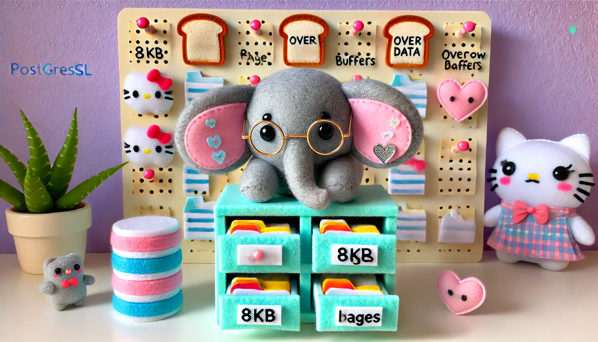
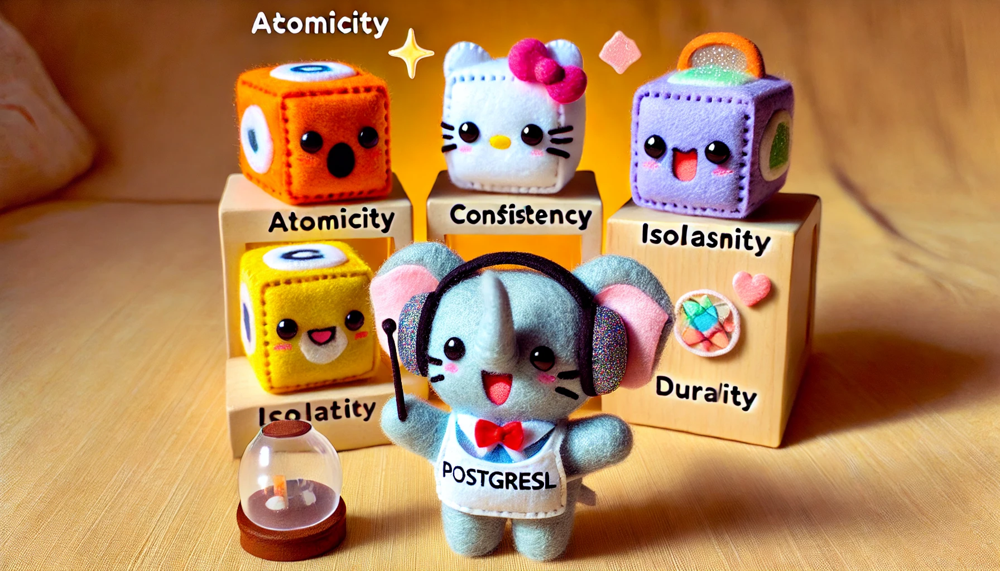
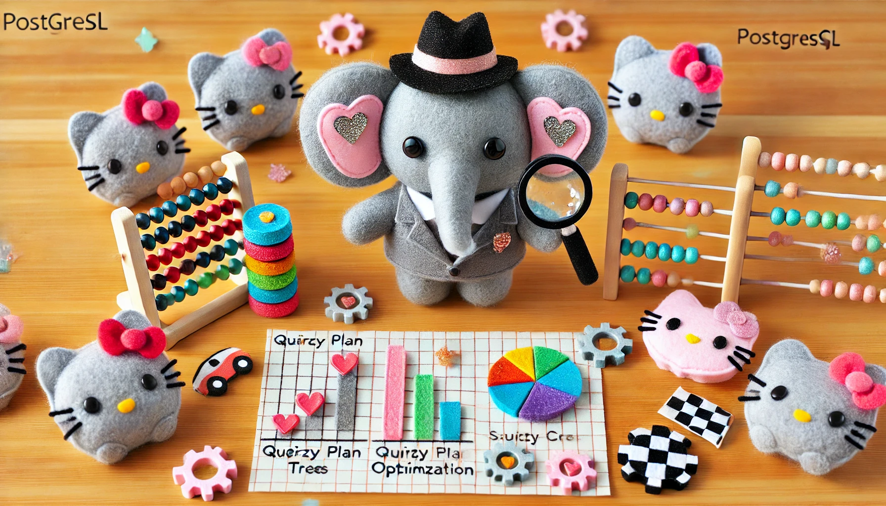
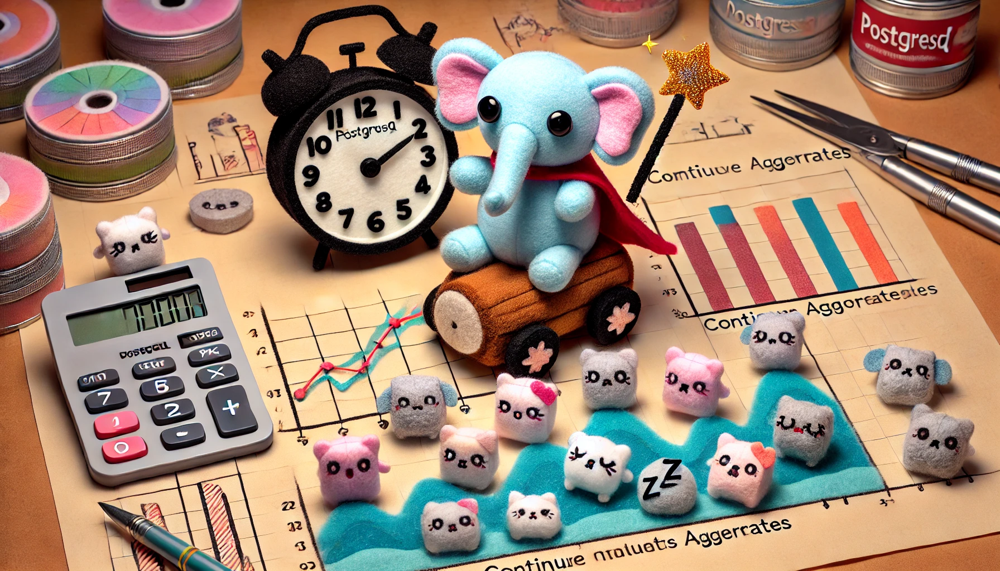

# PostgreSQL Performance Workshop 🐘

> **Signal vs Noise** - In a sea of data, how do you find the whales?

**Jônatas Davi Paganini** - https://ideia.me  
*Staff Developer at BaxEnergy - A Yokogawa company*


---

## Workshop Overview 🎯

This hands-on workshop will take you through the essential concepts of PostgreSQL performance optimization, from storage internals to advanced query optimization.

--

### What You'll Learn

* **Storage & Memory Management** - Understanding how PostgreSQL stores and manages data
* **Transaction Management** - ACID properties and concurrency control
* **Query Optimization** - Indexes, query plans, and performance tuning
* **TimescaleDB** - Time-series data optimization
* **Ruby Integration** - Best practices for Rails applications

--

### Workshop Structure

* **4 Main Modules** - Each with hands-on exercises
* **Interactive Polls** - Check your understanding
* **Real Examples** - Practical code and SQL
* **Performance Labs** - Hands-on optimization

---

## Module 1: Storage & Memory Management 💾


--

### What's Your Experience Level?

* Beginner - Just getting started with PostgreSQL
* Intermediate - Some experience with databases
* Advanced - Regular PostgreSQL user
* Expert - Database administrator or performance specialist

--

### Storage Fundamentals

PostgreSQL stores data in **pages** (8KB blocks) organized in **tablespaces**.

**Key Concepts**:
* **Heap** - Main storage area for table data
* **TOAST** - Storage for oversized values
* **Buffer Cache** - Memory management system
* **WAL** - Write-Ahead Log for durability

--

### TOAST (The Oversized-Attribute Storage Technique)


**What TOAST Does**:
* Compresses large field values
* Stores them in separate tables
* Transparent to users
* Automatic management

--

### Buffer Management



**Buffer Cache Components**:
```sql
-- Monitor buffer usage
SELECT blks_read, blks_hit
FROM pg_stat_database
WHERE datname = 'mydb';

-- Buffer hit ratio
SELECT 
  round(100.0 * blks_hit / (blks_hit + blks_read), 2) as hit_ratio
FROM pg_stat_database;
```

--

### WAL (Write-Ahead Log)

**Ensures Data Durability**:
* Logs changes before writing to data files
* Enables crash recovery
* Supports replication
* Critical for ACID compliance

**WAL Configuration**:
```sql
-- Check WAL settings
SHOW wal_level;
SHOW synchronous_commit;
SHOW checkpoint_timeout;
```

---

## Module 2: Transaction Management 🔄


--

### ACID Properties Quiz

Which ACID property ensures that transactions are all-or-nothing?

* Atomicity
* Consistency  
* Isolation
* Durability

--

### ACID Properties Deep Dive



**ACID Breakdown**:
* **Atomicity** - All-or-nothing execution
* **Consistency** - Valid data only
* **Isolation** - Concurrent transactions don't interfere
* **Durability** - Committed changes are permanent

--

### Transaction Isolation Levels

**PostgreSQL Supports**:
* **Read Committed** (default)
* **Repeatable Read**
* **Serializable**

**Isolation Trade-offs**:
```ruby
# Example: Read Committed
Account.transaction do
  balance = account.balance  # Can see other commits
  sleep(1)
  # Balance might have changed!
end

# Example: Repeatable Read  
Account.transaction(isolation: :repeatable_read) do
  balance = account.balance  # Consistent view
  sleep(1)
  # Same balance throughout transaction
end
```

--

### MVCC (Multi-Version Concurrency Control)

**How PostgreSQL Handles Concurrency**:
* Each transaction sees a consistent snapshot
* Updates create new row versions
* Old versions remain for other transactions
* Automatic cleanup via VACUUM

**MVCC Benefits**:
* No read locks needed
* High concurrency
* Consistent reads
* Automatic conflict resolution

---

## Module 3: Query Optimization 🔍



--

### Query Performance Experience

How often do you analyze query performance in your current role?

* Never - I just write queries
* Sometimes - When things are slow
* Regularly - Part of my routine
* Always - Performance is critical

--

### Index Types Overview

**PostgreSQL Index Types**:
* **B-tree** - Default, equality and range queries
* **BRIN** - Block Range Index for time-series
* **GiST** - Geometric/geographic data
* **GIN** - Full-text search and arrays

--

### B-tree Indexes

**Most Common Index Type**:
```sql
-- Basic B-tree index
CREATE INDEX idx_users_email ON users(email);

-- Compound index
CREATE INDEX idx_orders_composite ON orders(user_id, created_at);

-- Unique index
CREATE UNIQUE INDEX idx_users_unique_email ON users(email);
```

**When to Use**:
* Equality comparisons (=)
* Range queries (<, >, BETWEEN)
* Pattern matching (LIKE 'prefix%')
* ORDER BY operations

--

### BRIN Indexes

**Perfect for Time-Series Data**:
```sql
-- BRIN index for timestamps
CREATE INDEX idx_events_time ON events 
USING brin(created_at);

-- With custom page range
CREATE INDEX idx_events_time_brin ON events 
USING brin(created_at) WITH (pages_per_range = 128);
```

**BRIN Advantages**:
* Very small size (< 1% of table)
* Great for append-only data
* Efficient range queries
* Low maintenance overhead

--

### Query Plan Analysis


**Understanding Query Plans**:
```sql
-- Basic EXPLAIN
EXPLAIN SELECT * FROM users WHERE email = 'test@example.com';

-- With execution statistics
EXPLAIN ANALYZE SELECT * FROM users WHERE email = 'test@example.com';

-- With buffer information
EXPLAIN (ANALYZE, BUFFERS) 
SELECT * FROM users WHERE email = 'test@example.com';
```

--

### JOIN Types

**Understanding Different JOINs**:


**JOIN Performance Tips**:
* Use appropriate indexes
* Consider join order
* Watch for cartesian products
* Use EXPLAIN to analyze

---

## Module 4: TimescaleDB ⏰


--

### Time-Series Data Experience

How much time-series data do you work with?

* None - Regular relational data only
* Some - Occasional time-based queries
* Lots - Time-series is important
* Everything - Pure time-series applications

--

### TimescaleDB Overview

**Built on PostgreSQL**:
* Automatic time-based partitioning
* Continuous aggregates
* SQL compatibility
* Time-series optimizations

--

### Hypertables

**Automatic Time Partitioning**:
```sql
-- Create hypertable
SELECT create_hypertable('measurements', 'time',
  chunk_time_interval => INTERVAL '1 day');

-- View chunks
SELECT show_chunks('measurements');

-- Add compression
SELECT add_compression_policy('measurements', 
  INTERVAL '7 days');
```

--

### Continuous Aggregates



**Automatic Materialized Views**:
```sql
-- Create continuous aggregate
CREATE MATERIALIZED VIEW measurements_hourly
WITH (timescaledb.continuous) AS
SELECT time_bucket('1 hour', time) as bucket,
       device_id,
       avg(temperature) as avg_temp,
       max(temperature) as max_temp
FROM measurements
GROUP BY bucket, device_id;

-- Set refresh policy
SELECT add_continuous_aggregate_policy('measurements_hourly',
  start_offset => INTERVAL '3 hours',
  end_offset => INTERVAL '1 hour',
  schedule_interval => INTERVAL '1 hour');
```

--

### Time-Series Queries


**TimescaleDB Functions**:
```sql
-- Time bucketing
SELECT time_bucket('1 hour', time) as hour,
       avg(temperature) as avg_temp
FROM measurements
WHERE time > NOW() - INTERVAL '24 hours'
GROUP BY hour
ORDER BY hour;

-- Gap filling
SELECT time_bucket('1 hour', time) as hour,
       avg(temperature) as avg_temp,
       count(*) as readings
FROM measurements
WHERE time > NOW() - INTERVAL '24 hours'
GROUP BY hour
ORDER BY hour;
```

---

## Performance Lab: Hands-On Optimization 🧪

--

### Lab Setup

**What We'll Cover**:
* Storage optimization
* Index strategy
* Query tuning
* TimescaleDB features
* Ruby performance

--

### Storage Optimization Lab

**Exercise 1: Column Order**:
```sql
-- Analyze table structure
SELECT column_name, data_type, 
       pg_column_size(column_name::text) as size
FROM information_schema.columns
WHERE table_name = 'users'
ORDER BY ordinal_position;
```

**Exercise 2: TOAST Analysis**:
```sql
-- Check TOAST usage
SELECT schemaname, tablename, attname,
       n_distinct, correlation
FROM pg_stats
WHERE tablename = 'users'
  AND attname LIKE '%data%';
```

--

### Index Strategy Lab

**Exercise 3: Index Analysis**:
```sql
-- Find unused indexes
SELECT schemaname, tablename, indexname, idx_scan
FROM pg_stat_user_indexes
WHERE idx_scan = 0
  AND idx_is_unique IS FALSE;

-- Check index usage
SELECT schemaname, tablename, indexname,
       idx_scan, idx_tup_read, idx_tup_fetch
FROM pg_stat_user_indexes
ORDER BY idx_scan DESC;
```

**Exercise 4: Query Plan Analysis**:
```sql
-- Analyze slow queries
EXPLAIN (ANALYZE, BUFFERS, FORMAT JSON)
SELECT u.name, COUNT(o.id) as order_count
FROM users u
LEFT JOIN orders o ON u.id = o.user_id
WHERE u.created_at > '2024-01-01'
GROUP BY u.id, u.name
HAVING COUNT(o.id) > 5
ORDER BY order_count DESC;
```

--

### TimescaleDB Lab

**Exercise 5: Hypertable Creation**:
```sql
-- Create time-series table
CREATE TABLE sensor_data (
  time TIMESTAMPTZ NOT NULL,
  sensor_id TEXT NOT NULL,
  temperature DOUBLE PRECISION,
  humidity DOUBLE PRECISION
);

-- Convert to hypertable
SELECT create_hypertable('sensor_data', 'time',
  chunk_time_interval => INTERVAL '1 day');

-- Add compression
SELECT add_compression_policy('sensor_data',
  INTERVAL '7 days');
```

--

**Exercise 6: Continuous Aggregates**:
```sql
-- Create continuous aggregate
CREATE MATERIALIZED VIEW sensor_hourly
WITH (timescaledb.continuous) AS
SELECT time_bucket('1 hour', time) as bucket,
       sensor_id,
       avg(temperature) as avg_temp,
       avg(humidity) as avg_humidity
FROM sensor_data
GROUP BY bucket, sensor_id;

-- Query the aggregate
SELECT bucket, sensor_id, avg_temp, avg_humidity
FROM sensor_hourly
WHERE bucket > NOW() - INTERVAL '24 hours'
ORDER BY bucket DESC;
```

---

## Performance Monitoring & Tuning 📊

--

### Key Performance Metrics

**What to Monitor**:
* Query execution time
* Buffer hit ratio
* Index usage
* Lock contention
* Connection usage

--

### Monitoring Queries

**Essential Monitoring SQL**:
```sql
-- Database statistics
SELECT datname, 
       xact_commit, xact_rollback,
       blks_read, blks_hit,
       tup_returned, tup_fetched, tup_inserted
FROM pg_stat_database
WHERE datname = current_database();

-- Table statistics
SELECT schemaname, relname,
       seq_scan, seq_tup_read,
       idx_scan, idx_tup_fetch
FROM pg_stat_user_tables
ORDER BY seq_scan DESC;

-- Index statistics
SELECT schemaname, tablename, indexname,
       idx_scan, idx_tup_read, idx_tup_fetch
FROM pg_stat_user_indexes
ORDER BY idx_scan DESC;
```

--

### Performance Tuning Checklist

**Storage & Memory**:
* [ ] Monitor buffer hit ratio (>95%)
* [ ] Check TOAST usage
* [ ] Review VACUUM frequency
* [ ] Optimize column order

**Indexes**:
* [ ] Remove unused indexes
* [ ] Add missing indexes
* [ ] Consider BRIN for time-series
* [ ] Monitor index size

**Queries**:
* [ ] Use EXPLAIN ANALYZE
* [ ] Avoid N+1 queries
* [ ] Optimize JOINs
* [ ] Use appropriate data types

**TimescaleDB**:
* [ ] Set chunk intervals
* [ ] Configure compression
* [ ] Use continuous aggregates
* [ ] Implement retention policies

---

## Advanced Topics 🚀

--

### Partitioning Strategies

**When to Partition**:
* Tables > 100GB
* Time-based data retention
* Different storage policies
* Performance optimization

**Partition Types**:
```sql
-- Range partitioning
CREATE TABLE events (
  id BIGINT,
  created_at TIMESTAMP,
  data JSONB
) PARTITION BY RANGE (created_at);

-- List partitioning
CREATE TABLE orders (
  id BIGINT,
  status TEXT,
  data JSONB
) PARTITION BY LIST (status);

-- Hash partitioning
CREATE TABLE users (
  id BIGINT,
  email TEXT,
  data JSONB
) PARTITION BY HASH (id);
```

--

### Materialized Views

**When to Use**:
* Complex, expensive queries
* Frequently accessed reports
* Data warehouse scenarios
* Periodic analytics

**Example**:
```sql
-- Create materialized view
CREATE MATERIALIZED VIEW daily_order_stats AS
SELECT DATE_TRUNC('day', created_at) as date,
       COUNT(*) as order_count,
       SUM(total) as total_sales
FROM orders
GROUP BY 1
WITH DATA;

-- Refresh periodically
REFRESH MATERIALIZED VIEW daily_order_stats;
```

--

### Window Functions

**Advanced Analytics**:
```sql
-- Running totals
SELECT *,
       SUM(amount) OVER (
         ORDER BY created_at
         ROWS BETWEEN UNBOUNDED PRECEDING 
         AND CURRENT ROW
       ) as running_total
FROM transactions;

-- Ranking within groups
SELECT *,
       ROW_NUMBER() OVER (
         PARTITION BY department_id 
         ORDER BY salary DESC
       ) as salary_rank
FROM employees;
```

---

## Workshop Wrap-Up 🎉

--

### Key Takeaways

**What We Covered**:
* Storage internals and optimization
* Transaction management and ACID
* Query optimization and indexing
* TimescaleDB for time-series
* Ruby/Rails performance

--

### Performance Mindset

**Remember**:
* Measure before optimizing
* Understand the data
* Use appropriate tools
* Monitor continuously
* Test thoroughly

--

### Resources & Next Steps

**Learning Resources**:
* PostgreSQL Official Documentation
* TimescaleDB Documentation
* Rails Performance Guide
* Database Performance Tuning

**Practice Projects**:
* Build a monitoring dashboard
* Optimize existing queries
* Implement TimescaleDB
* Create performance benchmarks

--

### Final Check-in

How confident do you feel about PostgreSQL performance optimization now?

* Beginner - I understand the concepts
* Intermediate - I can apply the techniques
* Advanced - I can optimize complex systems
* Expert - I can teach others

---

## Thank You! 🙏

**Questions & Discussion**

* **Slides**: Available at https://github.com/jonatas/postgresql-performance-workshops
* **Code Examples**: All examples in the workshop repository
* **Contact**: https://ideia.me

--

**Keep Learning**:
* Practice with real data
* Monitor your applications
* Share knowledge with others
* Stay updated with PostgreSQL releases


