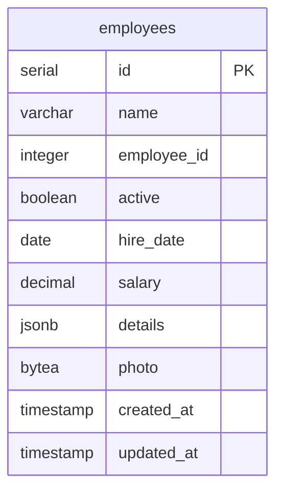

# PostgreSQL Storage Deep Dive - SQL Edition

This module provides a practical exploration of PostgreSQL's storage mechanisms using pure SQL commands and `psql`. For the language-agnostic version, see [Shared Storage Documentation](../../01_storage_README.md).


## Prerequisites

Before starting this module, ensure you understand:
- [ACID Properties](../../GLOSSARY.md#acid)
- [WAL (Write-Ahead Log)](../../GLOSSARY.md#wal)
- [TOAST](../../GLOSSARY.md#toast)
- Basic SQL knowledge
- `psql` command-line tool

## SQL-Specific Setup

### **Installation**
```bash
# Ensure PostgreSQL is running (Docker default in this repo uses port 5433)
psql -h 0.0.0.0 -p 5433 -U postgres -c "SELECT version();"

# Create workshop database (if not created by setup script)
psql -h 0.0.0.0 -p 5433 -U postgres -c "CREATE DATABASE workshop_db;" || true
```

### **Running Examples**
```bash
# Connect to the workshop database (Docker default port 5433)
psql -h 0.0.0.0 -p 5433 -U postgres -d workshop_db

# Run storage analysis
\i sql/01_storage/practice_storage.sql

# Run tuple analysis
\i sql/01_storage/practice_tuple.sql

# Run WAL analysis
\i sql/01_storage/practice_wal_final.sql

# Alternatively, using DATABASE_URL
# psql "$DATABASE_URL" -f sql/01_storage/practice_storage.sql
```

## 🚀 Quick Start Guide

### **Step 1: Verify PostgreSQL Connection**
```bash
# Test connection to PostgreSQL (Docker port 5433)
psql -h 0.0.0.0 -p 5433 -U postgres -c "SELECT version();"
```

### **Step 2: Create Workshop Database**
```bash
# Create the workshop database
psql -h 0.0.0.0 -p 5433 -U postgres -c "CREATE DATABASE workshop_db;" || true
```

### **Step 3: Run Storage Analysis**
```bash
# Run the basic storage analysis
psql -h 0.0.0.0 -p 5433 -U postgres -d workshop_db -f sql/01_storage/practice_storage.sql
```

### **Step 4: Run Tuple Analysis**
```bash
# Run the tuple analysis
psql -h 0.0.0.0 -p 5433 -U postgres -d workshop_db -f sql/01_storage/practice_tuple.sql
```

### **Step 5: Run WAL Analysis**
```bash
# Run the WAL analysis
psql -h 0.0.0.0 -p 5433 -U postgres -d workshop_db -f sql/01_storage/practice_wal_final.sql
```

## 📋 Script Descriptions

### **practice_storage.sql**
- **Purpose**: Basic storage analysis and table statistics
- **What it does**: 
  - Creates test tables with different data types
  - Analyzes storage sizes and TOAST behavior
  - Shows column-level storage information
- **Expected output**: Table sizes, column sizes, TOAST analysis
- **Duration**: ~30 seconds

### **practice_tuple.sql**
- **Purpose**: Detailed tuple analysis and storage patterns
- **What it does**:
  - Creates employee records with various data types
  - Compares theoretical vs actual tuple sizes
  - Analyzes NULL value impact on storage
  - Shows alignment and padding effects
- **Expected output**: Tuple size analysis, NULL value statistics, alignment data
- **Duration**: ~45 seconds

### **practice_wal_final.sql**
- **Purpose**: WAL (Write-Ahead Log) behavior analysis
- **What it does**:
  - Shows WAL configuration settings
  - Tests WAL generation with different operations
  - Demonstrates compression effects
  - Analyzes transaction WAL patterns
- **Expected output**: WAL settings, performance statistics, compression analysis
- **Duration**: ~60 seconds

## SQL-Specific Features

### **Pure SQL Analysis**
```sql
-- Table statistics using system views
SELECT 
    n_live_tup as live_tuples,
    n_dead_tup as dead_tuples,
    n_tup_ins as inserts,
    n_tup_upd as updates,
    n_tup_del as deletes
FROM pg_stat_user_tables
WHERE relname = 'documents';

-- Storage sizes using PostgreSQL functions
SELECT 
    pg_size_pretty(pg_total_relation_size('documents')) as total_size,
    pg_size_pretty(pg_relation_size('documents')) as table_size,
    pg_size_pretty(pg_indexes_size('documents')) as index_size;
```

### **SQL-Specific Analysis**
```sql
-- Analyze tuple size with SQL
SELECT 
    id,
    name,
    pg_column_size(name) as name_size,
    pg_column_size(employee_id) as employee_id_size,
    pg_column_size(active) as active_size,
    pg_column_size(hire_date) as hire_date_size,
    pg_column_size(salary) as salary_size,
    pg_column_size(details) as details_size,
    pg_column_size(photo) as photo_size,
    pg_column_size(created_at) as created_at_size,
    pg_column_size(updated_at) as updated_at_size,
    -- Calculate total tuple size
    pg_column_size(name) + 
    pg_column_size(employee_id) + 
    pg_column_size(active) + 
    pg_column_size(hire_date) + 
    pg_column_size(salary) + 
    pg_column_size(details) + 
    pg_column_size(photo) + 
    pg_column_size(created_at) + 
    pg_column_size(updated_at) as total_data_size
FROM employees
ORDER BY id;
```

## Learning Path

1. **Basic Storage Concepts** (practice_storage.sql)
   - Understanding 8KB pages
   - Basic tuple structure
   - Data type storage requirements
   - Simple storage examples

2. **Tuple Deep Dive** (practice_tuple.sql)
   - Detailed tuple analysis
   - NULL handling
   - Alignment requirements
   - Real-world tuple patterns

3. **TOAST Storage** (practice_storage.sql, practice_tuple.sql)
   - Large value handling
   - TOAST thresholds
   - Storage strategies
   - Compression options

4. **WAL and Performance** (practice_wal_final.sql)
   - Write-Ahead Log basics
   - Transaction impacts
   - Checkpoint behavior
   - Performance optimization

## Related Concepts

- [Query Planning](../03_queries/README.md#query-planning)
- [Transaction Management](../02_transactions/README.md#transaction-management)
- [Buffer Management](../../GLOSSARY.md#buffer-management)

## Database Structure



## Module Overview

In this module, you'll explore:
1. How PostgreSQL organizes data in tuples (rows)
2. How different data types affect storage and alignment
3. How PostgreSQL handles large values using TOAST
4. The relationship between theoretical and actual storage sizes

## SQL vs Ruby Comparison

### **Storage Analysis**
```sql
-- SQL approach
SELECT 
    pg_size_pretty(pg_total_relation_size('documents')) as total_size,
    pg_size_pretty(pg_relation_size('documents')) as table_size,
    pg_size_pretty(pg_indexes_size('documents')) as index_size;
```

```ruby
# Ruby approach
Document.storage_sizes
# => { total_size: "64 kB", table_size: "8192 bytes", index_size: "16 kB" }
```

### **Tuple Analysis**
```sql
-- SQL approach
SELECT 
    pg_column_size(name) + pg_column_size(employee_id) + 
    pg_column_size(active) + pg_column_size(hire_date) as actual_size
FROM employees;
```

```ruby
# Ruby approach
employee.analyze_tuple_size
# => Calculates theoretical vs actual tuple size
```

## Key SQL Commands

### **Storage Analysis Commands**
```sql
-- Table sizes
SELECT pg_size_pretty(pg_total_relation_size('table_name'));

-- TOAST analysis
SELECT c.relname, t.relname as toast_table
FROM pg_class c
JOIN pg_class t ON c.reltoastrelid = t.oid
WHERE c.relname = 'table_name';

-- Column sizes
SELECT column_name, pg_column_size(column_name::text)
FROM information_schema.columns
WHERE table_name = 'table_name';
```

### **Performance Monitoring**
```sql
-- Query statistics
SELECT query, calls, total_time, mean_time
FROM pg_stat_statements
ORDER BY total_time DESC
LIMIT 10;

-- Table statistics
SELECT schemaname, tablename, n_live_tup, n_dead_tup
FROM pg_stat_user_tables
ORDER BY n_dead_tup DESC;

-- Index usage
SELECT schemaname, tablename, indexname, idx_scan, idx_tup_read
FROM pg_stat_user_indexes
ORDER BY idx_scan DESC;
```

## 🔧 Troubleshooting

### **Common Issues and Solutions**

#### **Connection Issues**
```bash
# Error: connection to server failed
# Solution: Check if PostgreSQL is running
psql -h localhost -U postgres -c "SELECT 1;"

# Error: authentication failed
# Solution: Check your credentials or use environment variable
export PGPASSWORD=your_password
psql -h localhost -U postgres -d workshop_db
```

#### **Permission Issues**
```bash
# Error: permission denied for database
# Solution: Ensure you have proper permissions
psql -h localhost -U postgres -c "GRANT ALL PRIVILEGES ON DATABASE workshop_db TO your_user;"
```

#### **Script Errors**
```bash
# Error: function does not exist
# Solution: Check PostgreSQL version compatibility
psql -h localhost -U postgres -c "SELECT version();"

# Error: column does not exist
# Solution: Scripts are tested with PostgreSQL 12+
# Update to a newer version if needed
```

### **Expected Output Examples**

#### **Storage Analysis Output**
```
 size_type  |    size    
------------+------------
 Total Size | 64 kB
 Table Size | 8192 bytes
 Index Size | 16 kB
 TOAST Size | 8192 bytes
```

#### **Tuple Analysis Output**
```
 id |    name     | theoretical_size | actual_size | overhead 
----+-------------+------------------+-------------+----------
  1 | John Doe    |               54 |             |         
  2 | Jane Smith  |              165 |         153 |      -12
  3 | Bob Johnson |            18334 |        1442 |   -16892
```

#### **WAL Analysis Output**
```
   info_type    | current_lsn |     current_wal_file     | total_wal_size 
----------------+-------------+--------------------------+----------------
 WAL Statistics | 0/95F2A98   | 000000010000000000000009 | 150 MB
```

## Next Steps

After completing this module:
1. Move to [Transaction Management](../02_transactions/README.md) to understand concurrency
2. Explore [Query Optimization](../03_queries/README.md) for performance tuning
3. Learn about [TimescaleDB](../04_timescale/README.md) for time-series data
4. Review the [language-agnostic version](../../01_storage_README.md) for comprehensive concepts

## 📞 Support

If you encounter issues:
- Check your PostgreSQL version: `SELECT version();`
- Verify table exists: `\dt documents`
- Check permissions: `\du`
- Review the [Troubleshooting Guide](../../TROUBLESHOOTING.md)
- Check the [README Migration Summary](../../README_MIGRATION_SUMMARY.md) for project structure
